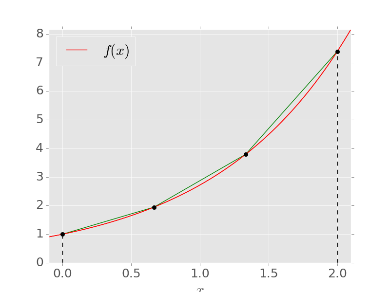

## Differentiation {#s-diff}

> *How do we differentiate functions numerically?*

### Basics

The definition of the derivative as
$$
f'(x_0) = \lim_{h\to 0}\frac{f(x_0+h) - f(x_0)}{h},
$$
suggests an obvious approximation: just pick some small finite $h$ to give the estimate
$$
f'(x_0) \approx \frac{f(x_0 + h) - f(x_0)}{h}.
$$
For $h>0$ this is called a **forward difference** (and, for $h<0$, a **backward difference**). It is an example of a **finite-difference formula**.

{width=60% fig-align="center"}

Geometrically, the forward difference is the slope of the straight line that interpolates $f$ at the nodes $x_0$ and $x_0+h$. To find its error, we use Taylor's theorem, which tells us that
$$
f(x_0+h) = f(x_0) + h f'(x_0) + \frac{h^2}{2}f''(\xi)
$$
for some $\xi$ between $x_0$ and $x_0+h$. Rearranging gives
$$
f'(x_0) = \frac{f(x_0+h)-f(x_0)}{h} - \frac{h}{2}f''(\xi).
$$
This shows that the **truncation error** for our forward difference approximation is $-f''(\xi)h/2$, for some $\xi\in[x_0,x_0+h]$. In other words, a smaller interval or a less "wiggly" function will lead to a better estimate, as you would expect.

::: {.callout-note}
We could also have derived the forward difference (and its error) by differentiating the linear interpolating polynomial and its error formula from Chapter 2. In general, finite-difference formulae are derivatives of interpolating polynomials, but Taylor's theorem is usually the quickest way to find their errors.
:::

::: {.eg}
## Derivative of $f(x)=\log(x)$ at $x_0=2$.

Using a forward-difference, we get the following sequence of approximations:

| $h$   | Forward difference | Error $\vert f'(2) - D\vert$ |
|-------|-------------------|------------------|
| 1     | 0.405465          | 0.0945349        |
| 0.1   | 0.487902          | 0.0120984        |
| 0.01  | 0.498754          | 0.00124585       |
| 0.001 | 0.499875          | 0.000124958      |

Indeed the error is linear in $h$, and we estimate that it is approximately $0.125 h$ when $h$ is small. This agrees with the error formula above, since $f''(x) = -x^{-2}$, so we expect $|f''(\xi)|/2\approx \tfrac18$.
:::

Since the error is proportional to $h$, the approximation is called **linear**, or **first order**, and we write the error as ${\cal O}(h)$.

::: {.callout-note title="Reminder: big-O notation"}
We write $g(h) = {\cal O}(h^p)$ as $h\to 0$ if there is a constant $M$ such that $|g(h)|\leq M|h|^p$ for all sufficiently small $h$. In other words, $g(h)$ gets smaller at least as fast as $h^p$. A method whose error is ${\cal O}(h^p)$ is said to be of **order** $p$.
:::

### Higher-order finite differences

To get a higher-order approximation, we can use more nodes. The most important example uses the two points on either side of $x$.

::: {.eg}
## Central difference

Using Taylor's theorem to expand $f$ about $x$ in both directions gives
$$
f(x \pm h) = f(x) \pm hf'(x) + \frac{h^2}{2}f''(x) \pm \frac{h^3}{6}f'''(\xi_\pm),
$$
for some $\xi_+\in(x,x+h)$ and $\xi_-\in(x-h,x)$. Subtracting the two expansions cancels the $f(x)$ and $f''(x)$ terms, and (using the Intermediate Value Theorem to combine the two $f'''$ terms) we get
$$
f'(x) = \frac{f(x+h) - f(x-h)}{2h} - \frac{h^2}{6}f'''(\xi)
$$
for some $\xi\in(x-h,x+h)$. This is called a **central difference** approximation for $f'(x)$, and is frequently used in practice. It is the slope of the quadratic that interpolates $f$ at $x-h$, $x$ and $x+h$, evaluated at the middle point.
:::

To see the quadratic behaviour of the truncation error, go back to our earlier example.

::: {.eg}
## Derivative of $f(x)=\log(x)$ at $x=2$

| $h$   | Forward difference | Error | Central difference | Error |
|-------|-------------------|------------------|-------------------|------------------|
| 1     | 0.405465          | 0.0945349        | 0.549306          | 0.0493061       |
| 0.1   | 0.487902          | 0.0120984        | 0.500417          | 0.000417293     |
| 0.01  | 0.498754          | 0.00124585       | 0.500004          | 4.16673e-06     |
| 0.001 | 0.499875          | 0.000124958      | 0.500000          | 4.16666e-08     |

The error for the central difference is about $0.04h^2$, which agrees with the formula since $f'''(\xi)\approx 2/2^3 = \tfrac14$ when $h$ is small.
:::

The same idea gives a formula for the **second derivative**. Adding (rather than subtracting) the Taylor expansions of $f(x\pm h)$, carried to one more term, cancels all of the odd derivatives and gives
$$
f''(x) = \frac{f(x-h) - 2f(x) + f(x+h)}{h^2} - \frac{h^2}{12}f^{(4)}(\xi)
$$
for some $\xi\in(x-h,x+h)$. This **second-order central difference** for $f''$ is the basis of the finite-difference methods for partial differential equations in Chapter 6.

::: {.eg}
## Second derivative of $f(x)=\log(x)$ at $x=2$

Here $f''(2) = -\tfrac14$ and $f^{(4)}(2) = -6/2^4 = -\tfrac38$, so we expect an error of about $\tfrac{3}{8}\cdot\tfrac{h^2}{12} = 0.03125h^2$:

| $h$   | Central difference for $f''(2)$ | Error |
|-------|-------------------|------------------|
| 1     | -0.2876820725     | 0.0376821        |
| 0.1   | -0.2503130218     | 0.000313022      |
| 0.01  | -0.2500031251     | 3.12505e-06      |
| 0.001 | -0.2500000311     | 3.11212e-08      |
:::

### Rounding error

The problem with numerical differentiation is that it involves subtraction of nearly-equal numbers. As $h$ gets smaller, the problem gets worse.

To quantify this for the central difference, suppose that we have the correctly rounded values of $f(x\pm h)$, so that
$$
\text{fl}[f(x+h)] = (1+\delta_1)f(x+h),\qquad
\text{fl}[f(x-h)]=(1+\delta_2)f(x-h),
$$
where $|\delta_1|,|\delta_2|\leq \epsilon_{\rm M}$. Ignoring the rounding error in dividing by $2h$, we then have that
$$
\begin{aligned}
&\left| f'(x) - \frac{\text{fl}[f(x+h)] - \text{fl}[f(x-h)]}{2h}\right| \\ = &\left| - \frac{f'''(\xi)}{6}h^2 - \frac{\delta_1f(x+h) - \delta_2f(x-h)}{2h}\right|\\
\leq &\frac{|f'''(\xi)|}{6}h^2 + \epsilon_{\rm M}\frac{|f(x+h)| + |f(x-h)|}{2h}\\
\leq &\frac{h^2}{6}M_3 + \frac{\epsilon_{\rm M}}{h}M_0,
\end{aligned}
$$
where $M_0$ and $M_3$ are the maximum values of $|f|$ and $|f'''|$ on $[x-h,x+h]$. The first term is the truncation error, which tends to zero as $h\to 0$. But the second term is the rounding error, which tends to infinity as $h\to 0$.

::: {.eg}
## Derivative of $f(x)=\log(x)$ at $x=2$ again

Here is a comparison of the terms in the inequality above (the red points are the left-hand side), shown on logarithmic scales, using $\xi=2$ to estimate the maxima.

{width=60% fig-align="center"}

You see that once $h$ is small enough, rounding error takes over and the error in the computed derivative starts to increase again.
:::

So there is an **optimal step size**. Minimising the bound $E(h) = \tfrac16 h^2M_3 + \epsilon_{\rm M}M_0/h$ by setting $E'(h) = \tfrac13 hM_3 - \epsilon_{\rm M}M_0/h^2 = 0$ gives
$$
h_* = \left(\frac{3\epsilon_{\rm M}M_0}{M_3}\right)^{1/3} \sim \epsilon_{\rm M}^{1/3},
$$
and the smallest possible error is of order $\epsilon_{\rm M}^{2/3}$. For our example, $h_*\approx 10^{-5}$, giving an error of about $10^{-11}$: we can never get a central-difference derivative accurate to the full $16$ digits. The same argument for the (first-order) forward difference gives $h_*\sim\epsilon_{\rm M}^{1/2}\approx 10^{-8}$, with an error of about $10^{-8}$.

### Differentiating noisy data

Exactly the same trade-off arises when $f$ is only known through **measurements**, except that the errors in the data are usually far larger than $\epsilon_{\rm M}$. If each measured value has an error of size up to $\delta$, then the error in the central difference is bounded by about
$$
\frac{h^2}{6}M_3 + \frac{\delta}{h},
$$
so the error from the data is amplified by a factor $1/h$. For the second derivative, the amplification factor is about $4/h^2$, which is much worse. With noisy data, it is often better to first **fit** a smooth model to the data (for example by least squares, as mentioned in Chapter 3) and then differentiate the model.

::: {.eg title="MATLAB demonstration: differentiating noisy measurements"}
A ball rolls down a ramp with constant acceleration $a = 2\,$m/s$^2$, so its position is $x(t) = t^2$. A sensor records the position every $0.02\,$s, with random errors of about $2\,$mm.

```matlab
rng(1)                                       % reproducible "measurements"
dt = 0.02;  t = (0:dt:2)';
x = t.^2 + 0.002*randn(size(t));             % noisy positions [m]

% Central differences for velocity and acceleration at interior points
v = (x(3:end) - x(1:end-2)) / (2*dt);
a = (x(3:end) - 2*x(2:end-1) + x(1:end-2)) / dt^2;

% Least-squares quadratic fit, then differentiate the fitted model
p = polyfit(t, x, 2);
aFit = 2*p(1);

figure
subplot(1, 2, 1)
plot(t(2:end-1), v, 'o', t, 2*t, 'LineWidth', 2.5, 'MarkerSize', 5)
legend('finite differences', 'exact v = 2t', 'Location', 'northwest')
xlabel('t [s]'), ylabel('velocity [m/s]'), grid on, set(gca, 'FontSize', 16)
subplot(1, 2, 2)
plot(t(2:end-1), a, 'o', t, 2*ones(size(t)), t, aFit*ones(size(t)), '--', ...
    'LineWidth', 2.5, 'MarkerSize', 5)
legend('finite differences', 'exact a = 2', 'from least-squares fit', 'Location', 'southwest')
xlabel('t [s]'), ylabel('acceleration [m/s^2]'), grid on, set(gca, 'FontSize', 16)
```
The velocities are slightly noisy, but the accelerations are useless: errors of $2\,$mm become errors of about $10\,$m/s$^2$ after dividing by $h^2 = 4\times 10^{-4}$. The acceleration from the fitted model is very close to the true value.
:::

### Richardson extrapolation

Finding higher-order formulae by differentiating interpolating polynomials is tedious, and there is a simpler trick to obtain higher-order formulae, called **Richardson extrapolation**.

We begin from the central-difference formula. Since we will use formulae with different $h$, let us define the notation
$$
D_h := \frac{f(x+h) - f(x-h)}{2h}.
$$

Now use Taylor's theorem to expand more terms in the truncation error:
$$
\begin{aligned}
f(x \pm h) = f(x) &\pm f'(x)h + \frac{f''(x)}{2}h^2 \pm \frac{f'''(x)}{3!}h^3 \\ &+ \frac{f^{(4)}(x)}{4!}h^4 \pm \frac{f^{(5)}(x)}{5!}h^5 + {\cal O}(h^6).
\end{aligned}
$$
Substituting into the formula for $D_h$, the even powers of $h$ cancel and we get
$$
\begin{aligned}
D_h &= \frac{1}{2h}\Big(2f'(x)h + 2f'''(x)\frac{h^3}{6} +   2f^{(5)}(x)\frac{h^5}{120} + {\cal O}(h^7)  \Big)\\
&=f'(x) + f'''(x)\frac{h^2}{6} + f^{(5)}(x)\frac{h^4}{120} + {\cal O}(h^6).
\end{aligned}
$$

::: {.callout-note}
The remainder here is ${\cal O}(h^6)$ because it gets smaller at least as fast as $h^6$ as $h\to 0$ (essentially, it contains no powers of $h$ less than 6).
:::

The leading term in the error here has the same coefficient $h^2/6$ as the truncation error we derived earlier, although we have now expanded the error to higher powers of $h$.

The trick is to apply the same formula with different step-sizes, typically $h$ and $h/2$:
$$
\begin{aligned}
D_h &= f'(x) + f'''(x)\frac{h^2}{6} + f^{(5)}(x)\frac{h^4}{120} + {\cal O}(h^6),\\
D_{h/2} &= f'(x) + f'''(x)\frac{h^2}{2^2(6)} + f^{(5)}(x)\frac{h^4}{2^4(120)} + {\cal O}(h^6).
\end{aligned}
$$
We can then eliminate the $h^2$ term by simple algebra:
$$
\begin{aligned}
D_h - 2^2D_{h/2} =& -3f'(x) + \left(1 - \frac{2^2}{2^4}\right)f^{(5)}(x)\frac{h^4}{120} + {\cal O}(h^6),\\
\implies \quad D_h^{(1)} :=& \frac{2^2D_{h/2} - D_h}{3} = f'(x) - f^{(5)}(x)\frac{h^4}{480} + {\cal O}(h^6).
\end{aligned}
$$
The new formula $D_h^{(1)}$ is 4th-order accurate.

::: {.eg}
## Derivative of $f(x)=\log(x)$ at $x=2$ (central difference).

| $h$   | $D_h$         | $\vert$Error$\vert$ | $D_h^{(1)}$    | $\vert$Error$\vert$ |
|-------|---------------|--------------|----------------|--------------|
| 1.0   | 0.5493061443  | 0.04930614433| 0.4979987836   | 0.00200121642|
| 0.1   | 0.5004172928  | 0.00041729278| 0.4999998434   | 1.56599487e-07|
| 0.01  | 0.5000041667  | 4.16672916e-06| 0.5000000000   | 1.56388791e-11|
| 0.001 | 0.5000000417  | 4.16666151e-08| 0.5000000000   | 9.29256672e-14|

The error in $D_h^{(1)}$ decreases by a factor of about $10^4$ each time $h$ is divided by $10$, as expected for a 4th-order method, until the last row. There, the truncation error would be about $2\times 10^{-15}$, but rounding error (of size about $\epsilon_{\rm M}/h$) has taken over.
:::

In fact, we could have applied this **Richardson extrapolation** procedure without knowing the coefficients of the error series. If we have some general order-$n$ approximation
$$
D_h = f'(x) + Ch^n + {\cal O}(h^{n+1}),
$$
then we can always evaluate it with $h/2$ to get
$$
D_{h/2} = f'(x) + C\frac{h^n}{2^n} + {\cal O}(h^{n+1})
$$
and then eliminate the $h^n$ term to get a new approximation
$$
D_h^{(1)} := \frac{2^nD_{h/2} - D_h}{2^n - 1} = f'(x) + {\cal O}(h^{n+1}).
$$

Furthermore, Richardson extrapolation can be applied iteratively. For example, for central differences, $D_h^{(1)}$ has error $C_1h^4 + {\cal O}(h^6)$, so combining $D_h^{(1)}$ and $D_{h/2}^{(1)}$ in the same way gives the 6th-order approximation $D_h^{(2)} := \big(2^4D_{h/2}^{(1)} - D_h^{(1)}\big)/(2^4 - 1)$, and so on.

::: {.callout-note}
The technique is used not only in differentiation but also in **Romberg integration** and the **Bulirsch-Stoer method** for solving ODEs. There is also nothing special about taking $h/2$; we could have taken $h/3$ or even $2h$, and modified the formula accordingly. But $h/2$ is usually convenient.
:::

::: {.callout-note}
Lewis Fry Richardson (1881--1953) was from Newcastle and an undergraduate there (when it was still a College of Durham). He was the first person to apply mathematics (finite differences) to weather prediction, and was ahead of his time: in the absence of electronic computers, he estimated that 60,000 people would be needed to predict the next day's weather!
:::

::: {.eg title="MATLAB demonstration: truncation error, rounding error and Richardson extrapolation"}
```matlab
f = @(x) log(x);  x0 = 2;  exact = 0.5;
h  = 10.^(-(0:0.25:12))';
Df = (f(x0 + h) - f(x0)) ./ h;                 % forward difference
Dc = (f(x0 + h) - f(x0 - h)) ./ (2*h);         % central difference
Dc2 = (f(x0 + h/2) - f(x0 - h/2)) ./ h;        % central difference with h/2
Dr = (4*Dc2 - Dc) / 3;                         % Richardson extrapolation

figure
loglog(h, abs(Df - exact), 'o-', h, abs(Dc - exact), 's-', h, abs(Dr - exact), '^-', ...
    'LineWidth', 2, 'MarkerSize', 6)
legend('forward difference', 'central difference', 'Richardson', 'Location', 'southwest')
xlabel('step size h'), ylabel('|error|'), grid on, set(gca, 'FontSize', 18)
```
Each curve falls with slope $1$, $2$ and $4$ respectively, until rounding error takes over and the error grows again like $\epsilon_{\rm M}/h$. Notice that the higher-order methods reach their best accuracy at larger values of $h$.
:::

## Numerical integration {#s-int}

> *How do we calculate integrals numerically?*

The definite integral
$$
I(f) := \int_a^b f(x)\,\mathrm{d}x
$$
can usually not be evaluated in closed form. To approximate it numerically, we can use a **quadrature formula**
$$
I_n(f) := \sum_{k=0}^n \sigma_k f(x_k),
$$
where $x_0,\ldots,x_n$ are a set of **nodes** and $\sigma_0,\ldots,\sigma_n$ are a set of corresponding **weights**.

::: {.callout-note}
The nodes are also known as **quadrature points** or **abscissas**, and the weights as **coefficients**.
:::

::: {.eg}
## The trapezium rule

$$
I_1(f) = \frac{b-a}{2}\Big( f(a) + f(b) \Big).
$$

This is the quadrature formula above with $x_0=a$, $x_1=b$, $\sigma_0=\sigma_1=\tfrac12(b-a)$.

For example, with $a=0$, $b=2$, $f(x)=\mathrm{e}^x$, we get
$$
I_1(f) = \frac{2 - 0}{2}\big(\mathrm{e}^0 + \mathrm{e}^{2}\big) = 8.389 \quad \textrm{to 4 s.f.}
$$
The exact answer is
$$
I(f) = \int_0^{2}\mathrm{e}^x\,\mathrm{d}x = \mathrm{e}^{2} - \mathrm{e}^0 = 6.389 \quad \textrm{to 4 s.f.}
$$
Graphically, $I_1(f)$ measures the area under the straight line that interpolates $f$ at the ends:

{width=60% fig-align="center"}
:::

### Newton-Cotes formulae

We can derive a family of "interpolatory" quadrature formulae by integrating interpolating polynomials of different degrees. We will also get error estimates using the interpolation error theorem.

Let $x_0, \ldots, x_n \in [a,b]$, where $x_0 < x_1 < \cdots < x_n$, be a set of $n+1$ nodes, and let $p_n\in{\cal P}_n$ be the polynomial that interpolates $f$ at these nodes. This may be written in Lagrange form as
$$
p_n(x) = \sum_{k=0}^n f(x_k)\ell_k(x), \quad \textrm{where}\quad \ell_k(x) = \prod_{\substack{j=0\\j\neq k}}^n\frac{x - x_j}{x_k - x_j}.
$$
To approximate $I(f)$, we integrate $p_n(x)$ to define the quadrature formula
$$
I_n(f) := \int_a^b\sum_{k=0}^n f(x_k)\ell_k(x)\,\mathrm{d}x = \sum_{k=0}^n f(x_k)\int_a^b\ell_k(x)\,\mathrm{d}x.
$$
In other words,
$$
I_n(f) := \sum_{k=0}^n\sigma_k f(x_k), \quad \textrm{where} \quad \sigma_k = \int_a^b\ell_k(x)\,\mathrm{d}x.
$$
When the nodes are equidistant, this is called a **Newton-Cotes formula**. If $x_0=a$ and $x_n=b$, it is called a **closed Newton-Cotes formula**.

::: {.eg}
## Trapezium rule

This is the closed Newton-Cotes formula with $n=1$. To see this, let $x_0=a$, $x_1=b$. Then
$$
\begin{aligned}
\ell_0(x) = \frac{x-b}{a-b} \implies \sigma_0 &= \int_a^b\ell_0(x)\,\mathrm{d}x \\ &= \frac{1}{a-b}\int_a^b(x-b)\,\mathrm{d}x \\ &= \frac{1}{2(a-b)}(x-b)^2\big|_a^b \\ &= \frac{b-a}{2},
\end{aligned}
$$
and
$$
\begin{aligned}
\ell_1(x) = \frac{x-a}{b-a} \implies \sigma_1 &= \int_a^b\ell_1(x)\,\mathrm{d}x \\ &= \frac{1}{b-a}\int_a^b(x-a)\,\mathrm{d}x \\ &= \frac{1}{2(b-a)}(x-a)^2\big|_a^b = \frac{b-a}{2}.
\end{aligned}
$$
This gives
$$
I_1(f) = \sigma_0f(a) + \sigma_1f(b) = \frac{b-a}{2}\big(f(a) + f(b)\big).
$$
:::

::: {.theorem}
Let $f$ be continuous on $[a,b]$ with $n+1$ continuous derivatives on $(a,b)$. Then the Newton-Cotes formula above satisfies the error bound
$$
\begin{aligned}
&\big|I(f) - I_n(f)\big| \leq \\ &\frac{\max_{\xi\in[a,b]}|f^{(n+1)}(\xi)|}{(n+1)!}\int_a^b\big|(x-x_0)(x-x_1)\cdots(x-x_{n}) \big|\,\mathrm{d}x.
\end{aligned}
$$
:::

**Proof:**
First note that the error in the Newton-Cotes formula may be written
$$
\begin{aligned}
\big|I(f) - I_n(f)\big| &= \left|\int_a^bf(x)\,\mathrm{d}x - \int_a^bp_n(x)\,\mathrm{d}x \right| \\
&= \left| \int_a^b\big[f(x) - p_n(x)\big]\,\mathrm{d}x\right| \\
&\leq \int_a^b\big|f(x) - p_n(x)\big|\,\mathrm{d}x.
\end{aligned}
$$
Now recall the interpolation error theorem, which says that, for each $x\in[a,b]$, we can write
$$
f(x) - p_n(x) = \frac{f^{(n+1)}(\xi)}{(n+1)!}(x-x_0)(x-x_1)\cdots(x-x_{n})
$$
for some $\xi\in(a,b)$. The theorem simply follows by inserting this into the inequality above. $\Box$

::: {.eg}
## Trapezium rule error

Let $M_2 = \max_{\xi\in[a,b]}|f''(\xi)|$. Here the theorem reduces to
$$
\begin{aligned}
\big|I(f) - I_1(f)\big| &\leq \frac{M_2}{(1+1)!}\int_a^b\big|(x-a)(x-b)\big|\,\mathrm{d}x \\ &= \frac{M_2}{2!}\int_a^b(x-a)(b-x)\,\mathrm{d}x \\ &= \frac{(b-a)^3}{12}M_2.
\end{aligned}
$$
For our earlier example with $a=0$, $b=2$, $f(x)=\mathrm{e}^x$, the estimate gives
$$
\big|I(f) - I_1(f)\big| \leq \tfrac1{12}(2^3)\mathrm{e}^{2} \approx 4.926.
$$
This is an overestimate of the actual error which was $\approx 2.000$.
:::

The theorem suggests that the accuracy of $I_n$ is limited both by the smoothness of $f$ (outside our control) and by the location of the nodes $x_k$. If the nodes are free to be chosen, then we can use **Gaussian quadrature** (see below).

::: {.callout-note}
As with interpolation, taking a high $n$ is not usually a good idea. One can prove for the closed Newton-Cotes formula that
$$
\sum_{k=0}^n|\sigma_k| \to \infty \quad \textrm{as} \quad n\to\infty.
$$
This makes the quadrature vulnerable to rounding errors for large $n$.
:::

### Composite Newton-Cotes formulae

Since the Newton-Cotes formulae are based on polynomial interpolation at equally-spaced points, the results need not converge as the number of nodes increases (recall the Runge phenomenon from Chapter 2). A better way to improve accuracy is to divide the interval $[a,b]$ into $m$ subintervals $[x_{i-1},x_i]$ of equal length
$$
h := \frac{b-a}{m},
$$
and use a Newton-Cotes formula of small degree $n$ on each subinterval.

::: {.eg}
## Composite trapezium rule

Applying the trapezium rule $I_1(f)$ on each subinterval gives
$$
\begin{aligned}
C_{1,m}(f) &= \frac{h}{2}\left[f(x_0) + f(x_1) + f(x_1) + f(x_2) + \ldots + f(x_{m-1}) + f(x_m) \right],\\
&= h\left[\tfrac12 f(x_0) + f(x_1) + f(x_2) + \ldots + f(x_{m-1}) + \tfrac12 f(x_m) \right].
\end{aligned}
$$
We are effectively integrating a piecewise-linear approximation of $f(x)$; here we show $m=3$ for our test problem $f(x)=\mathrm{e}^x$ on $[0,2]$:

{width=75% fig-align="center"}

When we halve the sub-interval width $h$, the error goes down by a factor $4$ (see the table below), suggesting that we have quadratic convergence, i.e., ${\cal O}(h^2)$.

To show this theoretically, we can apply the Newton-Cotes error theorem on each subinterval. On $[x_{i-1},x_i]$, the error of the trapezium rule is at most
$$
\frac{\max_{\xi\in[x_{i-1},x_i]}|f''(\xi)|}{2!}\int_{x_{i-1}}^{x_i}\big|(x-x_{i-1})(x-x_i)\big|\,\mathrm{d}x
$$
Note that
$$
\begin{aligned}
\int_{x_{i-1}}^{x_i}\big|(x-x_{i-1})(x-x_i)\big|\,\mathrm{d}x &= \int_{x_{i-1}}^{x_i}(x-x_{i-1})(x_i-x)\,\mathrm{d}x \\
&= \int_{x_{i-1}}^{x_i}\big[-x^2 + (x_{i-1} + x_i)x - x_{i-1}x_i\big]\,\mathrm{d}x\\
&= \big[-\tfrac13x^3 + \tfrac12(x_{i-1}+x_i)x^2 - x_{i-1}x_ix\big]_{x_{i-1}}^{x_i} \\
&= \tfrac16 x_{i}^3 - \tfrac12x_{i-1}x_i^2 + \tfrac12x_{i-1}^2x_i - \tfrac16x_{i-1}^3\\
&= \tfrac16(x_i - x_{i-1})^3 = \tfrac16 h^3.
\end{aligned}
$$
Adding up the errors on all $m$ subintervals gives
$$
\begin{aligned}
\big| I(f) - C_{1,m}(f) \big| &\leq \tfrac12 \max_i\left(\max_{\xi\in[x_{i-1},x_i]}|f''(\xi)|\right) m\frac{h^3}{6}\\
  &= \frac{mh^3}{12}\max_{\xi\in[a,b]}|f''(\xi)| =  \frac{b-a}{12}h^2\max_{\xi\in[a,b]}|f''(\xi)|.
 \end{aligned}
$$
As long as $f$ is sufficiently smooth, this shows that the composite trapezium rule will converge as $m\to\infty$. Moreover, the convergence will be ${\cal O}(h^2)$.
:::

### Exactness

From the Newton-Cotes error theorem, we see that the Newton-Cotes formula $I_n(f)$ will give the exact answer if $f^{(n+1)}=0$. In other words, it will be exact if $f \in{\cal P}_n$.

::: {.eg}
The trapezium rule $I_1(f)$ is exact for all linear polynomials $f\in{\cal P}_1$.
:::

The **degree of exactness** of a quadrature formula is the largest integer $n$ for which the formula is exact for all polynomials in ${\cal P}_n$.

To check whether a quadrature formula has degree of exactness $n$, it suffices to check whether it is exact for the basis $1$, $x$, $x^2, \ldots, x^n$.

::: {.eg}
## Simpson's rule

This is the $n=2$ closed Newton-Cotes formula
$$
I_2(f) = \frac{b-a}{6}\left[f(a) + 4f\left(\frac{a+b}{2}\right) + f(b)\right],
$$
derived by integrating a quadratic interpolating polynomial. Let us find its degree of exactness:
$$
\begin{aligned}
I(1) &= \int_a^b\,\mathrm{d}x = (b-a), \\
I_2(1) &= \frac{b-a}{6}[1 + 4 + 1] = b-a = I(1),\\
I(x) &= \int_a^b x\,\mathrm{d}x = \frac{b^2-a^2}{2}, \\
I_2(x) &= \frac{b-a}{6}\left[a + 2(a+b) + b\right] = \frac{(b-a)(b+a)}{2} = I(x),\\
I(x^2) &= \int_a^b x^2\,\mathrm{d}x = \frac{b^3 - a^3}{3}, \\
I_2(x^2) &= \frac{b-a}{6}\left[a^2 + (a+b)^2 + b^2\right] = \frac{2(b^3 - a^3)}{6} = I(x^2),\\
I(x^3) &= \int_a^b x^3\,\mathrm{d}x = \frac{b^4 - a^4}{4}, \\
I_2(x^3) &= \frac{b-a}{6}\left[a^3 + \tfrac12(a+b)^3 + b^3 \right] = \frac{b^4-a^4}{4} = I(x^3).
\end{aligned}
$$
This shows that the degree of exactness is at least 3 (contrary to what might be expected from the interpolation picture). You can verify that $I_2(x^4)\neq I(x^4)$, so the degree of exactness is exactly 3.
:::

This shows that the term $f'''(\xi)$ in the Newton-Cotes error bound for Simpson's rule is misleading. In fact, a more careful analysis gives the error bound
$$
\big|I(f) - I_2(f)\big| \leq \frac{(b-a)^5}{2880}\max_{\xi\in[a,b]}\big|f^{(4)}(\xi)\big|.
$$
In terms of degree of exactness, Simpson's formula does better than expected. In general, Newton-Cotes formulae with even $n$ have degree of exactness $n+1$. But this is by no means the highest possible (see the next section).

Simpson's rule can also be used in composite form. Divide $[a,b]$ into an *even* number $m$ of subintervals of width $h = (b-a)/m$, and apply Simpson's rule on each consecutive pair of subintervals. This gives the **composite Simpson's rule**
$$
C_{2,m}(f) = \frac{h}{3}\Big[f(x_0) + 4f(x_1) + 2f(x_2) + 4f(x_3) + \ldots + 2f(x_{m-2}) + 4f(x_{m-1}) + f(x_m)\Big],
$$
which satisfies
$$
\big|I(f) - C_{2,m}(f)\big| \leq \frac{b-a}{180}h^4\max_{\xi\in[a,b]}\big|f^{(4)}(\xi)\big|.
$$
So the composite Simpson's rule converges with order ${\cal O}(h^4)$, using the same function values as the composite trapezium rule.

::: {.eg}
## Composite rules for $\int_0^2\mathrm{e}^x\,\mathrm{d}x = 6.389056\ldots$

| $m$  | $h$     | $C_{1,m}(f)$ | $\vert I(f) - C_{1,m}(f)\vert$ | $C_{2,m}(f)$ | $\vert I(f) - C_{2,m}(f)\vert$ |
|------|---------|--------------|-----------------------|--------------|-----------------------|
| 1    | 2       | 8.389056     | 2.000                 | --           | --                    |
| 2    | 1       | 6.912810     | 0.524                 | 6.420728     | 3.17e-02              |
| 4    | 0.5     | 6.521610     | 0.133                 | 6.391210     | 2.15e-03              |
| 8    | 0.25    | 6.422298     | 0.033                 | 6.389194     | 1.38e-04              |
| 16   | 0.125   | 6.397373     | 0.008                 | 6.389065     | 8.65e-06              |
| 32   | 0.0625  | 6.391136     | 0.002                 | 6.389057     | 5.41e-07              |

Halving $h$ reduces the error by a factor of about $4$ for the trapezium rule, and about $16$ for Simpson's rule.
:::

::: {.eg title="MATLAB demonstration: integrating sampled data"}
In applications, we often only know the integrand at the points where it was measured, so Newton-Cotes formulae are the natural choice. Suppose a car accelerates from rest with speed $v(t) = 20(1 - \mathrm{e}^{-t/20})\,$m/s, but we only have speedometer readings every $5\,$s for one minute. The distance travelled is the integral of the speed.

```matlab
t = 0:5:60;                                   % times of the readings [s]
v = 20*(1 - exp(-t/20));                      % speedometer readings [m/s]
dTrap = trapz(t, v);                          % composite trapezium rule
h = t(2) - t(1);                              % composite Simpson (12 subintervals)
dSimp = h/3*(v(1) + 4*sum(v(2:2:end-1)) + 2*sum(v(3:2:end-2)) + v(end));
dExact = 20*(60 + 20*exp(-3) - 20);
fprintf('Trapezium: %.3f m,  Simpson: %.3f m,  exact: %.3f m\n', dTrap, dSimp, dExact);

figure
area(t, v, 'FaceColor', [0.85 0.9 1]), hold on
plot(t, v, 'o-', 'LineWidth', 2.5, 'MarkerSize', 8), hold off
legend('distance = area under the curve', 'speedometer readings', 'Location', 'southeast')
xlabel('time [s]'), ylabel('speed [m/s]'), grid on, set(gca, 'FontSize', 18)
```
The trapezium rule underestimates the exact distance of $819.9\,$m by about $2\,$m, because the speed curve is concave; Simpson's rule is much more accurate using the same readings.
:::

### Gaussian quadrature

The idea of **Gaussian quadrature** is to choose not only the weights $\sigma_k$ but also the nodes $x_k$, in order to achieve the highest possible degree of exactness.

Firstly, we will illustrate the brute force **method of undetermined coefficients**.

::: {.eg}
## Gaussian quadrature formula $G_1(f)=\sum_{k=0}^1\sigma_kf(x_k)$ on the interval $[-1,1]$

Here we have four unknowns $x_0$, $x_1$, $\sigma_0$ and $\sigma_1$, so we can impose four conditions:
$$
\begin{aligned}
G_1(1) &= I(1) \implies \sigma_0 + \sigma_1 = \int_{-1}^1\,\mathrm{d}x = 2,\\
G_1(x) &= I(x) \implies \sigma_0x_0 + \sigma_1x_1 = \int_{-1}^1x\,\mathrm{d}x = 0,\\
G_1(x^2) &= I(x^2) \implies \sigma_0x_0^2 + \sigma_1x_1^2 = \int_{-1}^1x^2\,\mathrm{d}x = \tfrac23,\\
G_1(x^3) &= I(x^3) \implies \sigma_0x_0^3 + \sigma_1x_1^3 = \int_{-1}^1x^3\,\mathrm{d}x = 0.
\end{aligned}
$$
To solve this system, the symmetry suggests that $x_1=-x_0$ and $\sigma_0=\sigma_1$. This will automatically satisfy the equations for $x$ and $x^3$, leaving the two equations
$$
2\sigma_0 = 2, \qquad 2\sigma_0x_0^2 = \tfrac23,
$$
so that $\sigma_0=\sigma_1=1$ and $x_1=-x_0 = 1/\sqrt{3}$. The resulting Gaussian quadrature formula is
$$
G_1(f) = f\left(-\frac{1}{\sqrt{3}}\right) + f\left(\frac{1}{\sqrt{3}}\right).
$$
This formula has degree of exactness 3.
:::

In general, the Gaussian quadrature formula with $n+1$ nodes has degree of exactness $2n+1$.

The method of undetermined coefficients becomes unworkable for larger numbers of nodes, because of the nonlinearity of the equations. A much more elegant method uses orthogonal polynomials.

::: {.callout-note title="Orthogonal polynomials"}
Given a **weight function** $w(x)\geq 0$ on $[a,b]$, we define the inner product
$$
(f,g) := \int_a^b f(x)g(x)w(x)\,\mathrm{d}x.
$$
Polynomials $\phi_0,\phi_1,\phi_2,\ldots$, with $\phi_k$ of degree $k$, are **orthogonal** if $(\phi_j,\phi_k)=0$ whenever $j\neq k$. They can be constructed by applying the Gram-Schmidt process to $1, x, x^2,\ldots$; for example, taking each $\phi_k$ to be monic,
$$
\phi_0 = 1, \qquad \phi_1 = x - \frac{(x,\phi_0)}{(\phi_0,\phi_0)}\phi_0, \qquad \phi_2 = x^2 - \frac{(x^2,\phi_0)}{(\phi_0,\phi_0)}\phi_0 - \frac{(x^2,\phi_1)}{(\phi_1,\phi_1)}\phi_1.
$$
For $w(x)=1$ on $[-1,1]$, this gives the (monic) **Legendre polynomials** $\phi_0=1$, $\phi_1 = x$, $\phi_2 = x^2-\tfrac13$, $\ldots$ The key property we need is that $\phi_{n+1}$ is orthogonal to *every* polynomial of degree at most $n$, since any such polynomial is a combination of $\phi_0,\ldots,\phi_n$.

For more details, see Burden & Faires, *Numerical Analysis*, Chapter 8 (Approximation Theory), on orthogonal polynomials and least-squares approximation.
:::

::: {.theorem}
If $\{\phi_0,\phi_1,\ldots,\phi_n\}$ is a set of orthogonal polynomials on $[a,b]$ under the inner product $(f,g) = \int_a^b f(x)g(x)w(x)\,\mathrm{d}x$ and $\phi_k$ is of degree $k$ for each $k=0,1,\ldots,n$, then $\phi_k$ has $k$ distinct real roots, and these roots lie in the interval $(a,b)$.
:::

::: {.callout-note collapse="true" title="Proof (non-examinable)"}
Let $x_1,\ldots,x_j$ be the points where $\phi_k(x)$ changes sign in $(a,b)$. If $j=k$ then we are done. Otherwise, suppose $j<k$, and consider the polynomial
$$
q_j(x) = (x-x_1)(x-x_2)\cdots(x-x_j).
$$
Since $q_j$ has lower degree than $\phi_k$, they must be orthogonal, meaning
$$
(q_j,\phi_k)=0 \implies \int_a^b q_j(x)\phi_k(x)w(x)\,\mathrm{d}x = 0.
$$
On the other hand, notice that the product $q_j(x)\phi_k(x)$ cannot change sign in $[a,b]$, because each sign change in $\phi_k(x)$ is cancelled out by one in $q_j(x)$. This means that
$$
\int_a^b q_j(x)\phi_k(x)w(x)\,\mathrm{d}x \neq 0,
$$
which is a contradiction. $\Box$
:::

Remarkably, these roots are precisely the optimum choice of nodes for a quadrature formula to approximate the (weighted) integral
$$
I_{w}(f) = \int_a^b f(x)w(x)\,\mathrm{d}x.
$$

::: {.theorem}
## Gaussian quadrature

Let $\phi_{n+1}$ be a polynomial in ${\cal P}_{n+1}$ that is orthogonal on $[a,b]$ to all polynomials in ${\cal P}_{n}$, with respect to the weight function $w(x)$. If $x_0,x_1,\ldots,x_n$ are the roots of $\phi_{n+1}$, then the quadrature formula
$$
G_{n,w}(f) := \sum_{k=0}^n\sigma_kf(x_k), \qquad \sigma_k = \int_a^b\ell_k(x)w(x)\,\mathrm{d}x
$$
approximates $I_w(f)$ with degree of exactness ${2n+1}$ (the largest possible).
:::

**Proof:**
First, recall that any interpolatory quadrature formula based on $n+1$ nodes will be exact for all polynomials in ${\cal P}_n$ (this follows from the Newton-Cotes theorem, which can be modified to include the weight function $w(x)$). So in particular, $G_{n,w}$ is exact for $p_n\in{\cal P}_n$.

Now let $p_{2n+1}\in{\cal P}_{2n+1}$. The trick is to divide this by the orthogonal polynomial $\phi_{n+1}$ whose roots are the nodes. This gives
$$
p_{2n+1}(x) = \phi_{n+1}(x)q_n(x) + r_n(x) \quad \textrm{for some} \quad q_n,r_n \in{\cal P}_n.
$$
Then
$$
\begin{aligned}
G_{n,w}(p_{2n+1}) &= \sum_{k=0}^n\sigma_kp_{2n+1}(x_k) = \sum_{k=0}^n\sigma_k\Big[\phi_{n+1}(x_k)q_n(x_k) + r_n(x_k) \Big] \\ &= \sum_{k=0}^n\sigma_kr_n(x_k) = I_w(r_n),
\end{aligned}
$$
where we have used the fact that $G_{n,w}$ is exact for $r_n\in{\cal P}_n$. Now, since $q_n$ has lower degree than $\phi_{n+1}$, it must be orthogonal to $\phi_{n+1}$, so
$$
I_w(\phi_{n+1}q_n) = \int_a^b\phi_{n+1}(x)q_n(x)w(x)\,\mathrm{d}x = 0
$$
and hence
$$
\begin{aligned}
G_{n,w}(p_{2n+1}) &= I_w(r_n) + 0= I_w(r_n) + I_w(\phi_{n+1}q_n) \\ &= I_w( \phi_{n+1}q_n + r_n) = I_w(p_{2n+1}). \qquad \Box
\end{aligned}
$$

Like Newton-Cotes, we see that Gaussian quadrature is based on integrating an interpolating polynomial, but now the nodes are the roots of an orthogonal polynomial, rather than equally spaced points.

::: {.eg}
## Gaussian quadrature with $n=1$ on $[-1,1]$ and $w(x)=1$ (again)

To find the nodes $x_0$, $x_1$, we need to find the roots of the orthogonal polynomial $\phi_2(x)$. For this inner product, these are the Legendre polynomials, so
$$
\phi_2(x) = x^2 - \tfrac13.
$$
Thus the nodes are $x_0= -1/\sqrt{3}, x_1=1/\sqrt{3}$. Integrating the Lagrange polynomials gives the corresponding weights
$$
\begin{aligned}
\sigma_0 &= \int_{-1}^1\ell_0(x)\,\mathrm{d}x = \int_{-1}^1\frac{x-\tfrac1{\sqrt{3}}}{-\tfrac2{\sqrt{3}}}\,\mathrm{d}x = -\tfrac{\sqrt{3}}{2}\left[\tfrac12x^2 - \tfrac1{\sqrt{3}}x\right]_{-1}^1 = 1,\\
\sigma_1 &= \int_{-1}^1\ell_1(x)\,\mathrm{d}x = \int_{-1}^1\frac{x+\tfrac1{\sqrt{3}}}{\tfrac2{\sqrt{3}}}\,\mathrm{d}x = \tfrac{\sqrt{3}}{2}\left[\tfrac12x^2 + \tfrac1{\sqrt{3}}x\right]_{-1}^1 = 1,
\end{aligned}
$$
as before.
:::

Gaussian quadrature formulae are usually tabulated on $[-1,1]$. To use them on a general interval $[a,b]$, we change variables to $x = \tfrac{a+b}{2} + \tfrac{b-a}{2}t$, so that
$$
\int_a^b f(x)\,\mathrm{d}x = \frac{b-a}{2}\int_{-1}^1 f\Big(\tfrac{a+b}{2} + \tfrac{b-a}{2}t\Big)\,\mathrm{d}t \approx \frac{b-a}{2}\sum_{k=0}^n\sigma_kf\Big(\tfrac{a+b}{2} + \tfrac{b-a}{2}t_k\Big),
$$
where $t_k$ and $\sigma_k$ are the nodes and weights on $[-1,1]$.

::: {.eg}
## Two-point Gaussian quadrature for $\int_0^2\mathrm{e}^x\,\mathrm{d}x$

With $a=0$, $b=2$, the nodes $t_k = \pm 1/\sqrt{3}$ map to $x = 1\pm 1/\sqrt{3}$, and the weights are $\tfrac{b-a}{2}\sigma_k = 1$. So
$$
G_1(\mathrm{e}^x) = \mathrm{e}^{1-1/\sqrt{3}} + \mathrm{e}^{1+1/\sqrt{3}} = 6.368108\ldots,
$$
with error $0.021$. Using only two function evaluations, this is far more accurate than the trapezium rule (error $2.000$), and even more accurate than Simpson's rule (error $0.032$), which uses three.
:::

::: {.callout-note}
Using an appropriate weight function $w(x)$ can be useful for integrands with a singularity, since we can incorporate this in $w(x)$ and still approximate the integral with $G_{n,w}$.
:::

::: {.eg}
## Gaussian quadrature for $\int_0^1 \cos(x)x^{-1/2}\,\mathrm{d}x$, with $n=0$

This is a Fresnel integral, with exact value $1.80905\ldots$ Let us compare the effect of using an appropriate weight function.

1. *Unweighted quadrature ($w(x)\equiv 1$).* The orthogonal polynomial of degree 1 is
   $$
   \phi_1(x) = x - \frac{\int_0^1x\,\mathrm{d}x}{\int_0^1\,\mathrm{d}x} = x-\tfrac12 \implies x_0=\tfrac12.
   $$
   The corresponding weight may be found by imposing $G_{0}(1)=I(1)$, which gives $\sigma_0=\int_0^1\,\mathrm{d}x = 1$. Then our estimate is
   $$
   G_0\left(\frac{\cos(x)}{\sqrt{x}}\right) = \frac{\cos\left(\tfrac12\right)}{\sqrt{\tfrac12}} = 1.2411\ldots
   $$

2. *Weighted quadrature with $w(x) = x^{-1/2}$.* This time we get
   $$
   \phi_1(x) = x - \frac{\int_0^1x^{1/2}\,\mathrm{d}x}{\int_0^1x^{-1/2}\,\mathrm{d}x} = x-\frac{2/3}{2} \implies x_0=\tfrac13.
   $$
   The corresponding weight is $\sigma_0 = \int_0^1x^{-1/2}\,\mathrm{d}x = 2$, so the new estimate is the more accurate
   $$
   G_{0,w}\big(\cos(x)\big) = 2\cos\left(\tfrac13\right) = 1.8899\ldots
   $$
:::

Unlike Newton-Cotes formulae with equally-spaced points, it can be shown that $G_{n,w}(f)\to I_w(f)$ as $n\to\infty$, for any continuous function $f$. This follows (with a bit of analysis) from the fact that all of the weights $\sigma_k$ are positive, along with the fact that they sum to a fixed number $\int_a^bw(x)\,\mathrm{d}x$. For Newton-Cotes, the signed weights still sum to a fixed number, but  $\sum_{k=0}^n|\sigma_k|\to\infty$, which destroys convergence.

Not surprisingly, there is also an error formula, which depends on $f^{(2n+2)}$.

::: {.theorem}
## Error estimate for Gaussian quadrature

Let $\phi_{n+1}\in{\cal P}_{n+1}$ be monic and orthogonal on $[a,b]$ to all polynomials in ${\cal P}_n$, with respect to the weight function $w(x)$. Let $x_0,x_1,\ldots,x_n$ be the roots of $\phi_{n+1}$, and let $G_{n,w}(f)$ be the Gaussian quadrature formula defined above. If $f$ has $2n+2$ continuous derivatives on $(a,b)$, then there exists $\xi\in(a,b)$ such that
$$
I_w(f) - G_{n,w}(f) = \frac{f^{(2n+2)}(\xi)}{(2n+2)!}\int_a^b\phi_{n+1}^2(x)w(x)\,\mathrm{d}x.
$$
:::

::: {.callout-note collapse="true" title="Proof (non-examinable)"}
We will need the following result from calculus.

**Mean value theorem for integrals.** If $f,g$ are continuous on $[a,b]$ and $g(x)\geq 0$ for all $x\in[a,b]$, then there exists $\xi\in[a,b]$ such that
$$
\int_a^bf(x)g(x)\,\mathrm{d}x = f(\xi)\int_a^bg(x)\,\mathrm{d}x.
$$
To prove this, let $m$ and $M$ be the minimum and maximum values of $f$ on $[a,b]$, respectively. Since $g(x)\geq 0$, we have that
$$
m\int_a^bg(x)\,\mathrm{d}x \leq \int_a^bf(x)g(x)\,\mathrm{d}x \leq M\int_a^bg(x)\,\mathrm{d}x.
$$
Now let $I=\int_a^bg(x)\,\mathrm{d}x$. If $I=0$ then $g(x)\equiv 0$, so $\int_a^bf(x)g(x)\,\mathrm{d}x=0$ and the result holds for every $\xi$. Otherwise, we have
$$
m \leq \frac{1}{I}\int_a^bf(x)g(x)\,\mathrm{d}x \leq M,
$$
and by the Intermediate Value Theorem, $f$ attains every value between $m$ and $M$ somewhere in $[a,b]$.

**Proof of the error estimate.** We use **Hermite interpolation**. Since the $x_k$ are distinct, there exists a unique polynomial $p_{2n+1}$ such that
$$
p_{2n+1}(x_k) = f(x_k), \quad p_{2n+1}'(x_k) = f'(x_k) \quad \textrm{for $k=0,\ldots,n$},
$$
and (by an argument similar to the proof of the interpolation error theorem) for each $x$ there exists $\lambda\in(a,b)$, depending on $x$, such that
$$
f(x) - p_{2n+1}(x) = \frac{f^{(2n+2)}(\lambda)}{(2n+2)!}\prod_{i=0}^n(x-x_i)^2.
$$
Now we know that $(x-x_0)(x-x_1)\cdots(x-x_n)=\phi_{n+1}(x)$, since we fixed $\phi_{n+1}$ to be monic. Hence
$$
\int_a^bf(x)w(x)\,\mathrm{d}x - \int_a^bp_{2n+1}(x)w(x)\,\mathrm{d}x = \int_a^b\frac{f^{(2n+2)}(\lambda)}{(2n+2)!}\phi_{n+1}^2(x)w(x)\,\mathrm{d}x.
$$
Now we know that $G_{n,w}$ must be exact for $p_{2n+1}$, so
$$
\int_a^bp_{2n+1}(x)w(x)\,\mathrm{d}x = G_{n,w}(p_{2n+1}) = \sum_{k=0}^n\sigma_kp_{2n+1}(x_k) = \sum_{k=0}^n\sigma_kf(x_k)=G_{n,w}(f).
$$
For the right-hand side, we can't take $f^{(2n+2)}(\lambda)$ outside the integral since $\lambda$ depends on $x$. But $\phi_{n+1}^2(x)w(x)\geq 0$ on $[a,b]$, so we can apply the mean value theorem for integrals and get
$$
I_w(f) - G_{n,w}(f) = \frac{f^{(2n+2)}(\xi)}{(2n+2)!}\int_a^b\phi_{n+1}^2(x)w(x)\,\mathrm{d}x
$$
for some $\xi$ that does not depend on $x$.
:::

::: {.eg title="MATLAB demonstration: comparing quadrature rules"}
```matlab
f = @(x) exp(x);  a = 0;  b = 2;  exact = exp(2) - 1;
ms = 2.^(1:7);                                 % numbers of subintervals (even)
errT = zeros(size(ms));  errS = errT;  errG = errT;
for j = 1:length(ms)
    m = ms(j);  x = linspace(a, b, m+1);  h = (b - a)/m;
    errT(j) = abs(trapz(x, f(x)) - exact);
    errS(j) = abs(h/3*(f(x(1)) + 4*sum(f(x(2:2:end-1))) + 2*sum(f(x(3:2:end-2))) + f(x(end))) - exact);
    % composite two-point Gauss: two nodes in each of the m subintervals
    mid = (x(1:end-1) + x(2:end))/2;
    errG(j) = abs(h/2*sum(f(mid - h/(2*sqrt(3))) + f(mid + h/(2*sqrt(3)))) - exact);
end
figure
loglog(ms, errT, 'o-', ms, errS, 's-', ms, errG, '^-', 'LineWidth', 2.5, 'MarkerSize', 8)
legend('composite trapezium', 'composite Simpson', 'composite 2-point Gauss', 'Location', 'southwest')
xlabel('number of subintervals m'), ylabel('|error|'), grid on, set(gca, 'FontSize', 18)

% MATLAB's adaptive quadrature handles the singular Fresnel integral directly
integral(@(x) cos(x)./sqrt(x), 0, 1)
```
The trapezium errors fall like $h^2$, while Simpson's rule and the two-point Gauss rule both fall like $h^4$. MATLAB's `integral` uses an adaptive Gaussian-type rule, which places extra nodes where the integrand is hardest to approximate.
:::

## Knowledge checklist {.unnumbered}

**Key topics:**

1. Finite-difference approximations of first and second derivatives (forward, backward and central differences) and their truncation errors.

2. The trade-off between truncation and rounding (or measurement) error in numerical differentiation, and the optimal step size.

3. Richardson extrapolation.

4. Quadrature: Newton-Cotes formulae (trapezium and Simpson's rules), their composite versions, error bounds and degree of exactness.

5. Gaussian quadrature: orthogonal polynomials, optimal nodes, degree of exactness and weighted integrals.

**Key skills:**

- Deriving finite-difference formulae and their errors using Taylor's theorem, and estimating their order of accuracy from numerical results.

- Choosing a step size that balances truncation and rounding error, and recognising when data are too noisy to differentiate directly.

- Applying Richardson extrapolation to improve the accuracy of an approximation.

- Deriving and applying quadrature formulae (including weights, nodes and degree of exactness), and bounding their errors.

- Using composite rules and Gaussian quadrature to compute integrals efficiently, including on general intervals.
