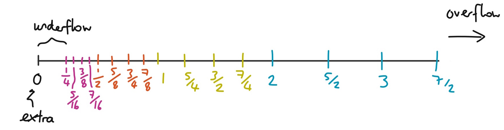
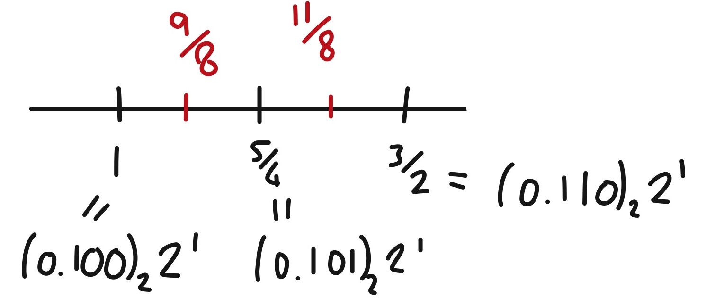
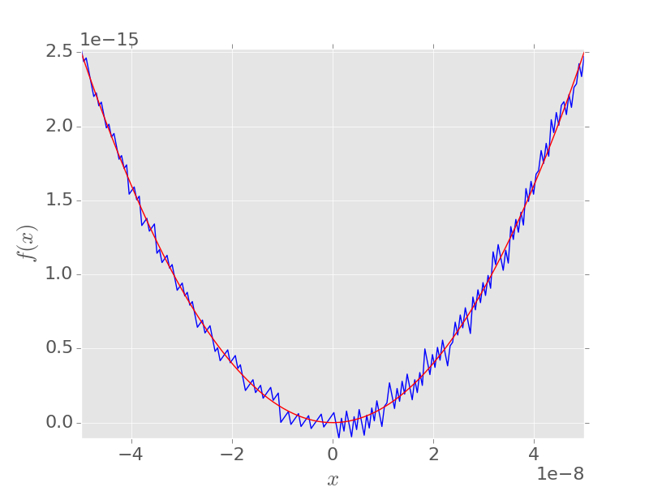
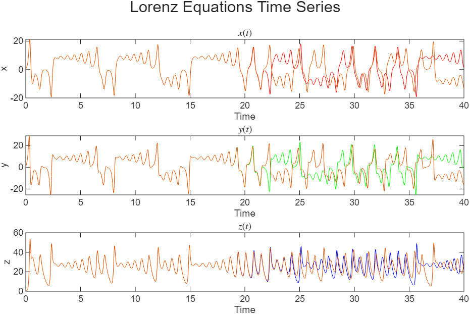

The goal of this chapter is to explore and begin to answer the following question:

> *How do we represent numbers and symbolic expressions on a computer?*

::: {.callout-example title="A surprising calculation"}
In MATLAB, the following comparison returns `0` (false):

```matlab
0.1 + 0.2 == 0.3
```

The numbers $0.1$, $0.2$ and $0.3$ cannot be stored exactly in binary, and the tiny rounding errors mean that the two sides differ by about $5.6\times 10^{-17}$. By the end of this chapter, you will understand why.
:::

Integer arithmetic on a computer is exact, provided the results stay within some maximum size.

::: {.callout-example title="64-bit integers"}
If 1 bit (binary digit) is used to store the sign $\pm$, then the remaining 63 bits can store the magnitude, and the largest possible number is
$$
1\times 2^{62} +1\times 2^{61} + \ldots + 1\times 2^{1} + 1\times 2^{0} = 2^{63}-1.
$$
:::

::: {.callout-note}
Integers in Python have arbitrary precision, so they can grow as large as memory allows. In most other languages, integers have a fixed size and exceeding the range causes an **overflow**: in Java, for example, the result wraps around to a negative number, while MATLAB's fixed-size integer types (such as `int64`) saturate at the largest representable value.
:::

In contrast to the integers, only a subset of the real numbers within any given interval can be represented exactly.

Symbolic expressions representing a range of mathematical objects and operations can also be manipulated exactly using [Computer Algebra Systems (CAS)](https://en.wikipedia.org/wiki/Computer_algebra_system), although such operations are almost always much slower than numerical computations using integer or real-valued numbers. This trade-off between numerical and symbolic computation will be a key theme throughout the course.

## Fixed-point numbers

In everyday life, we tend to use a **fixed-point** representation of real numbers:
$$
x = \pm (d_1d_2\cdots d_{k-1}.d_k\cdots d_n)_\beta, \quad \textrm{where} \quad d_1,\ldots,d_n\in\{0,1,\ldots,\beta - 1\}.
$$
Here $\beta$ is the base (e.g. 10 for decimal arithmetic or 2 for binary). The word *fixed* refers to the position of the point: a fixed-point system uses a fixed number of digits before and after the point, so the numbers it can represent are equally spaced, a distance $\beta^{-(n-k+1)}$ apart.

::: {.callout-example title="$(10.1)_2 = 1\times 2^1 + 0\times 2^0 + 1\times 2^{-1} = 2.5$"}
:::

More generally, if we allow any number of digits and forbid leading zeros (other than a single $0$ before the point for numbers less than $1$), then every real number has a unique representation of this form. The only exception is that a number whose expansion terminates can also be written with an infinite trailing sequence of the digit $\beta - 1$.

::: {.callout-example title="$3.1999\cdots = 3.2$"}
:::

## Floating-point numbers

Computers use a **floating-point** representation. Fix a base $\beta\geq 2$, a number of digits $m$, and an exponent range $e_{\rm min} \leq e \leq e_{\rm max}$. Only numbers in the **floating-point number system** $F\subset\mathbb{R}$ can be represented exactly, where
$$
F = \big\{ \pm (0.d_1d_2\cdots d_{m})_\beta\beta^e \;| \; d_i \in \{0,1,\ldots,\beta-1\}, \; e \in \mathbb{Z}, \; e_{\rm min} \leq e \leq e_{\rm max}\big\}.
$$
Here $(0.d_1d_2\cdots d_{m})_\beta$ is called the **fraction** (or **significand** or **mantissa**), and $e$ is the **exponent**. This can represent a much larger range of numbers than a fixed-point system of the same size, although at the cost that the numbers are not equally spaced. If we require $d_1\neq 0$, then each non-zero number in $F$ has a unique representation and $F$ is called **normalised**. From now on, we assume that $F$ is normalised, with the number $0$ included separately.

::: {.callout-example title="Floating-point number system with $\beta=2$, $m=3$, $e_{\rm min}=-1, e_{\rm max}=2$"}
{width=90% fig-align="center"}
:::

::: {.callout-note}
Notice that the spacing between numbers jumps by a factor $\beta$ at each power of $\beta$. The largest possible number is $(0.111)_22^2 = (\tfrac12 + \tfrac14 + \tfrac18)(4) = \tfrac72$. The smallest non-zero number is $(0.100)_22^{-1}=\tfrac12(\tfrac12) = \tfrac14$.
:::

::: {.callout-example title="IEEE 754 standard for double-precision (64-bit) arithmetic"}
Here $\beta=2$, and there are 52 bits for the fraction, 11 for the exponent, and 1 for the sign. The stored exponent field is $E = (e_1e_2\cdots e_{11})_2 \in [0, 2047]$, and a normalised number has the value
$$
\pm (1.d_1\cdots d_{52})_22^{E-1023} = \pm (0.1d_1\cdots d_{52})_22^{E-1022}.
$$
When $\beta=2$, the first digit of a normalised number is always $1$, so it doesn't need to be stored in memory. The standard's **exponent bias** is 1023; in the $(0.1\cdots)_2$ form used in these notes it becomes 1022, so the exponents $e = E - 1022$ lie in the range $-1022$ to $1025$. The two extreme values of the exponent field are reserved: $E=0$ stores $\pm 0$ and the subnormal numbers (see below), and $E = 2047$ stores $\pm\infty$ and `NaN` ("not a number"). Normalised numbers therefore have exponents from $-1021$ to $1024$.

The smallest positive normalised number in this system is $(0.1)_22^{-1021} \approx 2.225\times 10^{-308}$, and the largest number is $(0.1\cdots 1)_22^{1024} \approx 1.798\times 10^{308}$. In MATLAB, these are returned by `realmin` and `realmax`.
:::

::: {.callout-note}
IEEE stands for Institute of Electrical and Electronics Engineers. The [IEEE 754](https://en.wikipedia.org/wiki/IEEE_754) standard was first published in 1985 (and revised in 2008 and 2019), and is used for floating-point arithmetic by MATLAB, Python and almost all modern hardware. The automatic 1 is sometimes called the "hidden bit". The exponent bias avoids the need to store the sign of the exponent.
:::

Numbers outside the finite set $F$ cannot be represented exactly. If a calculation produces a non-zero result that is smaller in absolute value than the smallest normalised number, it is called **underflow**; IEEE arithmetic first represents such results using subnormal numbers (see below), and results smaller still are rounded to 0. If a result is larger in absolute value than the largest number in $F$, it is called **overflow**; in IEEE arithmetic (and hence in MATLAB), the result is $\pm\infty$, so that `2*realmax` returns `Inf`.

::: {.callout-note}
In IEEE arithmetic, when the exponent field is $E=0$, a zero fraction stores $\pm 0$ (the sign bit gives the sign). The non-zero fractions with $E=0$ store **subnormal** numbers, which have hidden bit $0$ rather than $1$. These fill the gap between 0 and the smallest normalised number (in our toy system above, the gap between $0$ and $\tfrac14$), so that underflow happens gradually.
:::

::: {.callout-note}
**Ariane 5 rocket failure (1996):** The maiden flight ended in failure. Only 40 seconds after initiation, at altitude 3700m, the launcher veered off course and exploded. The cause was a software exception during data conversion from a 64-bit float to a 16-bit integer. The converted number was too large to be represented (an overflow), causing an exception.
:::

The mapping from $\mathbb{R}$ to $F$ is called **rounding** and denoted $\mathrm{fl}(x)$. Usually it is simply the nearest number in $F$ to $x$. If $x$ lies exactly midway between two numbers in $F$, a method of breaking ties is required. The IEEE standard specifies *round to nearest even*—i.e., take the neighbour with last digit 0 in the fraction. Ties are then rounded up and down equally often, which avoids statistical bias or prolonged drift in one direction.

::: {.callout-note}
**Vancouver stock exchange index:** In 1982, the index was established at 1000. By November 1983, it had fallen to 520, even though the exchange seemed to be doing well. Explanation: the index was rounded *down* to 3 digits at every recomputation. Since the errors were always in the same direction, they added up to a large error over time. Upon recalculation, the index doubled!
:::

::: {.callout-example title="Our toy system from earlier"}
{width=70% fig-align="center"}

$\tfrac98 = (1.001)_2$ lies exactly midway between its neighbours $1 = (0.100)_22^1$ and $\tfrac54 = (0.101)_22^1$, so the tie-break rule applies: $1$ has last digit $0$, so $\tfrac98$ is rounded down to $1$.
$\tfrac{11}{8} = (1.011)_2$ lies exactly midway between its neighbours $\tfrac54 = (0.101)_22^1$ and $\tfrac32=(0.110)_22^1$; this time $\tfrac32$ has last digit $0$, so $\tfrac{11}{8}$ is rounded up to $\tfrac32$.
:::

## Significant figures

When doing calculations without a computer, we often use the terminology of **significant figures**. To count the number of significant figures in a number $x$, start with the first non-zero digit from the left, and count all the digits thereafter, including final zeros if they are after the decimal point.

::: {.callout-example title="3.1056, 31.050, 0.031056, 0.031050, and 3105.0 all have 5 significant figures (s.f.)."}
:::

To round $x$ to $n$ s.f., replace $x$ by the nearest number with $n$ s.f. An approximation $\hat{x}$ of $x$ is "correct to $n$ s.f." if both $\hat{x}$ and $x$ round to the same number to $n$ s.f.

## Rounding error

There are two common ways of measuring the error of an approximation in numerical analysis that we will use throughout the course:

::: {.definition}
## Absolute and relative errors
If $x$ is the true value of a number and $\hat{x}$ is an approximation, we define the **absolute error** of this approximation as the quantity
$$
|\hat{x} - x|,
$$
while the **relative error** of the approximation is given by
$$
\frac{|\hat{x} - x|}{|x|},
$$
assuming $x \neq 0$.
:::

::: {.callout-note}
Relative errors are often more useful because they are scale invariant. E.g., an error of 1 hour is irrelevant in estimating the age of a lecture theatre, but catastrophic in timing your arrival at the lecture.
:::

If $|x|$ lies between the smallest non-zero number in $F$ and the largest number in $F$, then we can write
$$
\mathrm{fl}(x) = x(1+\delta), \quad \textrm{where} \quad \delta = \frac{\mathrm{fl}(x) - x}{x},
$$
so that $|\delta|$ is the relative error incurred by rounding.

To bound $|\delta|$, write $x=(0.d_1d_2\cdots)_\beta\beta^e$ with $d_1 \neq 0$ and $e\in[e_{\rm min},e_{\rm max}]$. If $x\notin F$, this significand will not terminate after $m$ digits, but rounding changes it by at most $\tfrac12\beta^{-m}$, so
$$
|\mathrm{fl}(x) - x| \leq \tfrac12\beta^{-m}\beta^e.
$$
Since $d_1 \neq 0$, the significand of $x$ is at least $(0.1)_\beta = \beta^{-1}$, so $|x| \geq \beta^{-1}\beta^e$. Therefore
$$
|\delta| = \frac{|\mathrm{fl}(x) - x|}{|x|} \leq \frac{\tfrac12\beta^{-m}\beta^e}{\beta^{-1}\beta^e} = \tfrac12\beta^{1-m}.
$$
The number $\epsilon_{\rm M} = \tfrac12\beta^{1-m}$ is called the **unit roundoff**, and is independent of $x$. So the relative rounding error satisfies
$$
|\delta| \leq \epsilon_{\rm M}.
$$

::: {.callout-note}
Terminology varies between sources. The distance between 1 and the next larger number in $F$ is $\beta^{1-m} = 2\epsilon_{\rm M}$, and many texts (and MATLAB) call this quantity the **machine epsilon**. Typing `eps` in MATLAB returns $2^{-52} \approx 2.2204\times 10^{-16}$, so the bound on the relative rounding error in double precision is `eps/2`.
:::

::: {.callout-example title="Unit roundoff for our toy system and for IEEE double precision"}
For our system with $\beta=2$, $m=3$, we have $\epsilon_{\rm M} = \tfrac12\cdot 2^{1-3} = \tfrac18$. For IEEE double precision, we have $\beta=2$ and $m=53$ (including the hidden bit), so $\epsilon_{\rm M}=\tfrac12\cdot 2^{1-53}=2^{-53}\approx 1.11\times 10^{-16}$.
:::

When adding/subtracting/multiplying/dividing two numbers in $F$, the result will not be in $F$ in general, so must be rounded.

::: {.callout-example title="Our toy system again ($\beta=2$, $m=3$, $e_{\rm min}=-1$, $e_{\rm max}=2$)"}
Let us multiply $x=\tfrac58$ and $y=\tfrac78$. We have
$$
xy = \tfrac{35}{64} = \tfrac12 + \tfrac1{32} + \tfrac1{64} = (0.100011)_2.
$$
This has too many significant digits to represent in our system, so the best we can do is round the result to $\mathrm{fl}(xy) = (0.100)_2 = \tfrac12$.
:::

::: {.callout-note}
In practice, the hardware effectively computes the exact result (using a few extra digits) and then rounds once, as we did in this example.
:::

For ${\circ} = +,-,\times, \div$, IEEE standard arithmetic requires **correctly rounded** operations: the result must be the exact result rounded to $F$. Provided no overflow or underflow occurs, this means that
$$
\mathrm{fl}(x {\,\circ\,} y) = (x {\,\circ\,} y)(1+\delta), \quad |\delta|\leq\epsilon_{\rm M}.
$$

## Loss of significance

You might think that the above guarantees the accuracy of calculations to within $\epsilon_{\rm M}$, but this is true only if $x$ and $y$ are themselves exact. In reality, we are probably starting from $\bar{x}=x(1+\delta_1)$ and $\bar{y}=y(1 + \delta_2)$, with $|\delta_1|, |\delta_2| \leq \epsilon_{\rm M}$. In that case, there is an error even before we round the result, since
$$
\begin{aligned}
\bar{x} \pm \bar{y} &= x(1+ \delta_1) \pm y(1 + \delta_2)\\
&= (x\pm y)\left(1 + \frac{x\delta_1 \pm y\delta_2}{x\pm y}\right).
\end{aligned}
$$
If the correct answer $x\pm y$ is very small relative to $|x|$ and $|y|$ (for example, when subtracting two nearly equal numbers), then there can be an arbitrarily large relative error in the result, compared to the errors in the initial $\bar{x}$ and $\bar{y}$. In particular, this relative error can be much larger than $\epsilon_{\rm M}$. This is called **loss of significance** (or **catastrophic cancellation**), and is a major cause of errors in floating-point calculations.

::: {.callout-example title="Quadratic formula for solving $x^2 - 56x + 1 = 0$"}
To 4 s.f., the roots are
$$
x_1 = 28 + \sqrt{783} = 55.98, \quad x_2 = 28-\sqrt{783} = 0.01786.
$$
However, working to 4 s.f. we would compute $\sqrt{783} = 27.98$, which would lead to the results
$$
\bar{x}_1 = 55.98, \quad \bar{x}_2 = 0.02000.
$$
The smaller root is not correct to 4 s.f., because of catastrophic cancellation. One way around this is to note that $x^2 - 56x + 1 = (x-x_1)(x-x_2)$, so the product of the roots equals the constant term: $x_1x_2 = 1$. Computing $x_2 = 1/x_1 = 1/55.98 = 0.01786$ then gives the correct answer.
:::

::: {.callout-note}
Note that the error crept in when we rounded $\sqrt{783}$ to $27.98$, because this removed digits that would otherwise have been significant after the subtraction.
:::

::: {.callout-example title="Evaluate $f(x) = e^x - \cos(x) - x$ for $x$ very near zero."}
Let us plot this function in the range $-5\times 10^{-8}\leq x \leq 5\times 10^{-8}$ -- even in IEEE double precision arithmetic we find significant errors, as shown by the blue curve:

{width=70% fig-align="center"}

The problem is that, for such small $x$, we have $e^x \approx 1 + x$ and $\cos(x) \approx 1$, so we are subtracting numbers of size about $1$ to obtain an answer of size about $x^2 \leq 2.5\times 10^{-15}$. The rounding errors in computing $e^x$ and $\cos(x)$ are of size about $\epsilon_{\rm M} \approx 10^{-16}$, which is comparable to the answer itself.

The red curve shows the correct result approximated using the Taylor series
$$
\begin{aligned}
f(x) &= \left(1 + x + \frac{x^2}{2!} + \frac{x^3}{3!} + \ldots\right) - \left( 1 - \frac{x^2}{2!} + \frac{x^4}{4!} - \ldots\right) - x\\
&\approx x^2 + \frac{x^3}{6}.
\end{aligned}
$$
This avoids subtraction of nearly equal numbers. The error made by discarding the higher-order terms of the series is called the **truncation error**; here, the first neglected term is $x^5/120$, which is negligible for such small $x$.
:::

::: {.callout-note}
We will look in more detail at polynomial approximations, including Taylor series, in Chapter 2.
:::

Note that floating-point arithmetic violates many of the usual rules of real arithmetic, such as $(a+b)+c = a + (b+c)$.

::: {.callout-example title="In 2-digit decimal arithmetic,"}
$$
\begin{aligned}
\mathrm{fl}\big[(5.9 + 5.5) + 0.4\big] &= \mathrm{fl}\big[\mathrm{fl}(11.4) + 0.4\big] = \mathrm{fl}(11 + 0.4) = 11,\\
\mathrm{fl}\big[5.9 + (5.5 + 0.4)\big] &= \mathrm{fl}\big[5.9 + 5.9 \big] = \mathrm{fl}(11.8) = 12.
\end{aligned}
$$
:::

::: {.callout-example title="The average of two numbers."}
In $\mathbb{R}$, the average of two numbers always lies between the numbers. But if we work to 3 decimal digits,
$$
\mathrm{fl}\left(\frac{5.01 + 5.02}{2}\right) = \frac{\mathrm{fl}(10.03)}{2} = \frac{10.0}{2} = 5.00,
$$
which lies outside the interval $[5.01, 5.02]$!
:::

The moral of the story is that sometimes care is needed to ensure that we carry out a calculation accurately and as intended!

## Example: Weather Modelling

::: {.callout-example title="The Lorenz equations."}
A very simplistic description of an atmospheric fluid is given by the [Lorenz system of differential equations](https://en.wikipedia.org/wiki/Lorenz_system):
$$
\begin{aligned}
\frac{dx}{dt} &= \sigma(y-x),\\
\frac{dy}{dt} &= x(\rho-z)-y,\\
\frac{dz}{dt} &= xy-\beta z,
\end{aligned}
$$
where $\sigma$, $\rho$, and $\beta$ are positive constants. (Here $\beta$ is a model parameter, unrelated to the floating-point base $\beta$ used earlier in this chapter.)
:::
We will describe how to solve such equations numerically in Chapter 5. For now, let's look at a simulation of these equations computed by just iterating a bunch of addition and multiplication steps:

{width=70% fig-align="center"}

Here we plot all three variables over a particular window of time (loosely corresponding to something between minutes to hours, depending on several details of the physics we are neglecting). For each variable, we have run two simulations with two different values of $\beta$. One simulation has $\beta = 8/3 = 2.66666666666\dots$ and the other has $\beta = 8/3 + 10^{-10} = 2.66666666676\dots$. Nevertheless, you can clearly see that this tiny difference in parameters (well below what is experimentally measurable) has a huge impact on the solution. The reason for this, and a key reason why weather is fundamentally hard to predict, is the existence of [chaos](https://en.wikipedia.org/wiki/Chaos_theory) in many models of physical phenomena. However, truncation errors and floating-point errors also contribute to the discrepancies in this simulation. Indeed, $8/3$ cannot be stored exactly in binary floating point, and rounding errors of size about $\epsilon_{\rm M}$ are introduced at every step; in a chaotic system these grow just like the difference in parameters, so even two runs with identical parameters will eventually diverge if they carry out the same operations in a different order.

The overall lesson of this chapter so far is that small errors can exist due to analytically-understood reasons such as the *truncation error* in a Taylor series approximation, or the *floating-point error* in the numerical methods used. Such errors can not only impact individual calculations, but they can accumulate and entirely change outcomes of simulations, as we will see throughout the course. Nevertheless, computational methods still underlie an enormous range of scientific fields, so understanding these sources of error (and how they can become amplified) is a central theme of this course.

## Exact and symbolic computing

Symbolic computations require different data types from numerical ones; in MATLAB we can use the [Symbolic Math Toolbox](https://uk.mathworks.com/help/symbolic/symbolic-computations-in-matlab.html). In the following chapters, we will compare symbolic and numerical approaches to solving mathematical problems. One key difference is that symbolic computations are exact, but much more expensive to scale up to solve larger problems; for example, we will tackle numerical problems involving matrices of size $10^4 \times 10^4$ or larger, which would not be possible to successfully manipulate symbolically on a modern computer.

::: {.callout-example title="Exact arithmetic in MATLAB"}
Compare the following commands:

```matlab
1/3                          % double precision: displays 0.3333 (rounded)
sym(1)/3                     % symbolic: the exact fraction 1/3
vpa(sym(1)/3, 30)            % 1/3 evaluated to 30 significant digits
isAlways(sym(1)/10 + sym(2)/10 == sym(3)/10)   % returns 1 (true)
```

Unlike `0.1 + 0.2 == 0.3` from the start of the chapter, the symbolic comparison is exact and returns true.
:::

Symbolic computations are used to check or do laborious analytical work, but also to rigorously prove mathematical theorems which would be too onerous to carry out by hand. For instance, while the Lorenz equations above were first noted to have strange dependencies on initial conditions, it was only in 2002 that this was mathematically proved to be a chaotic system. Among other tools, the proof relied on [interval arithmetic](https://en.wikipedia.org/wiki/Interval_arithmetic), which computes intervals that are guaranteed to contain the true result of a calculation, by rounding the lower endpoint of each interval down and the upper endpoint up.

## Knowledge checklist {.unnumbered}

**Key topics:**

1. Integer, fixed-point and floating-point representations of numbers on computers.

2. Absolute and relative errors, rounding, and the unit roundoff (machine epsilon).

3. Overflow, underflow and loss of significance.

4. Symbolic and numerical representations.

**Key skills:**

- Understanding and distinguishing integer, fixed-point, and floating-point representations.

- Analysing the effects of rounding and machine epsilon in calculations.

- Diagnosing and managing rounding errors, overflow, and underflow.

