The goal of this chapter is to explore and begin to answer the following question:

> *How do we represent and manipulate continuous functions on a computer?*

## Interpolation

### Polynomial Interpolation: Motivation

The main idea of this section is to find a polynomial that approximates a general function $f$. But why polynomials? Polynomials have many nice mathematical properties but from the perspective of function approximation, the key one is the following: Any continuous function on a compact interval can be approximated to arbitrary accuracy using a polynomial (provided you are willing to go to a high enough degree).

::: {.theorem #WAT style="font-size:1.0em; font-family:mainfont;"}
## Weierstrass Approximation Theorem (1885)
For any $f\in C([0,1])$ and any $\epsilon > 0$, there exists a polynomial $p(x)$ such that
$$
\max_{0\leq x\leq 1}\big|f(x) - p(x)\big| \leq \epsilon.
$$
:::

::: {.callout-note}
This may be proved using an explicit sequence of polynomials, called Bernstein polynomials. By rescaling, the same result holds on any closed interval $[a,b]$.
:::

If $f$ is a polynomial of degree $n$,
$$
f(x) = p_n(x) = a_0 + a_1x + \ldots + a_nx^n,
$$
then we only need to store the $n+1$ coefficients $a_0,\ldots,a_n$. Operations such as taking the derivative or integrating $f$ are also convenient. On the other hand, polynomials are poor at approximating functions with singularities, such as $1/x$ near $x=0$, since a polynomial is bounded on any bounded interval.

::: {.callout-note}
To approximate functions like $1/x$, there is a well-developed theory of rational function interpolation, which is beyond the scope of this course.
:::

In this chapter, we look for a suitable polynomial $p_n$ by **interpolation**—that is, requiring $p_n(x_i) = f(x_i)$ at a finite set of points $x_i$, usually called **nodes**. Sometimes we will also require the derivative(s) of $p_n$ to match those of $f$. This type of function approximation where we want to match values of the function that we know at particular points is very natural in many applications. For example, weather forecasts involve numerically solving huge systems of partial differential equations (PDEs), which means actually solving them on a discrete grid of points. If we want weather predictions between grid points, we must **interpolate**. @fig-MET shows the spatial resolutions of a range of current and past weather models produced by the UK Met Office.

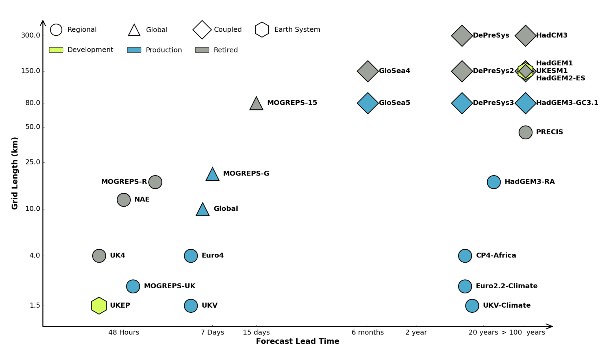{#fig-MET width=85% fig-align="center"}

### Taylor series

A truncated Taylor series is (in some sense) the simplest interpolating polynomial since it uses only a single node $x_0$, although it does require $p_n$ to match both $f$ and some of its derivatives.

::: {.callout-example title="Calculating $\sin(0.1)$ to 6 s.f. by Taylor series."}
We can approximate this using a Taylor series about the point $x_0=0$, which is
$$
\sin(x) = x - \frac{x^3}{3!} + \frac{x^5}{5!} - \frac{x^7}{7!} + \ldots.
$$
This comes from writing
$$
f(x) = a_0 + a_1(x-x_0) + a_2(x-x_0)^2 + \ldots,
$$
then differentiating term-by-term and matching values at $x_0$:
\begin{align*}
f(x_0) &= a_0,\\
f'(x_0) &= a_1,\\
f''(x_0) &= 2a_2,\\
f'''(x_0) &= 3(2)a_3,\\
&\vdots\\
\implies f(x) &= f(x_0) + f'(x_0)(x-x_0) + \frac{f''(x_0)}{2!}(x-x_0)^2 + \frac{f'''(x_0)}{3!}(x-x_0)^3 + \ldots.
\end{align*}
So
\begin{align*}
\textrm{1 term} \;&\implies\; f(0.1) \approx 0.1,\\
\textrm{2 terms} \;&\implies\; f(0.1) \approx 0.1 - \frac{0.1^3}{6} = 0.099833\ldots,\\
\textrm{3 terms} \;&\implies\; f(0.1) \approx 0.1 - \frac{0.1^3}{6} + \frac{0.1^5}{120} = 0.09983341\ldots.\\
\end{align*}
The next term will be $-0.1^7/7! \approx -2\times 10^{-11}$, which won't change the answer to 6 s.f.
:::

::: {.callout-note}
The exact answer is $\sin(0.1)=0.09983341\dots$.
:::

Mathematically, we can write the remainder as follows.

::: {.theorem}
## Taylor's Theorem
Let $f$ be $n+1$ times differentiable on $(a,b)$, and let $f^{(n)}$ be continuous on $[a,b]$. If $x,x_0\in[a,b]$ then there exists $\xi$ between $x_0$ and $x$ such that
$$
f(x) = \sum_{k=0}^n\frac{f^{(k)}(x_0)}{k!}(x-x_0)^k \; + \; \frac{f^{(n+1)}(\xi)}{(n+1)!}(x-x_0)^{n+1}.
$$
:::
The sum is called the **Taylor polynomial** of degree $n$, and the last term is called the **Lagrange form** of the remainder. Note that the unknown number $\xi$ depends on $x$.

::: {.callout-example title="We can use the Lagrange remainder to bound the error in our approximation."}
For $f(x)=\sin(x)$, we found the Taylor polynomial $x - x^3/3! + x^5/5!$. Since the $x^6$ term in the Taylor series of $\sin(x)$ is zero, this is also the Taylor polynomial of degree 6, $p_6(x)$. So we may use the remainder with $n=6$, which involves $f^{(7)}(x)=-\cos(x)$:
$$
\big|f(x) - p_6(x)\big| = \left|\frac{f^{(7)}(\xi)}{7!}(x-x_0)^7\right|
$$
for some $\xi$ between $x_0$ and $x$. For $x=0.1$, we have
$$
\big|f(0.1) - p_6(0.1)\big| = \frac{1}{5040}(0.1)^7\big|f^{(7)}(\xi)\big| \quad \textrm{for some $\xi\in[0,0.1]$}.
$$
Since $\big|f^{(7)}(\xi)\big| = \big|\cos(\xi)\big| \leq 1$, we can say, before calculating, that the error satisfies
$$
\big|f(0.1) - p_6(0.1)\big| \leq 1.984\times 10^{-11}.
$$
:::

::: {.callout-note}
The actual error is $1.984\times 10^{-11}$ (to 4 s.f.), so this is a tight estimate: $\cos(\xi)\approx 1$ for $\xi\in[0,0.1]$.
:::

Since this error arises from approximating $f$ with a truncated series, rather than due to rounding, it is known as **truncation error**. Note that it tends to be lower if you use more terms (larger $n$), or if the function oscillates less (smaller $f^{(n+1)}$ on the interval $(x_0,x)$).

Error estimates like the Lagrange remainder play an important role in numerical analysis and computation. Note that Taylor's theorem does not tell us the value of $\xi$, so in practice we must take a worst-case estimate to get an error bound, i.e., use the maximum value of $|f^{(n+1)}|$ over the interval between $x_0$ and $x$.

::: {.callout-note}
The proof of Taylor's theorem (and of the interpolation error theorem below) uses repeated application of Rolle's theorem: if $f$ is continuous on $[a,b]$ and differentiable on $(a,b)$, with $f(a)=f(b)=0$, then there exists $\xi\in(a,b)$ with $f'(\xi)=0$.
:::

### Polynomial Interpolation

The classical problem of **polynomial interpolation** is to find a polynomial
$$
p_n(x) = a_0 + a_1x + \ldots + a_n x^n = \sum_{k=0}^n a_k x^k
$$
that interpolates our function $f$ at $n+1$ distinct nodes $x_0, x_1, \ldots, x_n$. In other words, $p_n(x_i)=f(x_i)$ at each of the nodes $x_i$. Since the polynomial has $n+1$ unknown coefficients, we need $n+1$ conditions, one for each node.

::: {.callout-example title="Linear interpolation ($n=1$)"}
Here we have two nodes $x_0$, $x_1$, and seek a polynomial $p_1(x) = a_0 + a_1x$. Then the interpolation conditions require that
$$
\begin{cases}
p_1(x_0) = a_0 + a_1x_0 = f(x_0)\\
p_1(x_1) = a_0 + a_1x_1 = f(x_1)
\end{cases}
\implies\quad
p_1(x) = \frac{x_1f(x_0) - x_0f(x_1)}{x_1 - x_0} + \frac{f(x_1) - f(x_0)}{x_1 - x_0}x.
$$
:::

For general $n$, the interpolation conditions require
$$
\begin{matrix}
a_0 &+ a_1x_0 &+ a_2x_0^2 &+ \ldots &+ a_nx_0^n &= f(x_0),\\
a_0 &+ a_1x_1 &+ a_2x_1^2 &+ \ldots &+ a_nx_1^n &= f(x_1),\\
\vdots  & \vdots  & \vdots     &        &\vdots      & \vdots\\
a_0 &+ a_1x_n &+ a_2x_n^2 &+ \ldots &+ a_nx_n^n &= f(x_n),
\end{matrix}
$$
so we have to solve
$$
\underbrace{\begin{pmatrix}
1 & x_0 & x_0^2 & \cdots & x_0^n\\
1 & x_1 & x_1^2 & \cdots & x_1^n\\
\vdots & \vdots &\vdots& & \vdots\\
1 & x_n & x_n^2 & \cdots & x_n^n\\
\end{pmatrix}}_{V}
\begin{pmatrix}
a_0\\ a_1\\ \vdots\\ a_n
\end{pmatrix}
=
\begin{pmatrix}
f(x_0)\\ f(x_1)\\ \vdots\\ f(x_n)
\end{pmatrix}.
$$
The matrix $V$ is called a **Vandermonde matrix**. Its determinant is $\det(V) = \prod_{0\leq i < j\leq n} (x_j - x_i)$, which is non-zero provided the nodes are all distinct, so the system has a unique solution. This establishes an important result, where $\mathcal{P}_n$ denotes the space of all real polynomials of degree $\leq n$.

::: {.theorem}
#### Existence/uniqueness
Given $n+1$ distinct nodes $x_0, x_1, \ldots, x_n$, there is a unique polynomial $p_n\in\mathcal{P}_n$ that interpolates $f(x)$ at these nodes.
:::

We may also prove uniqueness by the following elegant argument.

**Proof (Uniqueness part of Existence/Uniqueness Theorem):**
Suppose that in addition to $p_n$ there is another interpolating polynomial $q_n\in\mathcal{P}_n$. Then the difference $r_n := p_n - q_n$ is also a polynomial with degree $\leq n$. But we have
$$
r_n(x_i) = p_n(x_i) - q_n(x_i) = f(x_i)-f(x_i)=0 \quad \textrm{for $i=0,\ldots,n$},
$$
so $r_n(x)$ has $n+1$ roots. A non-zero polynomial of degree $\leq n$ has at most $n$ roots, so we must have $r_n(x)\equiv 0$, which implies that $q_n=p_n$.

::: {.callout-note}
Note that the unique polynomial through $n+1$ points may have degree $< n$. This happens when $a_n=0$ in the solution to the Vandermonde system above.
:::

::: {.eg }
## Interpolate $f(x)=\cos(x)$ with $p_2\in\mathcal{P}_2$ at the nodes $\{0, \tfrac{\pi}{2}, \pi\}$.

We have $x_0=0$, $x_1=\tfrac{\pi}{2}$, $x_2=\pi$, so $f(x_0)=1$, $f(x_1)=0$, $f(x_2)=-1$. Clearly the unique interpolant is a straight line $p_2(x) = 1 - \tfrac2\pi x$.

If we took the nodes $\{0,2\pi,4\pi\}$, we would get a constant function $p_2(x)=1$.

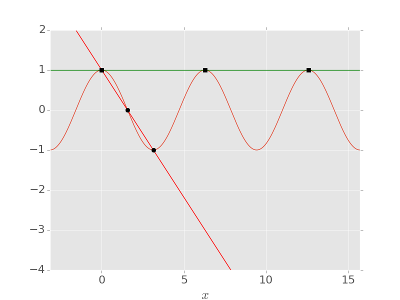{width=70% fig-align="center"}
:::

One way to compute the interpolating polynomial would be to solve the Vandermonde system above, e.g. by Gaussian elimination. However, this is not recommended: as $n$ grows, the Vandermonde matrix becomes very badly conditioned, meaning that small rounding errors in the data can produce large errors in the computed coefficients (we will make this precise in Chapter 3). In practice, we choose a different basis for $p_n$.

::: {.callout-note}
The Vandermonde matrix arises when we write $p_n$ in the **natural basis** $\{1,x,x^2,\ldots\}$, but we could also choose to work in some other basis...
:::

::: {.eg title="MATLAB demonstration: the Vandermonde approach"}
MATLAB's `vander` builds the Vandermonde matrix (with the columns in the order $x^n, \ldots, x, 1$, which is the order that `polyval` expects for the coefficients):

```matlab
% Quadratic interpolant of cos(x) at three nodes
x = linspace(-pi/4, pi/4, 3)';
a = vander(x) \ cos(x);           % coefficients, highest power first
xx = linspace(-1, 1, 200);
figure
plot(xx, cos(xx), 'LineWidth', 3), hold on
plot(xx, polyval(a, xx), '--', 'LineWidth', 3)
plot(x, cos(x), 'ko', 'MarkerSize', 10, 'MarkerFaceColor', 'k'), hold off
legend('f(x) = cos(x)', 'interpolant p_2(x)', 'nodes', 'Location', 'south')
xlabel('x'), ylabel('y'), set(gca, 'FontSize', 18), grid on

% The condition number grows rapidly with n
for n = [5 10 20 30]
    x = linspace(-1, 1, n+1)';
    fprintf('n = %2d, cond(V) = %.2e\n', n, cond(vander(x)));
end
```
:::

### Lagrange Polynomials {#sec-polylag}

This uses a special basis of polynomials $\{\ell_k\}$ in which the interpolation equations reduce to the identity matrix. In other words, the coefficients in this basis are just the function values,
$$
p_n(x) = \sum_{k=0}^n f(x_k)\ell_k(x).
$$

::: {.eg title="Linear interpolation again."}
We can re-write our linear interpolant to separate out the function values:
$$
p_1(x) = \underbrace{\frac{x - x_1}{x_0 - x_1}}_{\ell_0(x)}f(x_0) + \underbrace{\frac{x-x_0}{x_1-x_0}}_{\ell_1(x)}f(x_1).
$$
Then $\ell_0$ and $\ell_1$ form the necessary basis. In particular, they have the property that
$$
\ell_0(x_i) = \begin{cases}
1 & \textrm{if $i=0$},\\
0 & \textrm{if $i=1$},
\end{cases}
\qquad
\ell_1(x_i) = \begin{cases}
0 & \textrm{if $i=0$},\\
1 & \textrm{if $i=1$},
\end{cases}
$$
:::

For general $n$, the $n+1$ **Lagrange polynomials** are defined as a product
$$
\ell_k(x) = \prod_{\substack{j=0\\j\neq k}}^n\frac{x - x_j}{x_k - x_j}.
$$
By construction, they have the property that
$$
\ell_k(x_i) = \begin{cases}
1 & \textrm{if $i=k$},\\
0 & \textrm{otherwise}.
\end{cases}
$$
From this, it follows that the interpolating polynomial may be written as above.

::: {.callout-note}
By the Existence/Uniqueness Theorem, the Lagrange polynomials are the *unique* polynomials in $\mathcal{P}_n$ with this property.
:::

::: {.eg}
## Compute the quadratic interpolating polynomial to $f(x)=\cos(x)$ with nodes $\{-\tfrac\pi4, 0, \tfrac\pi4\}$ using Lagrange polynomials.

The Lagrange polynomials of degree 2 for these nodes are
$$
\begin{aligned}
\ell_0(x) &= \frac{(x-x_1)(x-x_2)}{(x_0-x_1)(x_0-x_2)} = \frac{x(x-\tfrac\pi4)}{\tfrac\pi4\cdot\tfrac\pi2},\\
\ell_1(x) &= \frac{(x-x_0)(x-x_2)}{(x_1-x_0)(x_1-x_2)} = \frac{(x+\tfrac\pi4)(x-\tfrac\pi4)}{-\tfrac\pi4\cdot\tfrac\pi4},\\
\ell_2(x) &= \frac{(x-x_0)(x-x_1)}{(x_2-x_0)(x_2-x_1)}\\
&= \frac{x(x+\tfrac\pi4)}{\tfrac\pi2\cdot\tfrac\pi4}.
\end{aligned}
$$
So the interpolating polynomial is
$$
\begin{aligned}
p_2(x) &= f(x_0)\ell_0(x) + f(x_1)\ell_1(x) + f(x_2)\ell_2(x)\\
&= \tfrac{1}{\sqrt{2}}\tfrac8{\pi^2}x(x-\tfrac\pi4) - \tfrac{16}{\pi^2}(x+\tfrac\pi4)(x-\tfrac\pi4) +\tfrac{1}{\sqrt{2}}\tfrac8{\pi^2}x(x+\tfrac\pi4) = \tfrac{16}{\pi^2}\big(\tfrac{1}{\sqrt{2}} - 1\big)x^2 + 1.
\end{aligned}
$$
The Lagrange polynomials and the resulting interpolant are shown below:

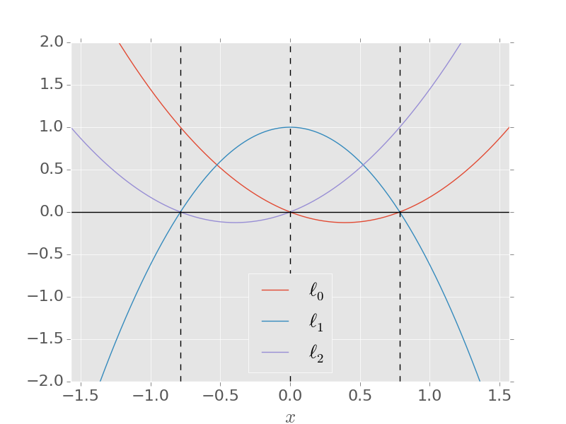{width=45%}
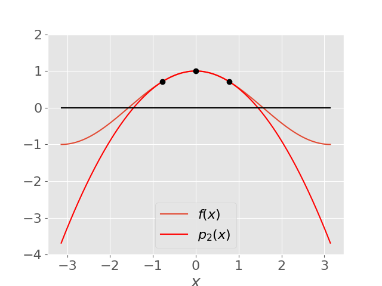{width=45%}
:::

::: {.callout-note}
Lagrange polynomials were actually discovered by Edward Waring in 1776 and rediscovered by Euler in 1783, before they were published by Lagrange himself in 1795; a classic example of Stigler's law of eponymy!
:::

::: {.eg title="MATLAB demonstration: plotting the Lagrange basis"}
```matlab
x = [-pi/4, 0, pi/4];             % nodes
xx = linspace(-1, 1, 200);
figure, hold on
for k = 1:length(x)
    others = x([1:k-1, k+1:end]);
    ell_k = prod((xx' - others) ./ (x(k) - others), 2);   % l_k evaluated on the grid
    plot(xx, ell_k, 'LineWidth', 3, 'DisplayName', sprintf('$\\ell_%d(x)$', k-1))
end
plot(x, zeros(size(x)), 'ko', 'MarkerSize', 10, 'MarkerFaceColor', 'k', 'DisplayName', 'nodes')
hold off
legend('Interpreter', 'latex', 'Location', 'southoutside', 'Orientation', 'horizontal')
xlabel('x'), set(gca, 'FontSize', 18), grid on
```
:::

The Lagrange form of the interpolating polynomial is easy to write down, but changing any of the nodes means that the $\ell_k$ must all be recomputed from scratch, and similarly for adding a new node (moving to higher degree). An alternative basis, due to Newton, builds up $p_n$ one node at a time so that adding a node is cheap; we will not need it in this course.

### Interpolation Error

The goal here is to estimate the error $|f(x)-p_n(x)|$ when we approximate a function $f$ by a polynomial interpolant $p_n$. Clearly this will depend on $x$.

::: {.eg}
## Quadratic interpolant for $f(x)=\cos(x)$ with $\{-\tfrac\pi4,0,\tfrac\pi4\}$.

From @sec-polylag, we have $p_2(x) = \tfrac{16}{\pi^2}\left(\tfrac{1}{\sqrt{2}}-1\right)x^2 + 1$, so the error is
$$
|f(x) - p_2(x)| = \left|\cos(x) -  \tfrac{16}{\pi^2}\left(\tfrac{1}{\sqrt{2}}-1\right)x^2 - 1\right|.
$$
This is shown below:

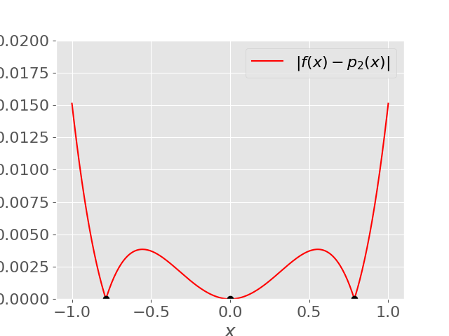{width=70% fig-align="center"}

Clearly the error vanishes at the nodes themselves, but note that it generally does better near the middle of the set of nodes — this is quite typical behaviour.
:::

There is an error formula for interpolation that is analogous to Taylor's theorem (and its proof again uses Rolle's theorem).

::: {.theorem}
#### Cauchy's Interpolation Error Theorem
Let $p_n\in{\cal P}_n$ be the unique polynomial interpolating $f(x)$ at the $n+1$ distinct nodes $x_0, x_1, \ldots, x_n \in [a,b]$, and let $f$ be continuous on $[a,b]$ with $n+1$ continuous derivatives on $(a,b)$. Then for each $x\in[a,b]$ there exists $\xi\in(a,b)$ such that
$$
f(x) - p_n(x) = \frac{f^{(n+1)}(\xi)}{(n+1)!}(x-x_0)(x-x_1)\cdots(x-x_n).
$$
:::

This looks similar to the error formula for Taylor polynomials (see Taylor's Theorem). But now the error vanishes at multiple nodes rather than just at $x_0$.

From the formula, you can see that the error will be larger for a more "wiggly" function, where the derivative $f^{(n+1)}$ is larger. It might also appear that the error will go down as the number of nodes $n$ increases; we will see in @sec-chebyshev that this is not always true.

::: {.callout-note}
As in Taylor's theorem, note the appearance of an undetermined point $\xi$. This will prevent us knowing the error exactly, but we can make an estimate as before.
:::

::: {.eg}
## Quadratic interpolant for $f(x)=\cos(x)$ with $\{-\tfrac\pi4,0,\tfrac\pi4\}$.

For $n=2$, Cauchy's Interpolation Error Theorem says that
$$
f(x) - p_2(x) = \frac{f^{(3)}(\xi)}{6}x(x+\tfrac\pi4)(x-\tfrac\pi4) = \tfrac16\sin(\xi)x(x+\tfrac\pi4)(x-\tfrac\pi4),
$$
for some $\xi$ in the smallest interval containing both $x$ and the nodes. For $x\in[-1,1]$, this means that $\xi\in[-1,1]$.

For an upper bound on the error at a particular $x$, we can just use $|\sin(\xi)|\leq 1$ and plug in $x$.

To bound the maximum error within the interval $[-1,1]$, let us maximise the polynomial $w(x)=x(x+\tfrac\pi4)(x-\tfrac\pi4)$. We have $w'(x) = 3x^2 - \tfrac{\pi^2}{16}$ so turning points are at $x=\pm\tfrac\pi{4\sqrt{3}}$. We have
$$
w(-\tfrac\pi{4\sqrt{3}}) = 0.186\ldots, \quad
w(\tfrac\pi{4\sqrt{3}}) = -0.186\ldots, \quad
w(-1) = -0.383\ldots, \quad w(1) = 0.383\ldots.
$$

So our error estimate for $x\in[-1,1]$ is
$$
|f(x) - p_2(x)| \leq \tfrac16(0.383) = 0.0638\ldots
$$

From the plot earlier, we see that this bound is satisfied (as it has to be), although not tight.
:::

### Node Placement: Chebyshev nodes {#sec-chebyshev}

You might expect polynomial interpolation to *converge* as $n\to\infty$. Surprisingly, this is not the case if you take **equally-spaced** nodes $x_i$. This was shown by Runge in a famous 1901 paper.

::: {.eg}
## The Runge function $f(x) = 1/(1 + 25x^2)$ on $[-1,1]$.

Here are illustrations of $p_n$ for increasing $n$:

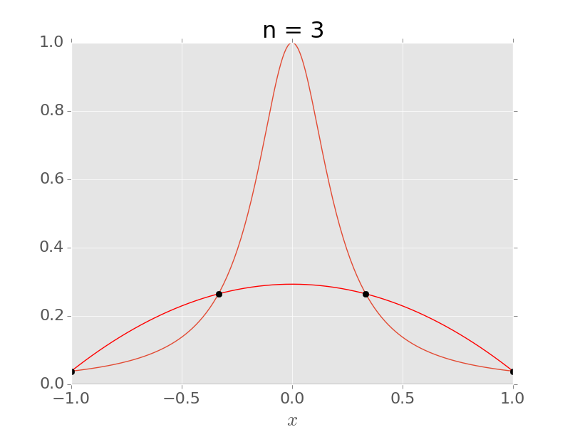{width=45%}
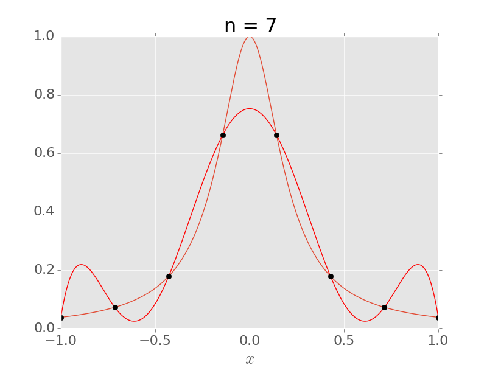{width=45%}
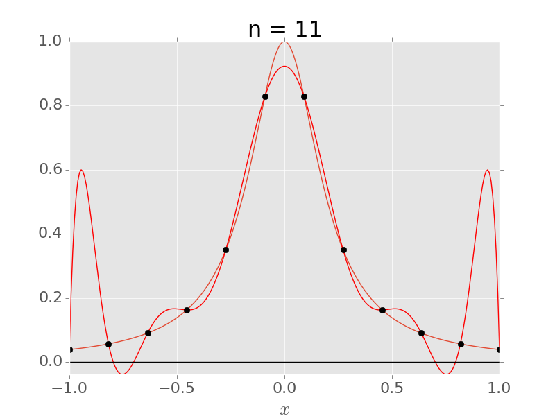{width=45%}
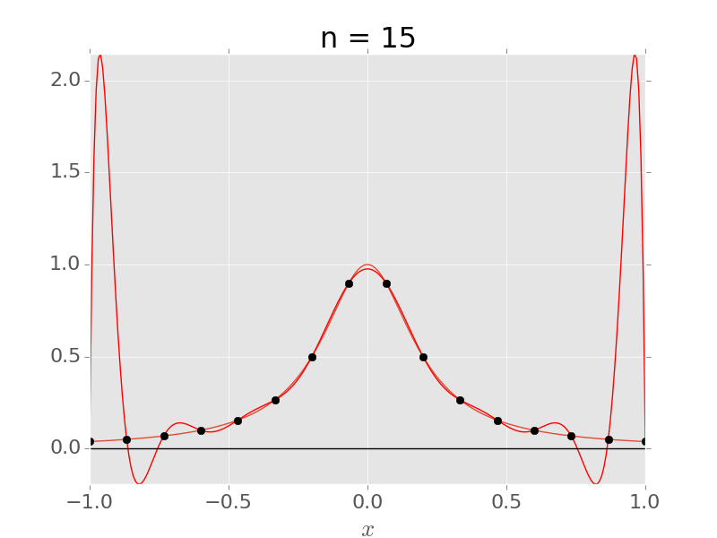{width=45%}

Notice that $p_n$ is converging to $f$ in the middle, but diverging more and more near the ends, even within the interval $[x_0,x_n]$. This is called the **Runge phenomenon**.
:::

::: {.callout-note}
A full mathematical explanation for this divergence usually uses complex analysis — see Chapter 13 of *Approximation Theory and Approximation Practice* by L.N. Trefethen (SIAM, 2013). For a more elementary proof, see [this StackExchange post](http://math.stackexchange.com/questions/775405/).
:::

The problem is (largely) coming from the **node polynomial**
$$
w(x) = \prod_{i=0}^n(x-x_i),
$$
which appears in the interpolation error formula. For equally spaced nodes, $|w(x)|$ is much larger near the ends of the interval than in the middle. We can avoid the Runge phenomenon by choosing different nodes $x_i$ that are **not uniformly spaced**.

Since the problems are occurring near the ends of the interval, it would be logical to put more nodes there. A good choice is given by taking equally-spaced points on the unit circle $|z|=1$, and projecting to the real line:

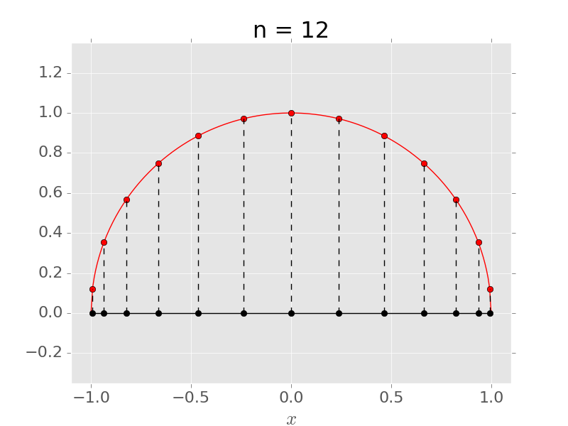{width=60% fig-align="center"}

The points around the circle are
$$
\phi_j = \frac{(2j+1)\pi}{2(n+1)}, \quad j=0,\ldots,n,
$$
so the corresponding **Chebyshev nodes** are
$$
x_j = \cos\left[\frac{(2j + 1)\pi}{2(n+1)}\right], \quad j=0,\ldots,n.
$$

::: {.eg}
## The Runge function $f(x) = 1/(1+25x^2)$ on $[-1,1]$ using the Chebyshev nodes.

For $n=3$, the nodes are $x_0=\cos(\tfrac\pi8)$, $x_1=\cos(\tfrac{3\pi}{8})$, $x_2=\cos(\tfrac{5\pi}{8})$, $x_3=\cos(\tfrac{7\pi}{8})$.

Below we illustrate the resulting interpolant for $n=15$:

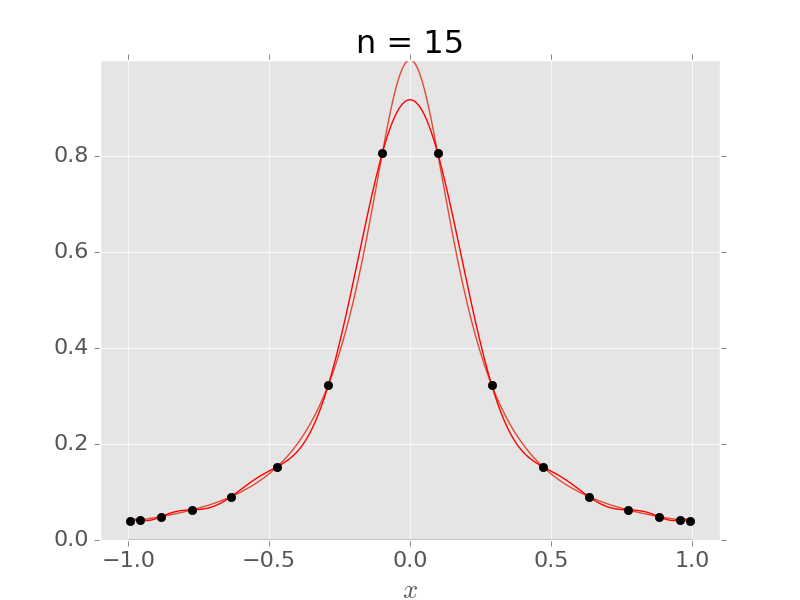{width=50% fig-align="center"}

Compare this to the example with equally spaced nodes.
:::

In fact, the Chebyshev nodes are, in one sense, an optimal choice. They are the zeros of the **Chebyshev polynomial** $T_{n+1}(x) = \cos\big((n+1)\arccos(x)\big)$, and it can be shown that, among all choices of $n+1$ nodes in $[-1,1]$, they minimise $\max_{[-1,1]}|w(x)|$, giving $\max_{[-1,1]}|w(x)| = 2^{-n}$. Combined with the interpolation error theorem, this gives
$$
\max_{[-1,1]}|f(x) - p_n(x)| \leq \frac{1}{2^n(n+1)!}\max_{[-1,1]}\big|f^{(n+1)}\big|.
$$
So if all the derivatives of $f$ are bounded by the same constant $M$ on $[-1,1]$ (as for $\sin(x)$, $\cos(x)$ or $e^x$), the error tends to zero as $n\to\infty$.

::: {.callout-note}
For the Runge function, the derivatives $f^{(n+1)}$ grow very rapidly with $n$, so this bound alone does not explain the convergence seen above with Chebyshev nodes; a full explanation again uses complex analysis (see Trefethen's book).
:::

::: {.eg title="MATLAB demonstration: equally spaced vs Chebyshev nodes"}
```matlab
f = @(x) 1 ./ (1 + 25*x.^2);      % Runge function
xx = linspace(-1, 1, 1000);
for n = [5 10 15 20]
    xe = linspace(-1, 1, n+1);                 % equally spaced nodes
    xc = cos((2*(0:n) + 1)*pi / (2*(n+1)));    % Chebyshev nodes
    pe = polyval(polyfit(xe, f(xe), n), xx);
    pc = polyval(polyfit(xc, f(xc), n), xx);
    fprintf('n = %2d: max error equispaced %.2e, Chebyshev %.2e\n', ...
        n, max(abs(f(xx) - pe)), max(abs(f(xx) - pc)));
end

% Side-by-side plots for n = 15
n = 15;
xe = linspace(-1, 1, n+1);
xc = cos((2*(0:n) + 1)*pi / (2*(n+1)));
nodes = {xe, xc};
titles = {'Equally spaced nodes', 'Chebyshev nodes'};
figure
for j = 1:2
    subplot(1, 2, j)
    xn = nodes{j};
    plot(xx, f(xx), 'LineWidth', 3), hold on
    plot(xx, polyval(polyfit(xn, f(xn), n), xx), '--', 'LineWidth', 3)
    plot(xn, f(xn), 'ko', 'MarkerSize', 8, 'MarkerFaceColor', 'k'), hold off
    ylim([-0.5 2.5]), grid on
    title(sprintf('%s, n = %d', titles{j}, n))
    legend('Runge function f(x)', 'interpolant p_n(x)', 'nodes', 'Location', 'north')
    xlabel('x'), set(gca, 'FontSize', 18)
end
```
For larger $n$, MATLAB may warn that the polynomial is badly conditioned: `polyfit` works in the natural basis, so this is the Vandermonde problem from earlier.
:::

## Nonlinear Equations

> *How do we find roots of nonlinear equations?*

Given a general equation
$$
f(x) = 0,
$$
there will usually be no explicit formula for the root(s) $x_*$, so we must use an iterative method.

Rootfinding is a delicate business, and it is essential to begin by plotting a graph of $f(x)$, so that you can tell whether the answer you get from your numerical method is correct.

::: {.eg}
## $f(x) = \frac{1}{x} - a$, for $a > 0$.
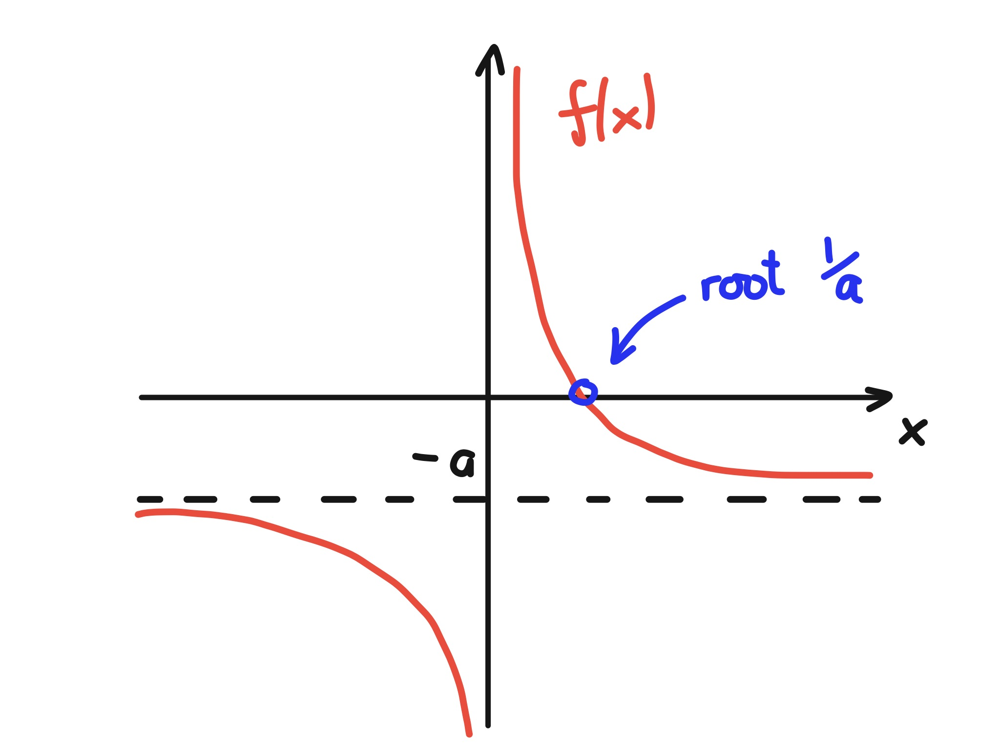{width=60% fig-align="center"}

Clearly we know the root is exactly $x_* = \frac{1}{a}$, but this will serve as a running example to test some of our methods.
:::

### Interval Bisection

If $f$ is continuous and we can find an interval where it changes sign, then it must have a root in this interval. Formally, this is based on:

::: {.theorem}
#### Intermediate Value Theorem
If $f$ is continuous on $[a,b]$ and $c$ lies between $f(a)$ and $f(b)$, then there is at least one point $x\in[a,b]$ such that $f(x)=c$.
:::

If $f(a)f(b)<0$, then $f$ changes sign at least once in $[a,b]$, so by the Intermediate Value Theorem there must be a point $x_*\in[a,b]$ where $f(x_*)=0$.

We can turn this into the following iterative algorithm:

::: {.algorithm title="Interval bisection"}
Let $f$ be continuous on $[a_0,b_0]$, with $f(a_0)f(b_0)<0$.

- At each step, set $m_k = (a_k + b_k)/2$.
- If $f(a_k)f(m_k)\geq 0$ then set $a_{k+1}=m_k$, $b_{k+1}=b_k$, otherwise set $a_{k+1}=a_k$, $b_{k+1}=m_k$.
- Stop when $f(m_k)=0$ or when $(b_k-a_k)/2$ is smaller than a chosen tolerance, and return $m_k$.
:::

::: {.eg}
## $f(x)=\tfrac1x - 0.5$.

1. Try $a_0=1$, $b_0=3$ so that $f(a_0)f(b_0)=0.5(-0.1666) < 0$.
   Now the midpoint is $m_0=(1 + 3)/2 = 2$, with $f(m_0)=0$.
   We are lucky and have already stumbled on the root $x_*=m_0=2$!

2. Suppose we had tried $a_0=1.5$, $b_0=3$, so  $f(a_0)=0.1666$ and $f(b_0)=-0.1666$, and again $f(a_0)f(b_0)<0$.
   Now $m_0 = 2.25$, $f(m_0)=-0.0555$. We have $f(a_0)f(m_0) < 0$, so we set $a_1 = a_0=1.5$ and $b_1 = m_0=2.25$. The root must lie in $[1.5,2.25]$.
   Now $m_1 = 1.875$, $f(m_1)=0.0333$, and $f(a_1)f(m_1)>0$, so we take $a_2 = m_1=1.875$, $b_2 = b_1=2.25$. The root must lie in $[1.875,2.25]$.
   We can continue this algorithm, halving the length of the interval each time.
:::

Since the interval halves in size at each iteration, and always contains a root, we are guaranteed to converge to a root provided that $f$ is continuous on $[a_0,b_0]$. Stopping at step $k$, we get the minimum possible error by choosing $m_k$ as our approximation.

::: {.eg}
## Same example with initial interval $[-0.5,0.5]$.
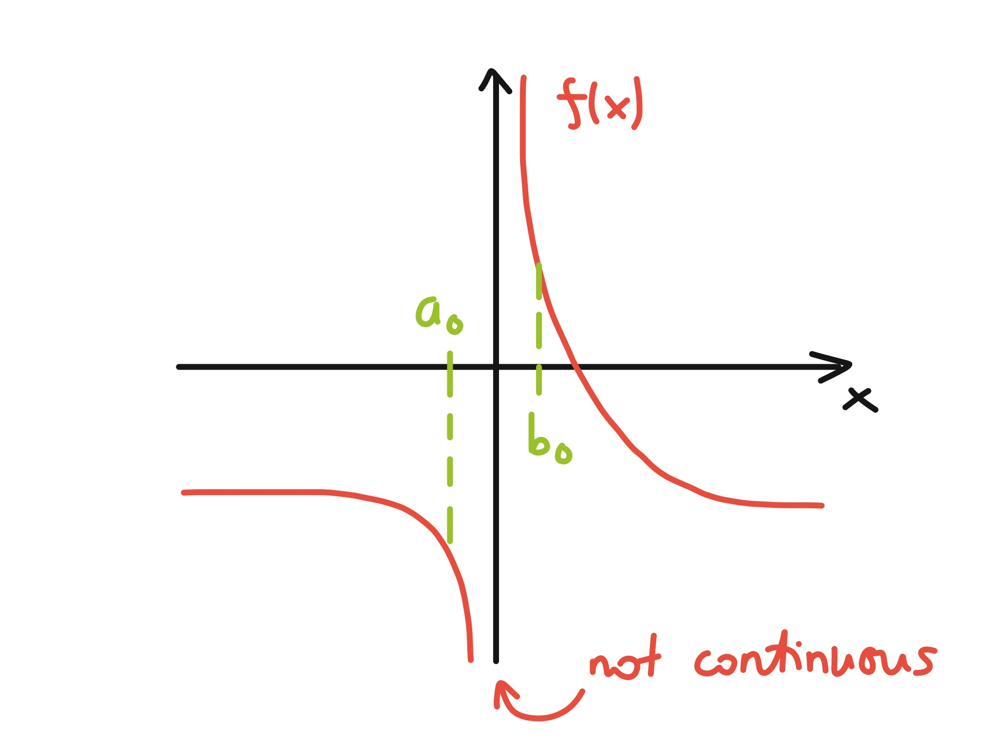{width=70% fig-align="center"}

In this case $f(a_0)f(b_0)<0$, but there is no root in the interval. This is because $f$ is not continuous on $[-0.5,0.5]$ (it has a singularity at $x=0$), so the Intermediate Value Theorem does not apply. Bisection will instead converge to the discontinuity at $x=0$.
:::

The rate of convergence is steady, so we can pre-determine how many iterations will be needed to converge to a given accuracy. After $k$ iterations, the interval has length
$$
|b_k - a_k| = \frac{|b_0 - a_0|}{2^k},
$$
so the error in the mid-point satisfies
$$
|m_k - x_*| \leq \frac{|b_0 - a_0|}{2^{k+1}}.
$$
In order for $|m_k - x_*| \leq \delta$, it is enough that
$$
\frac{|b_0 - a_0|}{2^{k+1}} \leq \delta \quad \iff \quad \log|b_0-a_0| - (k+1)\log(2) \leq \log(\delta) \quad \iff \quad k \geq \frac{\log|b_0-a_0| - \log(\delta)}{\log(2)} - 1.
$$

::: {.eg}
## Previous example continued

With $a_0=1.5$, $b_0=3$, as in the above example, then for $\delta = \epsilon_{\rm M}=1.1\times 10^{-16}$ we would need
$$
k \geq \frac{\log(1.5) - \log(1.1\times 10^{-16})}{\log(2)}-1 \quad \implies k \geq 53 \textrm{ iterations}.
$$
:::

::: {.callout-note}
This convergence is pretty slow, but the method has the advantage of being very robust (i.e., use it if all else fails...). It has the more serious disadvantage of *only working in one dimension*.
:::

### Fixed point iteration

This is a very common type of rootfinding method. The idea is to transform $f(x)=0$ into the form $g(x)=x$, so that a root $x_*$ of $f$ is a **fixed point** of $g$, meaning $g(x_*)=x_*$. To find $x_*$, we start from some initial guess $x_0$ and iterate
$$
x_{k+1} = g(x_k)
$$
until $|x_{k+1}-x_k|$ is sufficiently small. For a given equation $f(x)=0$, there are many ways to transform it into the form $x=g(x)$. Only some will result in a convergent iteration.

::: {.eg}
## $f(x)=x^2-2x-3$.
Note that the roots are $-1$ and $3$. Consider some different rearrangements, with $x_0=0$.

(a) $g(x) = \sqrt{2x+3}$, gives $x_k\to 3$ [to machine accuracy after 33 iterations].

(b) $g(x) = 3/(x-2)$, gives $x_k\to -1$ [to machine accuracy after 33 iterations].

(c) $g(x) = (x^2 - 3)/2$, gives $x_k\to -1$ [but very slowly!].

(d) $g(x) = x^2 - x - 3$, gives $x_k\to\infty$.

(e) $g(x) = (x^2+3)/(2x-2)$, gives $x_k\to -1$ [to machine accuracy after 5 iterations].

If instead we take $x_0=42$, then (a) and (b) still converge to the same roots, (c) now diverges, (d) still diverges, and (e) now converges to the other root $x_k\to 3$.
:::

::: {.eg title="MATLAB demonstration: comparing the rearrangements"}
```matlab
g = {@(x) sqrt(2*x + 3), @(x) 3./(x - 2), @(x) (x.^2 - 3)/2, ...
     @(x) x.^2 - x - 3,  @(x) (x.^2 + 3)./(2*x - 2)};
labels = 'abcde';
for j = 1:5
    x = 0;                                     % initial guess
    for k = 1:50
        x = g{j}(x);
    end
    fprintf('(%c): x_50 = %g\n', labels(j), x);
end
```
:::

In this section, we will consider which iterations will converge, before addressing the *rate* of convergence in @sec-order.

One way to ensure that the iteration will work is to find a **contraction mapping** $g$, which is a map $L\to L$ (for some closed interval $L$) satisfying
$$
|g(x)-g(y)| \leq \lambda|x-y|
$$
for some $\lambda < 1$ and for all $x$, $y \in L$. The sketch below shows the idea:

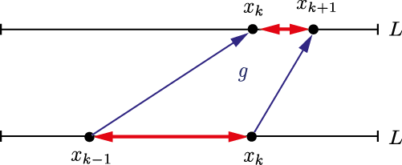{width=70% fig-align="center"}

::: {.theorem}
#### Contraction Mapping Theorem
If $g$ is a contraction mapping on $L=[a,b]$, then
1. There exists a unique fixed point $x_*\in L$ with $g(x_*)=x_*$.
2. For any $x_0\in L$, the iteration $x_{k+1}=g(x_k)$ will converge to $x_*$ as $k\to\infty$.
:::

::: {.callout-note collapse="true" title="Proof (non-examinable)"}
To prove *existence*, consider $h(x)=g(x)-x$. Since $g:L\to L$ we have $h(a)=g(a)-a\geq 0$ and $h(b)=g(b)-b\leq 0$. Moreover, it follows from the contraction property above that $g$ is continuous (think of "$\epsilon\delta$"), therefore so is $h$. So the Intermediate Value Theorem guarantees the existence of at least one point $x_*\in L$ such that $h(x_*)=0$, i.e. $g(x_*)=x_*$.

For *uniqueness*, suppose $x_*$ and $y_*$ are both fixed points of $g$ in $L$. Then
$$
|x_*-y_*| = |g(x_*)-g(y_*)| \leq \lambda |x_*-y_*| < |x_*-y_*|,
$$
which is a contradiction.

Finally, to show *convergence*, consider
$$
|x_*- x_{k+1} | = |g(x_*) - g(x_k)| \leq \lambda |x_* - x_k| \leq \ldots \leq \lambda^{k+1}|x_*-x_0|.
$$
Since $\lambda<1$, we see that $x_k\to x_*$ as $k\to\infty$.
:::

::: {.callout-note}
The Contraction Mapping Theorem is also known as the **Banach fixed point theorem**, and was proved by Stefan Banach in his 1920 PhD thesis.
:::

To apply this result in practice, we need to know whether a given function $g$ is a contraction mapping on some interval.

If $g$ is differentiable, then the mean value theorem says that, for any $x,y\in L$, there exists $\xi$ between $x$ and $y$ with
$$
g(x) = g(y) + g'(\xi)(x-y) \,\, \implies \,\, |g(x)-g(y)| \leq \Big(\max_{\xi\in L}|g'(\xi)|\Big)\,|x-y|.
$$
So if (a) $g:L\to L$ and (b) $|g'(x)|\leq M$ for all $x\in L$ with  $M<1$, then $g$ is a contraction mapping on $L$.

::: {.eg}
## Iteration (a) from previous example, $g(x) = \sqrt{2x + 3}$.

Here $g'=(2x + 3)^{-1/2}$, so we see that $|g'(x)|<1$ for all $x>-1$.

For $g$ to be a contraction mapping on an interval $L$, we also need that $g$ maps $L$ into itself. Since our particular $g$ is continuous and monotonic increasing (for $x>-\tfrac32$), it will map an interval $[a,b]$ to another interval whose end-points are $g(a)$ and $g(b)$.

For example, $g(-\tfrac12)=\sqrt{2}$ and $g(4)=\sqrt{11}$, so the interval $L=[-\tfrac12,4]$ is mapped into itself. It follows by the Contraction Mapping Theorem that (1) there is a unique fixed point $x_*\in[-\tfrac12,4]$ (which we know is $x_*=3$), and (2) the iteration will converge to $x_*$ for any $x_0$ in this interval (as we saw for $x_0=0$).
:::

In practice, it is not always easy to find a suitable interval $L$. But knowing that $|g'(x_*)|<1$ is enough to guarantee that the iteration will converge if $x_0$ is close enough to $x_*$.

::: {.theorem}
### Local Convergence Theorem
Let $g$ and $g'$ be continuous in the neighbourhood of an isolated fixed point $x_*=g(x_*)$. If $|g'(x_*)|<1$ then there is an interval $L=[x_*-\delta,x_*+\delta]$ such that $x_{k+1}=g(x_k)$ converges to $x_*$ whenever $x_0\in L$.
:::

::: {.callout-note collapse="true" title="Proof (non-examinable)"}
By continuity of $g'$, there exists some interval $L=[x_*-\delta,x_*+\delta]$ with $\delta>0$ such that $|g'(x)|\leq
M$ for some $M<1$, for all $x\in L$. Now let $x\in L$. It follows that
$$
|x_* - g(x)| = |g(x_*)-g(x)| \leq M|x_*-x| < |x_*-x| \leq \delta,
$$
so $g(x)\in L$. Hence $g$ is a contraction mapping on $L$ and the Contraction Mapping Theorem shows that $x_k\to x_*$.
:::

::: {.eg}
## Iteration (a) again, $g(x) = \sqrt{2x + 3}$.

Here we know that $x_*=3$, and $|g'(3)|=\tfrac13 < 1$, so the Local Convergence Theorem tells us that the iteration will converge to $3$ if $x_0$ is close enough to $3$.
:::

::: {.eg}
## Iteration (e) again, $g(x) = (x^2+3)/(2x-2)$.

Here we have
$$
g'(x) = \frac{x^2-2x-3}{2(x-1)^2},
$$
so we see that $g'(-1)=g'(3)=0 < 1$. So the Local Convergence Theorem tells us that the iteration will converge to either root if we start close enough.
:::

::: {.callout-note}
As we will see, the fact that $g'(x_*)=0$ is related to the fast convergence of iteration (e).
:::

### Orders of convergence {#sec-order}

To measure the speed of convergence, we compare the error $|x_*-x_{k+1}|$ to the error at the previous step, $|x_*-x_k|$. We can compare a few different iteration schemes that should converge to the same answer to get a sense for how our choice of scheme can impact the speed of convergence.

::: {.eg}
## Iteration (a) again, $g(x)=\sqrt{2x+3}$.

Look at the sequence of errors in this case:

| $x_k$           | $|3-x_k|$        | $|3-x_k|/|3-x_{k-1}|$ |
|-----------------|-----------------|-----------------------|
| 0.0000000000    | 3.0000000000    | -                     |
| 1.7320508076    | 1.2679491924    | 0.4226497308          |
| 2.5424597568    | 0.4575402432    | 0.3608506129          |
| 2.8433992885    | 0.1566007115    | 0.3422665304          |
| 2.9473375404    | 0.0526624596    | 0.3362849319          |
| 2.9823941860    | 0.0176058140    | 0.3343143126          |
| 2.9941256440    | 0.0058743560    | 0.3336600063          |

We see that the ratio $|x_*-x_k|/|x_*-x_{k-1}|$ is less than $1$, and seems to be converging to a constant $\lambda\approx\tfrac13$.
:::

::: {.eg}
## Iteration (e) again, $g(x) = (x^2+3)/(2x-2)$.

Now the sequence is:

| $x_k$           | $|(-1)-x_k|$     | $|(-1)-x_k|/|(-1)-x_{k-1}|$ |
|-----------------|-----------------|-----------------------------|
| 0.0000000000    | 1.0000000000    | -                           |
| -1.5000000000   | 0.5000000000    | 0.5000000000                |
| -1.0500000000   | 0.0500000000    | 0.1000000000                |
| -1.0006097561   | 0.0006097561    | 0.0121951220                |
| -1.0000000929   | 0.0000000929    | 0.0001523926                |

Again the ratio $|x_*-x_{k}|/|x_*-x_{k-1}|$ is less than $1$, but this time it seems to tend to $0$ as $k\to\infty$, meaning that the convergence is in some sense "accelerating".
:::

::: {.definition}
## Linear and superlinear convergence
Suppose that $x_k\to x_*$ as $k\to\infty$. We say that the sequence $\{x_k\}$ **converges linearly** with **rate** $\lambda$ if
$$
\lim_{k\to\infty}\frac{|x_*-x_{k+1}|}{|x_*-x_k|} = \lambda \quad \textrm{with} \quad 0<\lambda <1.
$$
If this limit is $\lambda=0$, then the convergence is **superlinear**.
:::

So iteration (a) converges linearly with rate $\lambda=\tfrac13$, and iteration (e) converges superlinearly.

::: {.callout-note}
Interval bisection does not quite fit this definition, since its error can fluctuate from one step to the next (in our first example, $m_0$ landed exactly on the root). However, the error *bound* $|b_k-a_k|/2$ halves at every step, so bisection is usually described as converging linearly with rate $\tfrac12$.
:::

The following result establishes conditions for linear and superlinear convergence.

::: {.theorem}
Let $g'$ be continuous in the neighbourhood of a fixed point $x_*=g(x_*)$, and suppose that $x_{k+1}=g(x_k)$ converges to $x_*$ as $k\to\infty$.

1. If $|g'(x_*)|\neq 0$ then the convergence will be linear with rate $\lambda=|g'(x_*)|$.

2. If $|g'(x_*)|=0$ then the convergence will be superlinear.
:::

**Proof:**
By the mean value theorem, note that
$$
x_* - x_{k+1} = g(x_*) - g(x_k) = g(x_*) - \Big[g(x_*) + g'(\xi_k)(x_k-x_*)\Big] = g'(\xi_k)(x_* - x_k)
$$
for some $\xi_k$ between $x_*$ and $x_k$. Since $x_k\to x_*$, we have $\xi_k\to x_*$ as $k\to\infty$, so
$$
\lim_{k\to\infty}\frac{|x_*-x_{k+1}|}{|x_*-x_k|} = \lim_{k\to\infty}|g'(\xi_k)| = |g'(x_*)|.
$$
This proves the result.

::: {.eg}
## Iterations (a) and (e) again.

For (a), we saw before that $g'(3)=\tfrac13$, so the theorem above shows that convergence will be linear with $\lambda = |g'(3)| = \tfrac13$, as we found numerically. For (e), we saw that $g'(-1)=0$, so the theorem shows that convergence will be superlinear, again consistent with our numerical findings.
:::

We can further classify convergence by its **order**. If
$$
\lim_{k\to\infty}\frac{|x_*-x_{k+1}|}{|x_*-x_k|^\alpha} = C \quad \textrm{for some constant} \quad 0 < C < \infty,
$$
then we say that the sequence converges with **order** $\alpha$. Linear convergence corresponds to $\alpha=1$ (with $C=\lambda$), $\alpha=2$ is called **quadratic** convergence and $\alpha=3$ is called **cubic** convergence, although for a general sequence $\alpha$ need not be an integer (e.g. the secant method below).

### Newton's method

This is a particular fixed point iteration that is very widely used because (as we will see) it usually converges quadratically.

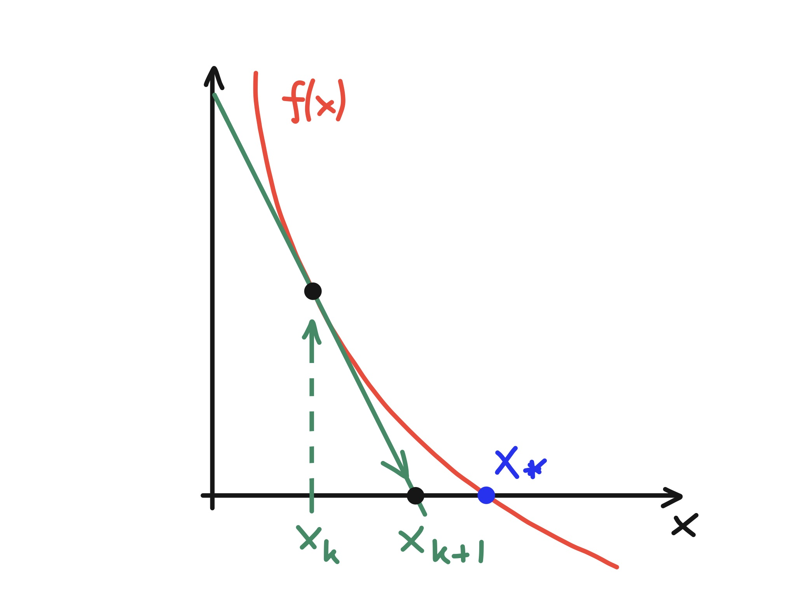{width=70% fig-align="center"}

Graphically, the idea of **Newton's method** is simple: given $x_k$, draw the tangent line to $f$ at $x=x_k$, and let $x_{k+1}$ be the $x$-intercept of this tangent. So
$$
\frac{0 - f(x_k)}{x_{k+1} - x_k} = f'(x_k) \quad \implies\quad  x_{k+1} = x_k - \frac{f(x_k)}{f'(x_k)}.
$$

::: {.callout-note}
In fact, Newton only applied the method to polynomial equations, and without using calculus. The general form using derivatives ("fluxions") was first published by Thomas Simpson in 1740. [See "Historical Development of the Newton-Raphson Method" by T.J. Ypma, *SIAM Review* **37**, 531 (1995).]
:::

Another way to derive this iteration is to approximate $f(x)$ by the linear part of its Taylor series centred at $x_k$:
$$
0 \approx f(x_{k+1}) \approx f(x_k) + f'(x_k)(x_{k+1} - x_{k}).
$$

The iteration function for Newton's method is
$$
g(x) = x - \frac{f(x)}{f'(x)},
$$
so using $f(x_*)=0$ we see that $g(x_*)=x_*$. To assess the convergence, note that
$$
g'(x) = 1 - \frac{f'(x)f'(x) - f(x)f''(x)}{[f'(x)]^2} = \frac{f(x)f''(x)}{[f'(x)]^2} \quad \implies g'(x_*)=0 \quad \textrm{if $f'(x_*)\neq 0$}.
$$
So if $f'(x_*)\neq 0$, the Local Convergence Theorem shows that the iteration will converge for $x_0$ close enough to $x_*$. Moreover, since $g'(x_*)=0$, the theorem in @sec-order shows that this convergence will be superlinear. In fact, expanding $f(x_k)$ and $f'(x_k)$ in Taylor series about $x_*$ shows that
$$
x_*-x_{k+1} = -\frac{f''(x_*)}{2f'(x_*)}(x_*-x_k)^2 + {\cal O}\big((x_*-x_k)^3\big),
$$
so the convergence is quadratic (order $\alpha=2$), provided that $f''(x_*)\neq 0$.

::: {.eg}
## Calculate $a^{-1}$ using $f(x)=\frac1x - a$ for $a>0$.

Newton's method gives the iterative formula
$$
x_{k+1} = x_k - \frac{\frac{1}{x_k}-a}{-\frac{1}{x_k^2}} = 2x_k - a x_k^2.
$$
Rearranging, we find that $\tfrac1a - x_{k+1} = a\big(\tfrac1a - x_k\big)^2$ exactly, so the iteration will converge for any $x_0\in(0,2/a)$, but will diverge if $x_0$ is too large. With $a=0.5$ and $x_0=1$, we obtain

| $x_k$         | $|2 - x_k|$         | $|2-x_k|/|2-x_{k-1}|$ | $|2-x_k|/|2-x_{k-1}|^2$ |
|---------------|---------------------|-----------------------|-------------------------|
| 1.0           | 1.0                 | -                     | -                       |
| 1.5           | 0.5                 | 0.5                   | 0.5                     |
| 1.875         | 0.125               | 0.25                  | 0.5                     |
| 1.9921875     | 0.0078125           | 0.0625                | 0.5                     |
| 1.999969482   | $3.05\times 10^{-5}$| 0.00390625            | 0.5                     |
| 2.0           | $4.65\times 10^{-10}$| $1.53\times 10^{-5}$ | 0.5                     |
| 2.0           | $1.08\times 10^{-19}$| $2.33\times 10^{-10}$| 0.5                     |

In 6 steps, the error is below $\epsilon_{\rm M}$: pretty rapid convergence! The third column shows that the convergence is superlinear. The fourth column shows that $|x_*-x_{k+1}|/|x_*-x_k|^2$ is constant, indicating that the convergence is quadratic (order $\alpha=2$), with $C = |f''(x_*)/(2f'(x_*))| = a = 0.5$, as predicted.
:::

::: {.callout-note}
Although the solution $\tfrac1a$ is known exactly, this method is so efficient that it is sometimes used in computer hardware to do division!
:::

In practice, it is not usually possible to determine ahead of time whether a given starting value $x_0$ will converge. A robust computer implementation should catch any attempt to take too large a step, and switch to a less sensitive (but slower) algorithm (e.g. bisection). However, it always makes sense to avoid any points where $f'(x)=0$.

::: {.eg}
## $f(x) = x^3-2x+2$.

Here $f'(x) = 3x^2-2$ so there are turning points at $x=\pm\sqrt{\tfrac23}$ where $f'(x)=0$, as well as a single real root at $x_*\approx -1.769$. The presence of points where $f'(x)=0$ means that care is needed in choosing a starting value $x_0$.

If we take $x_0=0$, then $x_1 = 0 - f(0)/f'(0) = 1$, but then $x_2 = 1 - f(1)/f'(1)=0$, so the iteration gets stuck in an infinite loop:

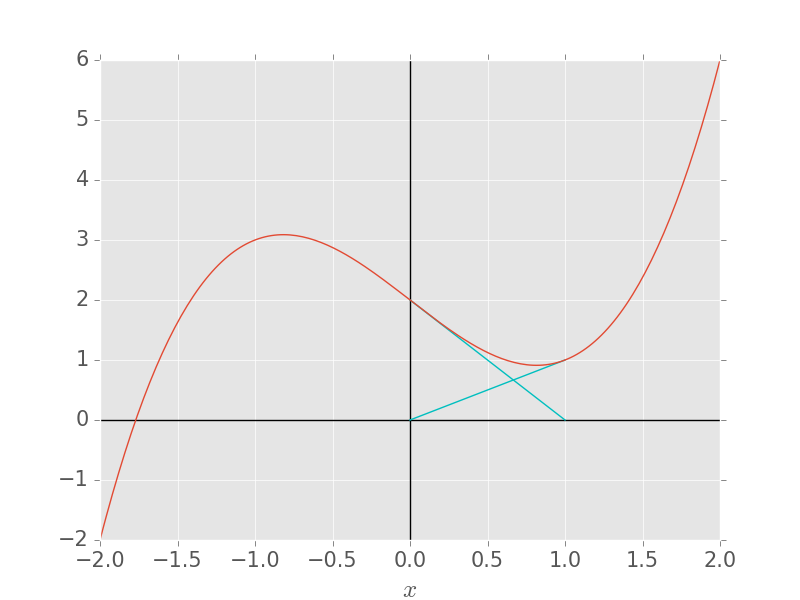{width=70% fig-align="center"}

Other starting values, e.g. $x_0=-0.5$ can also be sucked into this infinite loop! The correct answer is obtained for $x_0=-1.0$.
:::

::: {.callout-note}
The sensitivity of Newton's method to the choice of $x_0$ is beautifully illustrated by applying it to a **complex** function such as $f(z) = z^3 - 1$. The following plot colours points $z_0$ in the complex plane according to which root they converge to ($1$, $e^{2\pi i/3}$, or $e^{-2\pi i/3}$):

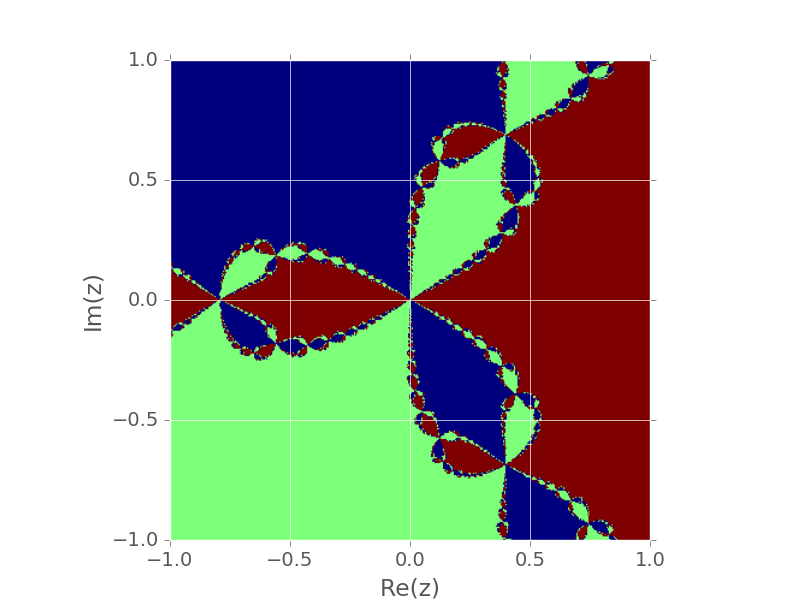{width=80% fig-align="center"}

The boundaries of these **basins of attraction** are fractal.
:::

::: {.eg title="MATLAB demonstration: comparing convergence rates"}
```matlab
% Bisection, fixed-point iteration (a) and Newton's method for x^2 - 2x - 3 = 0
f  = @(x) x.^2 - 2*x - 3;
df = @(x) 2*x - 2;
xs = 3;                                % the root we are aiming for
N = 40;  eb = zeros(N,1);  ef = eb;  en = eb;
a = 2;  b = 5;  xf = 0;  xn = 5;       % starting values
for k = 1:N
    m = (a + b)/2;  eb(k) = abs(m - xs);
    if f(a)*f(m) >= 0, a = m; else, b = m; end
    xf = sqrt(2*xf + 3);      ef(k) = abs(xf - xs);
    xn = xn - f(xn)/df(xn);   en(k) = abs(xn - xs);
end
figure
semilogy(1:N, eb, 'o-', 1:N, ef, 's-', 1:N, en, '^-', 'LineWidth', 2.5, 'MarkerSize', 8)
legend('bisection', 'fixed point (a)', 'Newton', 'Location', 'southwest')
xlabel('iteration k'), ylabel('error |x_k - x_*|'), set(gca, 'FontSize', 18), grid on
```
On a logarithmic scale, linear convergence appears as a straight line, while Newton's method plunges to machine precision within a few steps (errors that are exactly zero are not plotted). MATLAB's built-in rootfinder `fzero(f, [2 5])` combines bisection with faster methods.
:::

### Newton's method for systems

Newton's method generalises to higher-dimensional problems where we want to find $\mathbf{x}\in\mathbb{R}^m$ that satisfies $\mathbf{f}(\mathbf{x})=0$ for some function $\mathbf{f}:\mathbb{R}^m\to\mathbb{R}^m$.

To see how it works, take $m=2$ so that $\mathbf{x}=(x_1,x_2)^\top$ and $\mathbf{f}=[f_1(\mathbf{x}),f_2(\mathbf{x})]^\top$. Taking the linear terms in Taylor's theorem for two variables gives
$$
\begin{aligned}
0 &\approx f_1(\mathbf{x}_{k+1}) \approx f_1(\mathbf{x}_k) + \left.\frac{\partial f_1}{\partial x_1}\right|_{\mathbf{x}_k}(x_{1,k+1} - x_{1,k}) + \left.\frac{\partial f_1}{\partial x_2}\right|_{\mathbf{x}_k}(x_{2,k+1} - x_{2,k}),\\
0 &\approx f_2(\mathbf{x}_{k+1}) \approx f_2(\mathbf{x}_k) + \left.\frac{\partial f_2}{\partial x_1}\right|_{\mathbf{x}_k}(x_{1,k+1} - x_{1,k}) + \left.\frac{\partial f_2}{\partial x_2}\right|_{\mathbf{x}_k}(x_{2,k+1} - x_{2,k}).
\end{aligned}
$$

In matrix form, we can write
$$
\begin{pmatrix}
0\\
0
\end{pmatrix}
=
\begin{pmatrix}
f_1(\mathbf{x}_k)\\
f_2(\mathbf{x}_k)
\end{pmatrix}
+
\begin{pmatrix}
\frac{\partial f_1}{\partial x_1}(\mathbf{x}_k) & \frac{\partial f_1}{\partial x_2}(\mathbf{x}_k)\\
\frac{\partial f_2}{\partial x_1}(\mathbf{x}_k) & \frac{\partial f_2}{\partial x_2}(\mathbf{x}_k)
\end{pmatrix}
\begin{pmatrix}
x_{1,k+1} - x_{1,k}\\
x_{2,k+1} - x_{2,k}
\end{pmatrix}.
$$

The matrix of partial derivatives is called the **Jacobian matrix** $J(\mathbf{x}_k)$, so (for any $m$) we have
$$
\mathbf{0} = \mathbf{f}(\mathbf{x}_k) + J(\mathbf{x}_k)(\mathbf{x}_{k+1} - \mathbf{x}_{k}).
$$

To derive Newton's method, we rearrange this equation for $\mathbf{x}_{k+1}$. At each step, we solve the linear system
$$
J(\mathbf{x}_k)\boldsymbol{\delta}_k = -\mathbf{f}(\mathbf{x}_k)
$$
for the update $\boldsymbol{\delta}_k$, and then set $\mathbf{x}_{k+1} = \mathbf{x}_k + \boldsymbol{\delta}_k$. Formally, $\mathbf{x}_{k+1} = \mathbf{x}_k - J^{-1}(\mathbf{x}_k)\mathbf{f}(\mathbf{x}_k)$, but in practice we never compute $J^{-1}$ explicitly: solving the linear system is cheaper and more accurate, as we will see in Chapter 3.

::: {.callout-note}
If $m=1$, then $J(x_k) = \frac{\partial f}{\partial x}(x_k)$, and the linear system is just $f'(x_k)\delta_k = -f(x_k)$, so this reduces to the scalar Newton's method.
:::

::: {.eg }
## Apply Newton's method to the simultaneous equations $xy - y^3 - 1 = 0$ and $x^2y + y -5=0$, with starting values $x_0=2$, $y_0=3$.

The Jacobian matrix is
$$
J(x,y) = \begin{pmatrix}
y & x-3y^2\\
2xy & x^2 + 1
\end{pmatrix}.
$$
For the first iteration, we have
$$
J(2,3) = \begin{pmatrix}
3 & -25\\
12 & 5
\end{pmatrix}, \qquad
\mathbf{f}(2,3) = \begin{pmatrix}
-22\\
10
\end{pmatrix},
$$
and solving $J(2,3)\boldsymbol{\delta}_0 = -\mathbf{f}(2,3)$ gives $\boldsymbol{\delta}_0 = (-\tfrac49, -\tfrac{14}{15})^\top$, so
$$
\begin{pmatrix}
x_1\\
y_1
\end{pmatrix}
= \begin{pmatrix}
2\\
3
\end{pmatrix}
+ \begin{pmatrix}
-0.44444444\\
-0.93333333
\end{pmatrix}
= \begin{pmatrix}
1.55555556\\
2.06666667
\end{pmatrix}.
$$

Subsequent iterations give

| $k$ | $x_k$      | $y_k$      |
|-----|------------|------------|
| 2   | 1.54720541 | 1.47779333 |
| 3   | 1.78053503 | 1.15886481 |
| 4   | 1.95284300 | 1.02844269 |
| 5   | 1.99776297 | 1.00124041 |
| 6   | 1.99999524 | 1.00000260 |

so the method is converging accurately to the root $x_*=2$, $y_*=1$, shown in the following plot:

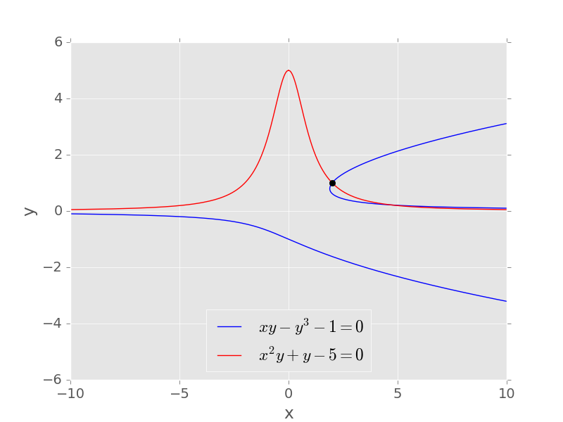{width=70% fig-align="center"}
:::

::: {.eg title="MATLAB demonstration: Newton's method for systems"}
```matlab
F = @(v) [v(1)*v(2) - v(2)^3 - 1;  v(1)^2*v(2) + v(2) - 5];
J = @(v) [v(2), v(1) - 3*v(2)^2;  2*v(1)*v(2), v(1)^2 + 1];
v = [2; 3];                            % starting values (x_0, y_0)
for k = 1:8
    v = v - J(v) \ F(v);               % solve J*delta = -F, no inverse needed
    fprintf('k = %d: x = %.10f, y = %.10f\n', k, v(1), v(2));
end
```
:::

By generalising the scalar analysis (beyond the scope of this course), it can be shown that the convergence is quadratic for $\mathbf{x}_0$ sufficiently close to $\mathbf{x}_*$, provided that $J(\mathbf{x}_*)$ is non-singular (i.e., $\det[J(\mathbf{x}_*)]\neq 0$).

::: {.callout-note}
In general, finding a good starting point in more than one dimension is difficult, particularly because interval bisection is not available. Algorithms that try to mimic bisection in higher dimensions are available, proceeding by a 'grid search' approach.
:::

### The secant method

A drawback of Newton's method is that the derivative $f'(x_k)$ must be computed at each iteration. This may be expensive to compute, or may not be available as a formula. For example, the function $f$ might be the right-hand side of some complex partial differential equation, and hence both difficult to differentiate and very high dimensional!

Instead we can use a **quasi-Newton method**
$$
x_{k+1} = x_k - \frac{f(x_k)}{g_k},
$$
where $g_k$ is some easily-computed approximation to $f'(x_k)$. Once the iteration has started, we already have two nearby points $x_{k-1}$, $x_k$, so we can approximate $f'(x_k)$ by a backward difference
$$
g_k = \frac{f(x_k) - f(x_{k-1})}{x_k - x_{k-1}} \quad \implies \quad x_{k+1} = x_k - \frac{f(x_k)(x_k - x_{k-1})}{f(x_k) - f(x_{k-1})}.
$$
This is called the **secant method**, and requires only one new function evaluation per iteration (once underway). The name comes from its graphical interpretation:

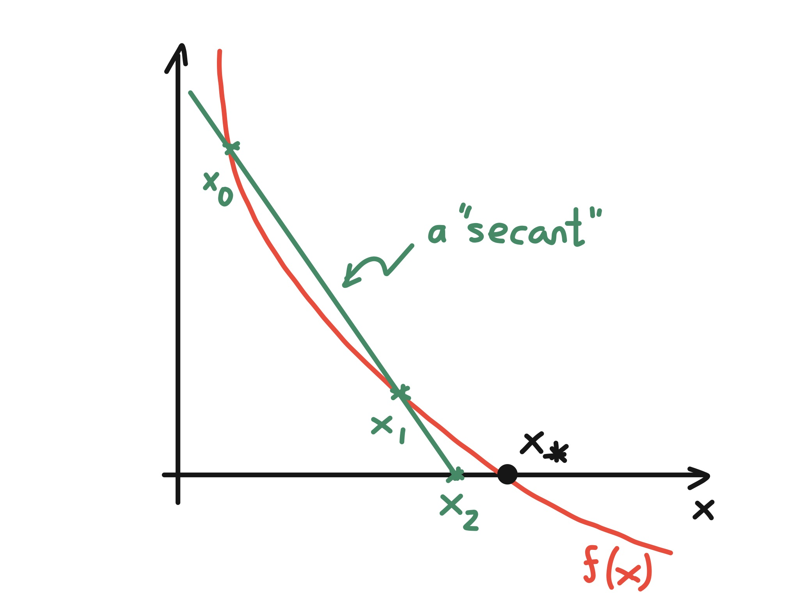{width=70% fig-align="center"}

::: {.callout-note}
The secant method was introduced by Newton.
:::

::: {.eg}
## $f(x)=\tfrac1x - 0.5$.

Now we need two starting values, so take $x_0=0.25$, $x_1=0.5$. The secant method gives:

| $k$ | $x_k$    | $|x_* - x_k|/|x_* - x_{k-1}|$ |
|-----|----------|------------------------------|
| 2   | 0.6875   | 0.875                        |
| 3   | 1.01562  | 0.75                         |
| 4   | 1.354    | 0.65625                      |
| 5   | 1.68205  | 0.492188                     |
| 6   | 1.8973   | 0.322998                     |
| 7   | 1.98367  | 0.158976                     |
| 8   | 1.99916  | 0.0513488                    |

Convergence to $\epsilon_{\rm M}$ is achieved in 12 iterations. Notice that the error ratio is decreasing, so the convergence is superlinear.
:::

The secant method is a **two-point method** since $x_{k+1} = g(x_{k-1},x_k)$, so the theorems above about single-point fixed-point iterations do not apply directly. Nevertheless, a Taylor expansion similar to the one for Newton's method gives the following result, which we state without proof.

::: {.theorem}
If $f'(x_*)\neq 0$ then the secant method converges for $x_0$, $x_1$ sufficiently close to $x_*$, with
$$
x_*-x_{k+1} \approx -\frac{f''(x_*)}{2f'(x_*)}(x_*-x_k)(x_*-x_{k-1}),
$$
and the order of convergence is $(1+\sqrt{5})/2 = 1.618\ldots$.
:::

::: {.callout-note}
This illustrates that orders of convergence need not be integers, and is also an appearance of the **golden ratio**. Although its order is lower than Newton's method, the secant method needs only one function evaluation per step (and no derivatives), so it is often faster in practice.
:::

## Knowledge checklist {.unnumbered}

**Key topics:**

1. Taylor's theorem and the Lagrange form of the remainder (truncation error).

2. Polynomial interpolation: existence and uniqueness, the Lagrange form, the interpolation error theorem, the Runge phenomenon, and Chebyshev nodes.

3. Rootfinding methods: interval bisection, fixed-point iteration, Newton's method (including for systems), and the secant method.

4. Convergence of iterative methods: contraction mappings, local convergence, and orders of convergence (linear, superlinear, quadratic).

**Key skills:**

- Constructing polynomial interpolants for a given data set or function using the Lagrange form, and bounding the error using Taylor's theorem and the interpolation error theorem.

- Explaining the Runge phenomenon and how the choice of interpolation nodes affects convergence.

- Implementing and analysing bisection, fixed-point and Newton iterations, and estimating their order of convergence from numerical data.
