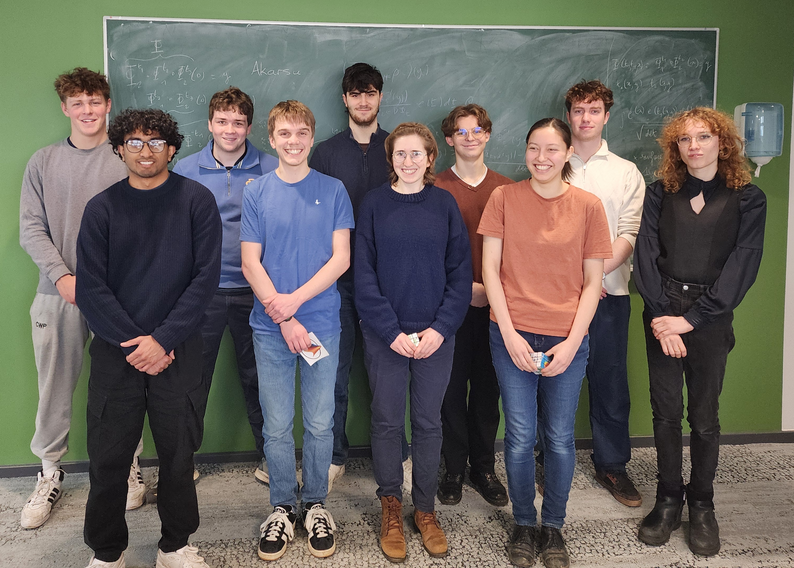

# Projects Showcase {.unnumbered}

The largest component of the assessment of this module is the **project**. There are approximately eight different project options to choose from across different areas of mathematics (e.g., pure, applied, probability, mathematical physics, etc.); each project has a distinct member of the Maths Department as supervisor. Each project consists of two parts: a **guided component** that is completed as part of a small group and an **extension component** that is open-ended and completed as an individual.

This page showcases some of the outstanding student projects (**individual extension component**) that were awarded prizes for their excellence. All prize-winning project videos are available on the [course YouTube channel](https://www.youtube.com/@CompMathDurham/videos).

We are very grateful to [MathWorks](https://www.mathworks.com) for generously providing the prizes!

{fig-align="center" width="90%"}

## Outstanding Projects 2025/2026 (selection)

**Jack Guilfoyle**: "Dependence of Initial Speed on Kink-Antikink Collisions"



**Talia Tobias**: "Paper Aeroplanes and Dynamical Systems"



**Abigail Weersing**: "Power Output of a Wind Farm"



**Thomas Newbury**: "Finite Size Scaling in the 2D Ising Model"



**Sam Todd**: "Gradient and Invasion Percolation"



**Ashwin Iyer**: "The Foucault Pendulum"



**Joshua Thompson**: "Random Braid Words and Link Properties"



**Cameron Connor**: "Structural Credit Risk Models"



