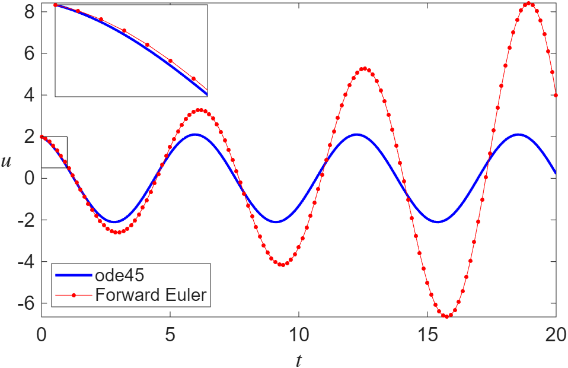
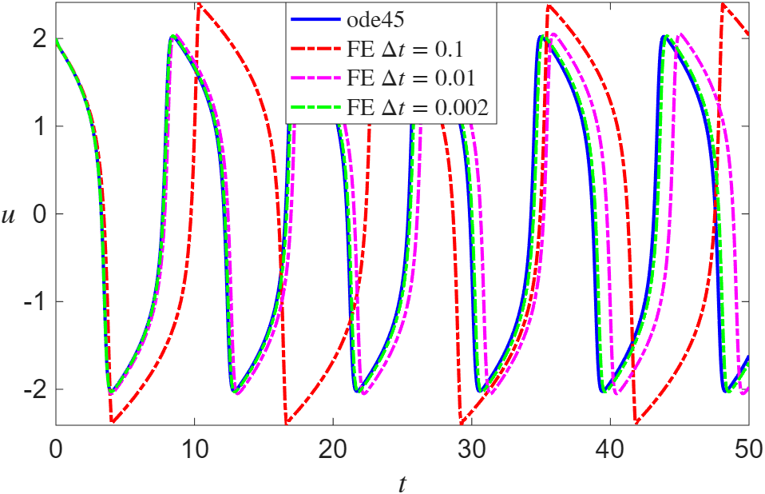
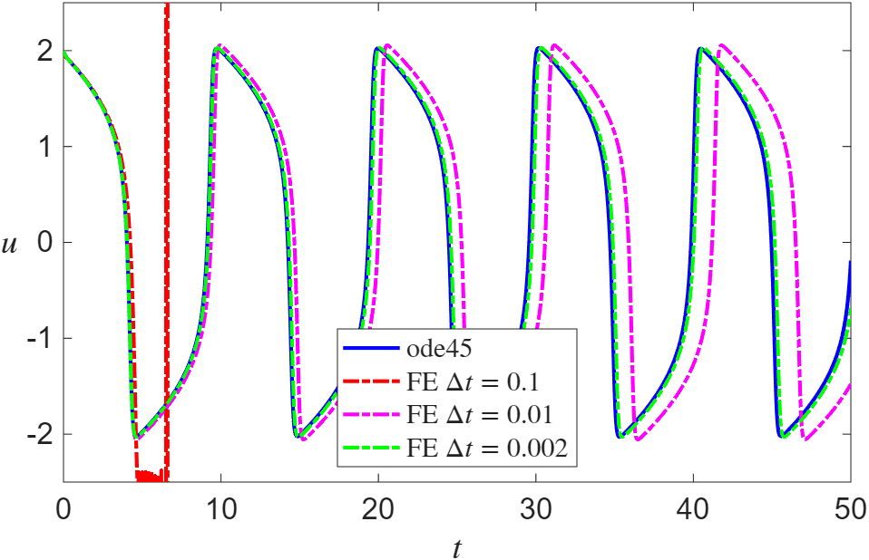
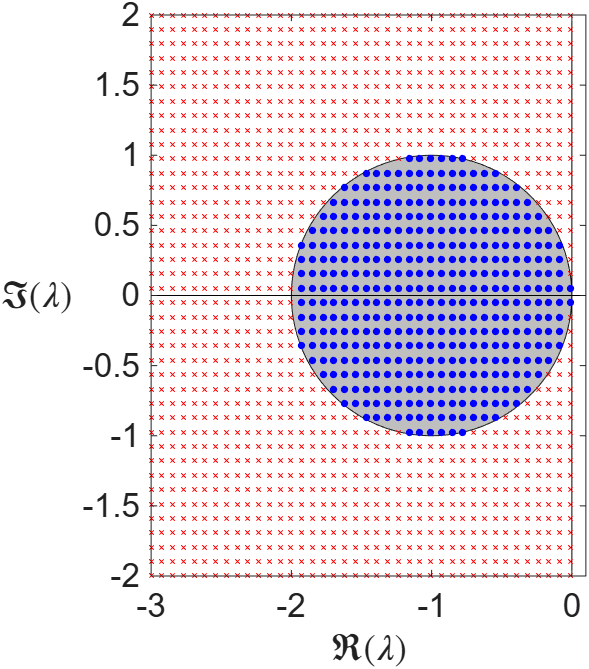

## How can computers solve differential equations?

- Almost all differential equations have no exact analytical solution
- Goal: understand the fundamentals of numerical timestepping, so we can choose a method for a given problem
- Key ideas: consistency, stability, convergence, order

# Basic Concepts

## First-order systems

$$
\dot{\mathbf{u}} = \frac{\mathrm{d}\mathbf{u}}{\mathrm{d}t} = \mathbf{f}(t,\mathbf{u}), \quad \mathbf{u}(t_0)=\mathbf{u}_0 \in \mathbb{R}^n
$$

- **Autonomous** if $\mathbf{f}(t,\mathbf{u})=\mathbf{f}(\mathbf{u})$
- Any $n$th order ODE $u^{(n)} = f\big(t, u, u',\dotsc, u^{(n-1)}\big)$ becomes a first-order system:
$$
y_0 = u, \;\; y_1 = u', \;\; \ldots, \;\; y_{n-1} = u^{(n-1)}
\quad\implies\quad
\begin{aligned}
y_0' &= y_1, \;\; \ldots, \;\; y_{n-2}' = y_{n-1}, \\
y_{n-1}' &= f\big(t, y_0, y_1, \dotsc, y_{n-1}\big)
\end{aligned}
$$

## Example

::: {.eg}
[$u''' = t + 2u + 3u''$, $\; u(0) = 1$, $u'(0) = 2$, $u''(0) = 3$]{.box-title}
Let $y_0 = u$, $y_1 = u'$, $y_2 = u''$:
$$
\begin{aligned}
y_0' &= y_1, & y_0(0) &= 1,\\
y_1' &= y_2, & y_1(0) &= 2,\\
y_2' &= t + 2y_0 + 3y_2, & y_2(0) &= 3.
\end{aligned}
$$

::: {.fragment}
$$
\frac{d}{dt}
\begin{bmatrix}
y_0 \\
y_1 \\
y_2
\end{bmatrix}
=
\begin{bmatrix}
0 & 1 & 0 \\
0 & 0 & 1 \\
2 & 0 & 3
\end{bmatrix}
\begin{bmatrix}
y_0 \\
y_1 \\
y_2
\end{bmatrix}
+
\begin{bmatrix}
0 \\
0 \\
t
\end{bmatrix}
$$
:::
:::

## Existence and uniqueness

::: {.thm}
[Picard–Lindelöf theorem]{.box-title}
Let $\mathcal{D}\subset\mathbb{R}\times\mathbb{R}^n$ be an open rectangle with interior point $(t_0,\mathbf{u}_0)$. Suppose $\mathbf{f}:\mathcal{D}\to\mathbb{R}^n$ is continuous in $t$ and Lipschitz continuous in $\mathbf{u}$ on $\mathcal{D}$. Then there exists $\varepsilon>0$ such that the initial-value problem has a unique solution $\mathbf{u}(t)$ for $t\in[t_0-\varepsilon,t_0+\varepsilon]$.
:::

- Follows from the contraction mapping theorem
- Globally Lipschitz and continuous for all $t$ $\implies$ solution exists for all $t$
- Autonomous systems: solution curves cannot cross

## Non-uniqueness

::: {.eg}
[Norton's Dome]{.box-title}
$$
\frac{\mathrm{d}u}{\mathrm{d}t} = v, \quad \frac{\mathrm{d}v}{\mathrm{d}t} = \sqrt{u}, \quad u(0) = v(0) = 0
$$

As well as $u(t) = 0$, for any $T > 0$:
$$
u(t) = \begin{cases}
    0 & t < T,\\
    \frac{1}{144}(t-T)^4 & t \geq T.
\end{cases}
$$

$\sqrt{u}$ is not Lipschitz at $u=0$.
:::

# Finite Difference Methods

## Forward Euler

Forward difference for $\dot{\mathbf{u}}$, with time step $\Delta t$:
$$
\mathbf{u}(t + \Delta t) \approx \mathbf{u}(t) + \Delta t\, \mathbf{f}(\mathbf{u}(t))
$$

With $\mathbf{u}_n \approx \mathbf{u}(n\Delta t)$:
$$
\mathbf{u}_{n+1} = \mathbf{u}_n + \Delta t\, \mathbf{f}(\mathbf{u}_n)
$$

- How accurate is it?
- Is it **convergent**: does $\mathbf{u}_n \to \mathbf{u}(t)$ as $\Delta t \to 0$?

## The van der Pol oscillator

$$
\frac{\mathrm{d}^2 u}{\mathrm{d} t^2} - C\left(1-u^2 \right )\frac{\mathrm{d} u}{\mathrm{d} t} + u = 0
$$

$$
\iff \quad \frac{\mathrm{d} u}{\mathrm{d} t} = v, \quad \frac{\mathrm{d}v}{\mathrm{d} t} = C\left(1-u^2\right)v - u
$$

- $C=0$: simple harmonic oscillator
- $C>0$: damping for $|u|>1$, "negative damping" for $|u|<1$

## MATLAB demo: forward Euler vs `ode45`

```matlab
C = 0; % Parameter C in the model.
% The ODE rhs function as an "anonymous function".
f = @(t,u)  [u(2); -C*(u(1)^2 - 1).*u(2) - u(1)];

U0 = [2; -0.65];  % Initial condition
tspan = linspace(0,20,1e3); % Time span

% Set low tolerances to ensure an accurate solution
options = odeset('RelTol',1e-11,'AbsTol',1e-11);
[~,u_ode45] = ode45(f, tspan, U0);

% Forward Euler setup (timestep, vector of solution points etc)
dt = 0.15; n = round(tspan(end)/dt); u_Euler = NaN(2,n);

u_Euler(:,1) = U0; % Initial condition for Euler method
for i = 1:n-1
    t = (i-1) * dt; % Current time (NB: Unused currently!)
    u_Euler(:,i+1) = u_Euler(:,i) + dt * f(t, u_Euler(:,i));
end
```

## Forward Euler: $C=0$

{fig-align="center" height="560"}

## Forward Euler: $C=3$

{fig-align="center" height="560"}

## Local truncation error

Substitute the true solution and Taylor expand:
$$
\mathbf{u}(t+\Delta t) = \mathbf{u}(t) + \Delta t\, \frac{\mathrm{d}\mathbf{u}}{\mathrm{d}t} + {\cal O}(\Delta t^2) = \mathbf{u}(t) + \Delta t\, \mathbf{f}(\mathbf{u}(t)) + {\cal O}(\Delta t^2)
$$

- Forward Euler has **LTE** ${\cal O}(\Delta t^2)$ (the **single-step error**)
- Alternatively, from the difference quotient:
$$
\frac{\mathbf{u}(t+\Delta t) - \mathbf{u}(t)}{\Delta t} = \mathbf{f}(\mathbf{u}(t)) + {\cal O}(\Delta t)
$$
- **Consistent:** LTE ${\cal O}(\Delta t)$ or smaller

Consistency is not enough for convergence!

# Stability

## Forward Euler: $C=4$

{fig-align="center" height="480"}

$\Delta t = 0.1$: $u_{70} \approx 10^{172}$

## The Dahlquist problem

$$
\frac{\mathrm{d}u}{\mathrm{d}t} = \lambda u, \qquad \lambda \in \mathbb{C}
$$

- Model for the linearised behaviour of a general system
- Exact solutions decay when $\Re(\lambda)<0$
- Does the numerical method decay too?

## Stability of forward Euler

::: {.eg}
[Stability of forward Euler]{.box-title}
$$
u_{n+1} = u_n + \Delta t \lambda u_n = (1+\Delta t \lambda)u_n \implies u_n = (1+\Delta t \lambda)^n u_0
$$

::: {.fragment}
Grows without bound if $|1 + \Delta t \lambda| > 1$. For real $\lambda$, stability requires
$$
-2 < \Delta t \lambda < 0.
$$
:::
:::

## A consistent but unstable method

::: {.eg}
[A consistent but unstable method]{.box-title}
$$
u_{n+1} = -4u_n + 5u_{n-1} + \Delta t(4\lambda u_n + 2\lambda u_{n-1})
= 4(\Delta t \lambda - 1)u_n + (5 + 2\Delta t \lambda)u_{n-1}
$$

::: {.fragment}
Try $u_n = C\mu^n$:
$$
\mu^2 = 4(\Delta t \lambda - 1)\mu + (5 + 2\Delta t \lambda)
\implies
\mu = 2(\Delta t \lambda - 1) \pm \sqrt{4(\Delta t \lambda)^2 - 6 \Delta t \lambda + 9}
$$
:::

::: {.fragment}
- $\Delta t \to 0$: $\mu \to -5$, so $u_n \sim (-5)^n$
- In fact, always some $|\mu| \geq \sqrt{19} > 1$: *always* unstable
:::
:::

## Stability regions

{fig-align="center" height="420"}

- **A-stable:** stable for all $\Re(\lambda)<0$
- Then choose $\Delta t$ for accuracy alone

## Backward Euler

$$
\mathbf{u}_{n+1} = \mathbf{u}_n + \Delta t\, \mathbf{f}(\mathbf{u}_{n+1})
$$

- **Implicit:** $\mathbf{u}_{n+1}$ appears on the right-hand side
- Each step is a rootfinding problem:
$$
\mathbf{G}(\mathbf{u}_{n+1}) := \mathbf{u}_{n+1} - \Delta t\, \mathbf{f}(\mathbf{u}_{n+1}) = \mathbf{u}_n
$$
- Direct when $\mathbf{f}$ is linear (a linear system, Chapter 3)
- Same LTE as forward Euler

## Stability of backward Euler

::: {.eg}
[Stability of backward Euler]{.box-title}
$$
u_{n+1} - \Delta t \lambda u_{n+1} = u_n
\implies u_{n+1} = \frac{1}{1-\Delta t \lambda}u_n
\implies u_n = \left( \frac{1}{1-\Delta t \lambda} \right)^n u_0
$$

::: {.fragment}
If $\Re(\lambda)<0$ and $\Delta t > 0$, then $\Re(1-\Delta t\lambda) > 1$, so
$$
\left|\frac{1}{1-\Delta t \lambda}\right| < 1.
$$
Backward Euler is **A-stable**.
:::
:::

## Convergence

::: {.thm}
[Lax Equivalence Theorem]{.box-title}
Assume the conditions of the Picard–Lindelöf theorem. A finite difference method converges (in a suitable sense) to the unique solution of
$$
\dot{\mathbf{u}} = \mathbf{f}(t, \mathbf{u}), \quad \mathbf{u}(t_0) = \mathbf{u}_0 \in \mathbb{R}^N,
$$
as $\Delta t \to 0$ if the method is both consistent and stable.
:::

- Holds in exact arithmetic only: rounding error builds up over long times or tiny steps
- **Global truncation error:** accumulation of the LTE over many steps

# Higher-Order Methods

## Runge-Kutta methods

Several function evaluations within one step ($\dot u = f(u)$):
$$
u_{n+1} = u_n + \Delta t \sum_{i=1}^s a_i k_i, \quad k_1 = f(u_n), \quad
k_i = f\left(u_n + \Delta t \sum_{j=1}^{i-1} a_{ij} k_j\right)
$$

- **Single-step:** only $u_n$ is needed
- **Explicit:** each $k_i$ uses only earlier $k_j$

## Derivation of RK2

::: {.eg}
[Derivation of RK2]{.box-title}
$$
u(t_n+\Delta t) = u(t_n) + \Delta t f(u(t_n)) + \frac{\Delta t^2}{2} f_u(u(t_n)) \dot{u}(t_n) + {\cal O}(\Delta t^3)
$$

::: {.fragment}
Evaluate $f$ at the midpoint:
$$
f\big(u(t_n) + \tfrac{\Delta t}{2} f(u(t_n))\big) = f(u(t_n)) + \frac{\Delta t}{2} f_u(u(t_n)) \dot{u}(t_n) + {\cal O}(\Delta t^2)
$$
:::

::: {.fragment}
Multiply by $\Delta t$: matches up to ${\cal O}(\Delta t^2)$, so
$$
u_{n+1} = u_n + \Delta t\, f\big(u_n + \tfrac{\Delta t}{2} f(u_n)\big)
$$
is one order more accurate than forward Euler, for one extra function evaluation.
:::
:::

## Linear multistep methods

Use several previous steps instead of several evaluations per step.

::: {.eg}
[Two-step Adams-Bashforth]{.box-title}
$$
u_{n+2} = u_{n+1} + \frac{\Delta t}{2} \Big( 3 f(u_{n+1}) - f(u_n) \Big)
$$
:::

- Second order, like RK2, but only one new function evaluation per step
- Needs more starting values than $u_0$: start with a Runge-Kutta method

## Beyond the basics

- Stability matters, but is hard to guarantee
- No explicit method of these forms is A-stable
- Implicit methods need (often difficult) rootfinding
- **Stiff** equations: hard to integrate stably, often large $|\lambda|$ when linearised
