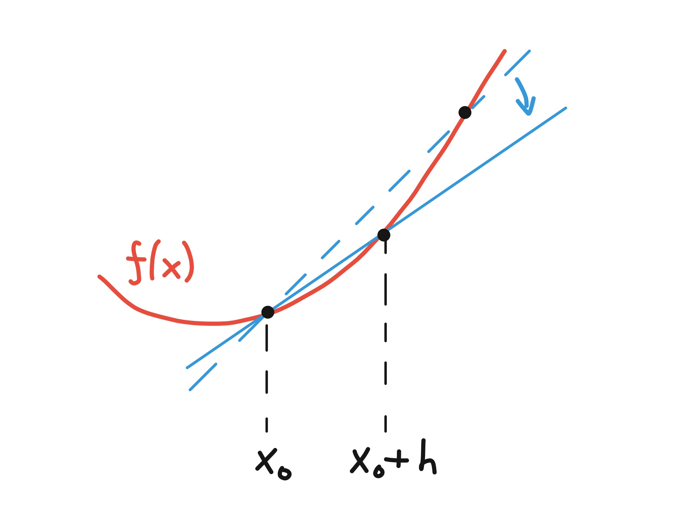
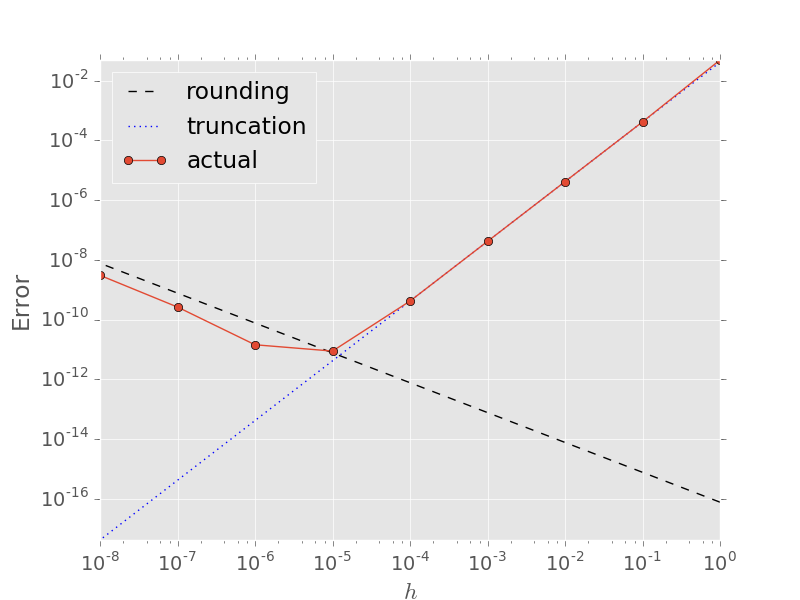
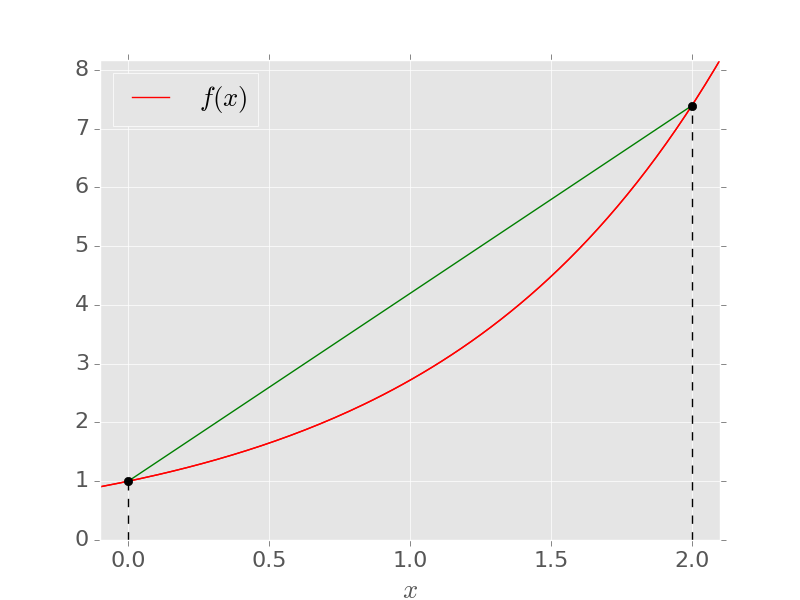

## Calculus on a computer

- **Differentiation:** finite differences, rounding error, Richardson extrapolation
- **Integration:** Newton-Cotes formulae, composite rules, Gaussian quadrature

# Differentiation

## Finite differences

:::: {.columns}
::: {.column width="55%"}
$$
f'(x_0) = \lim_{h\to 0}\frac{f(x_0+h) - f(x_0)}{h}
$$

**Forward difference** ($h>0$):
$$
f'(x_0) \approx \frac{f(x_0 + h) - f(x_0)}{h}
$$

($h<0$: **backward difference**)
:::
::: {.column width="45%"}

:::
::::

## Truncation error

Taylor's theorem: for some $\xi$ between $x_0$ and $x_0+h$,
$$
f(x_0+h) = f(x_0) + h f'(x_0) + \frac{h^2}{2}f''(\xi)
$$

$$
\implies \quad f'(x_0) = \frac{f(x_0+h)-f(x_0)}{h} - \frac{h}{2}f''(\xi)
$$

- Truncation error $-f''(\xi)h/2 = {\cal O}(h)$: **first order**
- Order $p$: error ${\cal O}(h^p)$, i.e. $|g(h)|\leq M|h|^p$ for small $h$

## Example

::: {.eg}
[Derivative of $f(x)=\log(x)$ at $x_0=2$]{.box-title}

| $h$   | Forward difference | Error $\vert f'(2) - D\vert$ |
|-------|-------------------|------------------|
| 1     | 0.405465          | 0.0945349        |
| 0.1   | 0.487902          | 0.0120984        |
| 0.01  | 0.498754          | 0.00124585       |
| 0.001 | 0.499875          | 0.000124958      |

Error $\approx 0.125 h$: agrees with $|f''(\xi)|/2 \approx \tfrac18$ since $f''(x) = -x^{-2}$.
:::

## Central difference

$$
f(x \pm h) = f(x) \pm hf'(x) + \frac{h^2}{2}f''(x) \pm \frac{h^3}{6}f'''(\xi_\pm)
$$

. . .

Subtract:
$$
f'(x) = \frac{f(x+h) - f(x-h)}{2h} - \frac{h^2}{6}f'''(\xi), \qquad \xi\in(x-h,x+h)
$$

Slope of the quadratic interpolating $f$ at $x-h$, $x$, $x+h$: **second order**.

## Central difference: example

::: {.eg}
[Derivative of $f(x)=\log(x)$ at $x=2$]{.box-title}

| $h$   | Forward | Error | Central | Error |
|-------|---------|-------|---------|-------|
| 1     | 0.405465 | 0.0945349 | 0.549306 | 0.0493061 |
| 0.1   | 0.487902 | 0.0120984 | 0.500417 | 0.000417293 |
| 0.01  | 0.498754 | 0.00124585 | 0.500004 | 4.16673e-06 |
| 0.001 | 0.499875 | 0.000124958 | 0.500000 | 4.16666e-08 |
:::

## Second derivative

Add the expansions of $f(x\pm h)$ (to one more term):
$$
f''(x) = \frac{f(x-h) - 2f(x) + f(x+h)}{h^2} - \frac{h^2}{12}f^{(4)}(\xi)
$$

::: {.eg}
[Second derivative of $f(x)=\log(x)$ at $x=2$]{.box-title}
$f''(2) = -\tfrac14$, $f^{(4)}(2) = -\tfrac38$, so expect error $\approx 0.03125h^2$:

| $h$   | Central difference for $f''(2)$ | Error |
|-------|-------------------|------------------|
| 1     | -0.2876820725     | 0.0376821        |
| 0.1   | -0.2503130218     | 0.000313022      |
| 0.01  | -0.2500031251     | 3.12505e-06      |
| 0.001 | -0.2500000311     | 3.11212e-08      |
:::

## Rounding error

$\text{fl}[f(x\pm h)] = (1+\delta_{1,2})f(x\pm h)$, $\;|\delta_1|,|\delta_2|\leq \epsilon_{\rm M}$:
$$
\begin{aligned}
\left| f'(x) - \frac{\text{fl}[f(x+h)] - \text{fl}[f(x-h)]}{2h}\right|
&= \left| - \frac{f'''(\xi)}{6}h^2 - \frac{\delta_1f(x+h) - \delta_2f(x-h)}{2h}\right|\\
&\leq \underbrace{\frac{h^2}{6}M_3}_{\text{truncation}} + \underbrace{\frac{\epsilon_{\rm M}}{h}M_0}_{\text{rounding}}
\end{aligned}
$$

$M_0$, $M_3$: maxima of $|f|$, $|f'''|$ on $[x-h,x+h]$

## Rounding error

::: {.eg}
[Derivative of $f(x)=\log(x)$ at $x=2$ again]{.box-title}
{fig-align="center" height="450"}
:::

## Optimal step size

$$
E(h) = \tfrac16 h^2M_3 + \frac{\epsilon_{\rm M}M_0}{h},
\qquad
E'(h) = \tfrac13 hM_3 - \frac{\epsilon_{\rm M}M_0}{h^2} = 0
$$

$$
\implies \quad h_* = \left(\frac{3\epsilon_{\rm M}M_0}{M_3}\right)^{1/3} \sim \epsilon_{\rm M}^{1/3}, \qquad E(h_*) \sim \epsilon_{\rm M}^{2/3}
$$

- Example: $h_*\approx 10^{-5}$, error $\approx 10^{-11}$, never the full 16 digits
- Forward difference: $h_*\sim\epsilon_{\rm M}^{1/2}\approx 10^{-8}$, error $\approx 10^{-8}$

## Differentiating noisy data

Measurement errors of size $\delta$ (usually $\gg \epsilon_{\rm M}$):
$$
\text{error} \lesssim \frac{h^2}{6}M_3 + \frac{\delta}{h}
$$

- First derivative: data error amplified by $1/h$
- Second derivative: amplified by about $4/h^2$
- Better: **fit** a smooth model (e.g. least squares), then differentiate the model

## MATLAB demo: differentiating noisy measurements

Ball rolling down a ramp: $x(t) = t^2$, $a = 2\,$m/s$^2$, positions every $0.02\,$s with $\approx 2\,$mm errors.

```matlab
rng(1)                                       % reproducible "measurements"
dt = 0.02;  t = (0:dt:2)';
x = t.^2 + 0.002*randn(size(t));             % noisy positions [m]

% Central differences for velocity and acceleration at interior points
v = (x(3:end) - x(1:end-2)) / (2*dt);
a = (x(3:end) - 2*x(2:end-1) + x(1:end-2)) / dt^2;

% Least-squares quadratic fit, then differentiate the fitted model
p = polyfit(t, x, 2);
aFit = 2*p(1);
```

## MATLAB demo: differentiating noisy measurements

```matlab
figure
subplot(1, 2, 1)
plot(t(2:end-1), v, 'o', t, 2*t, 'LineWidth', 2.5, 'MarkerSize', 5)
legend('finite differences', 'exact v = 2t', 'Location', 'northwest')
xlabel('t [s]'), ylabel('velocity [m/s]'), grid on, set(gca, 'FontSize', 16)
subplot(1, 2, 2)
plot(t(2:end-1), a, 'o', t, 2*ones(size(t)), t, aFit*ones(size(t)), '--', ...
    'LineWidth', 2.5, 'MarkerSize', 5)
legend('finite differences', 'exact a = 2', 'from least-squares fit', 'Location', 'southwest')
xlabel('t [s]'), ylabel('acceleration [m/s^2]'), grid on, set(gca, 'FontSize', 16)
```

## Richardson extrapolation

$$
D_h := \frac{f(x+h) - f(x-h)}{2h}
$$

Expand the truncation error further:
$$
D_h = f'(x) + f'''(x)\frac{h^2}{6} + f^{(5)}(x)\frac{h^4}{120} + {\cal O}(h^6)
$$

. . .

$$
D_{h/2} = f'(x) + f'''(x)\frac{h^2}{2^2(6)} + f^{(5)}(x)\frac{h^4}{2^4(120)} + {\cal O}(h^6)
$$

. . .

Eliminate the $h^2$ term:
$$
D_h^{(1)} := \frac{2^2D_{h/2} - D_h}{3} = f'(x) - f^{(5)}(x)\frac{h^4}{480} + {\cal O}(h^6) \quad \text{: 4th order}
$$

## Richardson extrapolation: example

::: {.eg}
[Derivative of $f(x)=\log(x)$ at $x=2$ (central difference)]{.box-title}

| $h$   | $D_h$         | $\vert$Error$\vert$ | $D_h^{(1)}$    | $\vert$Error$\vert$ |
|-------|---------------|--------------|----------------|--------------|
| 1.0   | 0.5493061443  | 0.04930614433| 0.4979987836   | 0.00200121642|
| 0.1   | 0.5004172928  | 0.00041729278| 0.4999998434   | 1.56599487e-07|
| 0.01  | 0.5000041667  | 4.16672916e-06| 0.5000000000   | 1.56388791e-11|
| 0.001 | 0.5000000417  | 4.16666151e-08| 0.5000000000   | 9.29256672e-14|

Error falls by $\approx 10^4$ per row until rounding error ($\approx\epsilon_{\rm M}/h$) takes over.
:::

## Richardson extrapolation: in general

For any order-$n$ approximation
$$
D_h = f'(x) + Ch^n + {\cal O}(h^{n+1}),
\qquad
D_{h/2} = f'(x) + C\frac{h^n}{2^n} + {\cal O}(h^{n+1})
$$

$$
\implies \quad D_h^{(1)} := \frac{2^nD_{h/2} - D_h}{2^n - 1} = f'(x) + {\cal O}(h^{n+1})
$$

- No need to know $C$
- Can be applied iteratively: $D_h^{(2)} := \big(2^4D_{h/2}^{(1)} - D_h^{(1)}\big)/(2^4 - 1)$ is 6th order

# Integration

## Quadrature

$$
I(f) := \int_a^b f(x)\,\mathrm{d}x \;\approx\; I_n(f) := \sum_{k=0}^n \sigma_k f(x_k)
$$

**Nodes** $x_0,\ldots,x_n$, **weights** $\sigma_0,\ldots,\sigma_n$

## The trapezium rule

::: {.eg}
[The trapezium rule]{.box-title}

:::: {.columns}
::: {.column width="55%"}
$$
I_1(f) = \frac{b-a}{2}\Big( f(a) + f(b) \Big)
$$

$\int_0^2\mathrm{e}^x\,\mathrm{d}x$:
$$
I_1(f) = \mathrm{e}^0 + \mathrm{e}^{2} = 8.389
$$
$$
I(f) = \mathrm{e}^{2} - \mathrm{e}^0 = 6.389
$$
:::
::: {.column width="45%"}

:::
::::
:::

## Newton-Cotes formulae

Integrate the interpolating polynomial $p_n(x) = \sum_{k=0}^n f(x_k)\ell_k(x)$:
$$
I_n(f) := \int_a^b p_n(x)\,\mathrm{d}x = \sum_{k=0}^n\sigma_k f(x_k), \qquad \sigma_k = \int_a^b\ell_k(x)\,\mathrm{d}x
$$

- **Newton-Cotes:** equidistant nodes
- **Closed:** $x_0=a$ and $x_n=b$

::: {.eg}
[Trapezium rule: closed Newton-Cotes with $n=1$]{.box-title}
$$
\sigma_0 = \int_a^b\frac{x-b}{a-b}\,\mathrm{d}x = \frac{b-a}{2},
\qquad
\sigma_1 = \int_a^b\frac{x-a}{b-a}\,\mathrm{d}x = \frac{b-a}{2}
$$
:::

## Newton-Cotes error

::: {.thm}
[Theorem]{.box-title}
Let $f$ be continuous on $[a,b]$ with $n+1$ continuous derivatives on $(a,b)$. Then
$$
\big|I(f) - I_n(f)\big| \leq \frac{\max_{\xi\in[a,b]}|f^{(n+1)}(\xi)|}{(n+1)!}\int_a^b\big|(x-x_0)(x-x_1)\cdots(x-x_{n}) \big|\,\mathrm{d}x.
$$
:::

## Newton-Cotes error: proof

$$
\big|I(f) - I_n(f)\big| = \left| \int_a^b\big[f(x) - p_n(x)\big]\,\mathrm{d}x\right| \leq \int_a^b\big|f(x) - p_n(x)\big|\,\mathrm{d}x,
$$
then insert the interpolation error formula
$$
f(x) - p_n(x) = \frac{f^{(n+1)}(\xi)}{(n+1)!}(x-x_0)\cdots(x-x_{n}). \quad\blacksquare
$$

## Trapezium rule error

::: {.eg}
[Trapezium rule error]{.box-title}
With $M_2 = \max_{\xi\in[a,b]}|f''(\xi)|$:
$$
\big|I(f) - I_1(f)\big| \leq \frac{M_2}{2!}\int_a^b(x-a)(b-x)\,\mathrm{d}x = \frac{(b-a)^3}{12}M_2
$$

::: {.fragment}
For $\int_0^2\mathrm{e}^x\,\mathrm{d}x$:
$$
\big|I(f) - I_1(f)\big| \leq \tfrac1{12}(2^3)\mathrm{e}^{2} \approx 4.926 \qquad (\text{actual error} \approx 2.000)
$$
:::
:::

- Accuracy limited by smoothness of $f$ and by the node locations
- Large $n$ is a bad idea: $\sum_{k=0}^n|\sigma_k| \to \infty$ as $n\to\infty$

## Composite trapezium rule

$m$ subintervals of width $h = (b-a)/m$, trapezium rule on each:
$$
C_{1,m}(f) = h\left[\tfrac12 f(x_0) + f(x_1) + f(x_2) + \ldots + f(x_{m-1}) + \tfrac12 f(x_m) \right]
$$

![$f(x)=\mathrm{e}^x$ on $[0,2]$, $m=3$](../im/comptrapz.png){fig-align="center" height="400"}

## Composite trapezium rule: error

On each subinterval:
$$
\int_{x_{i-1}}^{x_i}(x-x_{i-1})(x_i-x)\,\mathrm{d}x = \tfrac16 h^3
$$

. . .

Add up the $m$ subintervals:
$$
\big| I(f) - C_{1,m}(f) \big| \leq \tfrac12 \max_{\xi\in[a,b]}|f''(\xi)|\, m\frac{h^3}{6}
= \frac{b-a}{12}h^2\max_{\xi\in[a,b]}|f''(\xi)|
$$

. . .

Converges as $m\to\infty$, with order ${\cal O}(h^2)$.

## Degree of exactness

- Newton-Cotes $I_n(f)$ is exact if $f^{(n+1)}=0$, i.e. $f \in{\cal P}_n$
- **Degree of exactness:** largest $n$ such that the formula is exact for all of ${\cal P}_n$
- Suffices to check $1, x, x^2, \ldots, x^n$

::: {.eg}
[Simpson's rule ($n=2$)]{.box-title}
$$
I_2(f) = \frac{b-a}{6}\left[f(a) + 4f\left(\frac{a+b}{2}\right) + f(b)\right]
$$
:::

## Simpson's rule: degree of exactness

::: {.eg}
[Simpson's rule ($n=2$)]{.box-title}
$$
\begin{aligned}
I_2(1) &= \frac{b-a}{6}[1 + 4 + 1] = b-a = I(1)\\
I_2(x) &= \frac{b-a}{6}\left[a + 2(a+b) + b\right] = \frac{b^2-a^2}{2} = I(x)\\
I_2(x^2) &= \frac{b-a}{6}\left[a^2 + (a+b)^2 + b^2\right] = \frac{b^3 - a^3}{3} = I(x^2)\\
I_2(x^3) &= \frac{b-a}{6}\left[a^3 + \tfrac12(a+b)^3 + b^3 \right] = \frac{b^4-a^4}{4} = I(x^3)
\end{aligned}
$$

::: {.fragment}
$I_2(x^4)\neq I(x^4)$, so degree of exactness is **3**, not 2.
:::
:::

## Simpson's rule: error

$$
\big|I(f) - I_2(f)\big| \leq \frac{(b-a)^5}{2880}\max_{\xi\in[a,b]}\big|f^{(4)}(\xi)\big|
$$

- Newton-Cotes with even $n$: degree of exactness $n+1$

**Composite Simpson's rule** ($m$ even):
$$
C_{2,m}(f) = \frac{h}{3}\Big[f(x_0) + 4f(x_1) + 2f(x_2) + 4f(x_3) + \ldots + 2f(x_{m-2}) + 4f(x_{m-1}) + f(x_m)\Big]
$$
$$
\big|I(f) - C_{2,m}(f)\big| \leq \frac{b-a}{180}h^4\max_{\xi\in[a,b]}\big|f^{(4)}(\xi)\big|
$$

## The midpoint rule

$$
M(f) = (b-a)\,f\Big(\frac{a+b}{2}\Big)
$$

- One node, but exact for all linear polynomials
- $|I(f) - M(f)| \leq \frac{(b-a)^3}{24}\max_{\xi\in[a,b]}|f''(\xi)|$
- Composite midpoint rule $h\sum_{i=1}^m f\big(\tfrac{x_{i-1}+x_i}{2}\big)$: ${\cal O}(h^2)$, half the error constant of the trapezium rule

## Composite rules: comparison

::: {.eg}
[$\int_0^2\mathrm{e}^x\,\mathrm{d}x = 6.389056\ldots$]{.box-title}

| $m$  | $h$     | $C_{1,m}(f)$ | $\vert I(f) - C_{1,m}(f)\vert$ | $C_{2,m}(f)$ | $\vert I(f) - C_{2,m}(f)\vert$ |
|------|---------|--------------|-----------------------|--------------|-----------------------|
| 1    | 2       | 8.389056     | 2.000                 | --           | --                    |
| 2    | 1       | 6.912810     | 0.524                 | 6.420728     | 3.17e-02              |
| 4    | 0.5     | 6.521610     | 0.133                 | 6.391210     | 2.15e-03              |
| 8    | 0.25    | 6.422298     | 0.033                 | 6.389194     | 1.38e-04              |
| 16   | 0.125   | 6.397373     | 0.008                 | 6.389065     | 8.65e-06              |
| 32   | 0.0625  | 6.391136     | 0.002                 | 6.389057     | 5.41e-07              |

Halving $h$: error $\div 4$ (trapezium), $\div 16$ (Simpson).
:::

## MATLAB demo: integrating sampled data

Car speed $v(t) = 20(1 - \mathrm{e}^{-t/20})\,$m/s, speedometer readings every $5\,$s for one minute.

```matlab
t = 0:5:60;                                   % times of the readings [s]
v = 20*(1 - exp(-t/20));                      % speedometer readings [m/s]
dTrap = trapz(t, v);                          % composite trapezium rule
h = t(2) - t(1);                              % composite Simpson (12 subintervals)
dSimp = h/3*(v(1) + 4*sum(v(2:2:end-1)) + 2*sum(v(3:2:end-2)) + v(end));
dExact = 20*(60 + 20*exp(-3) - 20);
fprintf('Trapezium: %.3f m,  Simpson: %.3f m,  exact: %.3f m\n', dTrap, dSimp, dExact);

figure
area(t, v, 'FaceColor', [0.85 0.9 1]), hold on
plot(t, v, 'o-', 'LineWidth', 2.5, 'MarkerSize', 8), hold off
legend('distance = area under the curve', 'speedometer readings', 'Location', 'southeast')
xlabel('time [s]'), ylabel('speed [m/s]'), grid on, set(gca, 'FontSize', 18)
```

## Gaussian quadrature

Choose the nodes $x_k$ as well as the weights $\sigma_k$ for the highest degree of exactness.

::: {.eg}
[$G_1(f)=\sigma_0f(x_0) + \sigma_1f(x_1)$ on $[-1,1]$]{.box-title}
$$
\begin{aligned}
\sigma_0 + \sigma_1 &= \textstyle\int_{-1}^1\,\mathrm{d}x = 2, &
\sigma_0x_0 + \sigma_1x_1 &= \textstyle\int_{-1}^1x\,\mathrm{d}x = 0,\\
\sigma_0x_0^2 + \sigma_1x_1^2 &= \textstyle\int_{-1}^1x^2\,\mathrm{d}x = \tfrac23, &
\sigma_0x_0^3 + \sigma_1x_1^3 &= \textstyle\int_{-1}^1x^3\,\mathrm{d}x = 0
\end{aligned}
$$

::: {.fragment}
Symmetry: $x_1=-x_0$, $\sigma_0=\sigma_1$ $\implies$ $2\sigma_0 = 2$, $\;2\sigma_0x_0^2 = \tfrac23$
$$
G_1(f) = f\left(-\frac{1}{\sqrt{3}}\right) + f\left(\frac{1}{\sqrt{3}}\right) \quad \text{: degree of exactness 3}
$$
:::
:::

## Orthogonal polynomials

Weight function $w(x)\geq 0$ on $[a,b]$, inner product
$$
(f,g) := \int_a^b f(x)g(x)w(x)\,\mathrm{d}x
$$

- $\phi_0,\phi_1,\ldots$ (degree $k$) are **orthogonal** if $(\phi_j,\phi_k)=0$ for $j\neq k$
- Gram-Schmidt on $1, x, x^2,\ldots$:
$$
\phi_0 = 1, \quad \phi_1 = x - \frac{(x,\phi_0)}{(\phi_0,\phi_0)}\phi_0, \quad \phi_2 = x^2 - \frac{(x^2,\phi_0)}{(\phi_0,\phi_0)}\phi_0 - \frac{(x^2,\phi_1)}{(\phi_1,\phi_1)}\phi_1
$$
- $w(x)=1$ on $[-1,1]$: **Legendre polynomials** $1$, $x$, $x^2-\tfrac13$, $\ldots$
- $\phi_{n+1}$ is orthogonal to *every* polynomial of degree $\leq n$

## Gaussian quadrature

::: {.thm}
[Theorem]{.box-title}
If $\phi_0,\ldots,\phi_n$ are orthogonal polynomials on $[a,b]$ with $\phi_k$ of degree $k$, then $\phi_k$ has $k$ distinct real roots, all in $(a,b)$.
:::

::: {.thm}
[Gaussian quadrature]{.box-title}
Let $\phi_{n+1}\in{\cal P}_{n+1}$ be orthogonal on $[a,b]$ to all of ${\cal P}_{n}$ with respect to $w(x)$. If $x_0,\ldots,x_n$ are the roots of $\phi_{n+1}$, then
$$
G_{n,w}(f) := \sum_{k=0}^n\sigma_kf(x_k), \qquad \sigma_k = \int_a^b\ell_k(x)w(x)\,\mathrm{d}x
$$
approximates $I_w(f) = \int_a^b f(x)w(x)\,\mathrm{d}x$ with degree of exactness $2n+1$ (the largest possible).
:::

## Proof

$G_{n,w}$ is interpolatory with $n+1$ nodes, so it is exact on ${\cal P}_n$.

. . .

For $p_{2n+1}\in{\cal P}_{2n+1}$, divide by $\phi_{n+1}$:
$$
p_{2n+1}(x) = \phi_{n+1}(x)q_n(x) + r_n(x), \qquad q_n,r_n \in{\cal P}_n
$$

. . .

$$
G_{n,w}(p_{2n+1}) = \sum_{k=0}^n\sigma_k\Big[\underbrace{\phi_{n+1}(x_k)}_{=0}q_n(x_k) + r_n(x_k) \Big] = I_w(r_n)
$$

. . .

$q_n$ is orthogonal to $\phi_{n+1}$, so $I_w(\phi_{n+1}q_n) = 0$:
$$
G_{n,w}(p_{2n+1}) = I_w(r_n) + I_w(\phi_{n+1}q_n) = I_w(p_{2n+1}). \quad\blacksquare
$$

## Example

::: {.eg}
[$n=1$ on $[-1,1]$, $w(x)=1$ (again)]{.box-title}
$\phi_2(x) = x^2 - \tfrac13 \implies x_0= -1/\sqrt{3}, \; x_1=1/\sqrt{3}$
$$
\begin{aligned}
\sigma_0 &= \int_{-1}^1\frac{x-\tfrac1{\sqrt{3}}}{-\tfrac2{\sqrt{3}}}\,\mathrm{d}x = 1,
\qquad
\sigma_1 = \int_{-1}^1\frac{x+\tfrac1{\sqrt{3}}}{\tfrac2{\sqrt{3}}}\,\mathrm{d}x = 1
\end{aligned}
$$
:::

**General interval:** $x = \tfrac{a+b}{2} + \tfrac{b-a}{2}t$,
$$
\int_a^b f(x)\,\mathrm{d}x \approx \frac{b-a}{2}\sum_{k=0}^n\sigma_kf\Big(\tfrac{a+b}{2} + \tfrac{b-a}{2}t_k\Big)
$$

## Example

::: {.eg}
[Two-point Gaussian quadrature for $\int_0^2\mathrm{e}^x\,\mathrm{d}x$]{.box-title}
Nodes $x = 1\pm 1/\sqrt{3}$, weights $\tfrac{b-a}{2}\sigma_k = 1$:
$$
G_1(\mathrm{e}^x) = \mathrm{e}^{1-1/\sqrt{3}} + \mathrm{e}^{1+1/\sqrt{3}} = 6.368108\ldots
$$

| Rule | Function evaluations | Error |
|---|---|---|
| Trapezium | 2 | 2.000 |
| Simpson | 3 | 0.032 |
| Gauss | 2 | 0.021 |
:::

## Weighted quadrature

::: {.eg}
[$\int_0^1 \cos(x)x^{-1/2}\,\mathrm{d}x = 1.80905\ldots$, with $n=0$]{.box-title}

**Unweighted** ($w\equiv 1$):
$$
\phi_1(x) = x - \frac{\int_0^1x\,\mathrm{d}x}{\int_0^1\,\mathrm{d}x} = x-\tfrac12, \quad \sigma_0 = 1
\implies G_0 = \frac{\cos\left(\tfrac12\right)}{\sqrt{\tfrac12}} = 1.2411\ldots
$$

::: {.fragment}
**Weighted** ($w(x) = x^{-1/2}$):
$$
\phi_1(x) = x - \frac{\int_0^1x^{1/2}\,\mathrm{d}x}{\int_0^1x^{-1/2}\,\mathrm{d}x} = x-\tfrac13, \quad \sigma_0 = 2
\implies G_{0,w} = 2\cos\left(\tfrac13\right) = 1.8899\ldots
$$
:::
:::

## Gaussian quadrature: convergence and error

- $G_{n,w}(f)\to I_w(f)$ as $n\to\infty$ for any continuous $f$: all weights $\sigma_k > 0$
- Newton-Cotes: $\sum_{k}|\sigma_k|\to\infty$, which destroys convergence

::: {.thm}
[Error estimate for Gaussian quadrature]{.box-title}
Let $\phi_{n+1}$ be monic, with roots $x_0,\ldots,x_n$. If $f$ has $2n+2$ continuous derivatives on $(a,b)$, then there exists $\xi\in(a,b)$ such that
$$
I_w(f) - G_{n,w}(f) = \frac{f^{(2n+2)}(\xi)}{(2n+2)!}\int_a^b\phi_{n+1}^2(x)w(x)\,\mathrm{d}x.
$$
:::

## Knowledge checklist

1. Finite differences for first and second derivatives, and their truncation errors
2. Truncation vs rounding (or measurement) error, and the optimal step size
3. Richardson extrapolation
4. Newton-Cotes formulae (trapezium, Simpson), composite rules, error bounds, degree of exactness
5. Gaussian quadrature: orthogonal polynomials, optimal nodes, weighted integrals
