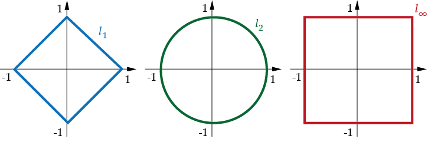
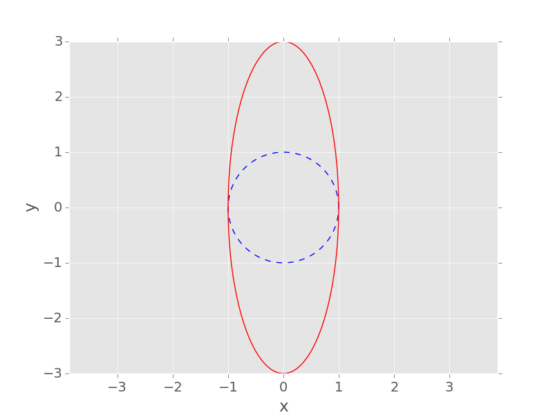
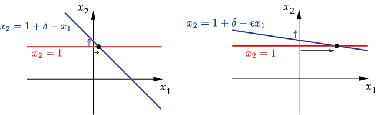
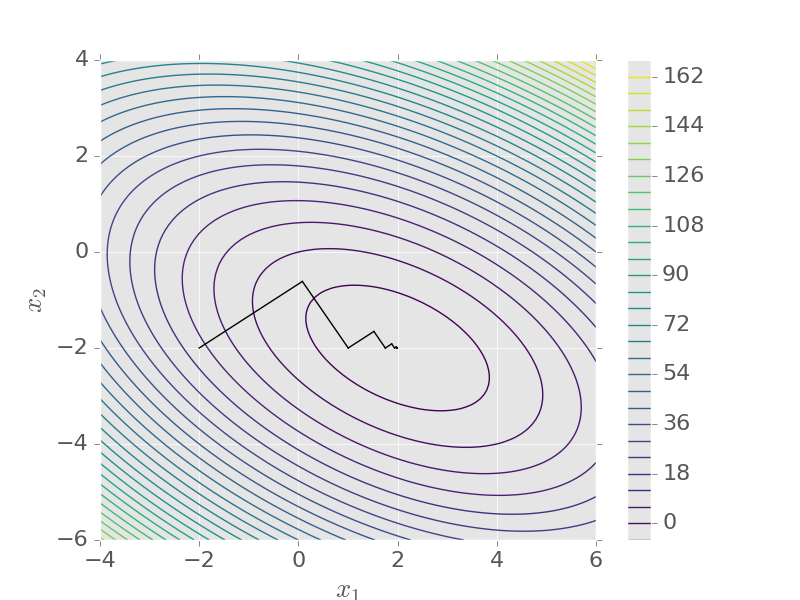
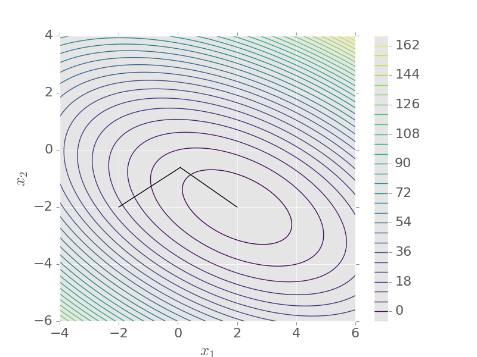

## How do we solve a linear system numerically?

$$
A\mathbf{x} = \mathbf{b}, \qquad A\in\mathbb{R}^{n\times n}, \quad \mathbf{x}, \mathbf{b}\in\mathbb{R}^n
$$

- Unique solution $\mathbf{x} = A^{-1}\mathbf{b}$ iff $A$ is non-singular ($\det(A)\neq 0$)
- Goal: solve **efficiently** and **accurately**
- $n = 10^6$ is routine, e.g. backward Euler for the heat equation (Chapter 6):
$$
(I - \Delta t\,\alpha A)\mathbf{u}_{n+1} = \mathbf{u}_n \quad \text{at every time step}
$$

# Direct Methods

## Triangular systems

$$
L = \begin{pmatrix}
l_{11} & 0 & \cdots & 0\\
l_{21} & l_{22} & \ddots & \vdots\\
\vdots & &\ddots & 0\\
l_{n1} & \cdots & \cdots & l_{nn}
\end{pmatrix},
\qquad
\det(L) = l_{11}l_{22}\cdots l_{nn}
$$

::: {.eg}
[Solve $L\mathbf{x} = \mathbf{b}$ for $n=4$]{.box-title}
$$
\begin{aligned}
l_{11}x_1 &= b_1,\\
l_{21}x_1 + l_{22}x_2 &= b_2,\\
l_{31}x_1 + l_{32}x_2 + l_{33}x_3 &= b_3,\\
l_{41}x_1 + l_{42}x_2 + l_{43}x_3 + l_{44}x_4 &= b_4.
\end{aligned}
\qquad\implies\qquad
x_1 = \frac{b_1}{l_{11}}, \;\; x_2 = \frac{b_2 - l_{21}x_1}{l_{22}}, \;\; \ldots
$$
:::

## Forward and backward substitution

**Forward substitution** for lower triangular $L\mathbf{x}=\mathbf{b}$:
$$
x_j = \frac{b_j - \sum_{k=1}^{j-1}l_{jk}x_k}{l_{jj}}, \quad j=1,\ldots,n.
$$

**Backward substitution** for upper triangular $U\mathbf{x}=\mathbf{b}$:
$$
x_j = \frac{b_j - \sum_{k=j+1}^{n}u_{jk}x_k}{u_{jj}}, \quad j=n,\ldots,1.
$$

## Cost of forward substitution

::: {.eg}
[Count the floating-point operations ($+$, $-$, $\times$, $\div$)]{.box-title}

- $j=1$: 1 division
- $j=2$: 1 division + [1 subtraction + 1 multiplication]
- $\vdots$
- $j=n$: 1 division + $(n-1)\,\times$[1 subtraction + 1 multiplication]

::: {.fragment}
$$
\sum_{j=1}^n\Big(1 + 2(j-1)\Big) = 2\sum_{j=1}^nj - \sum_{j=1}^n1 = n(n+1) - n = n^2.
$$
:::
:::

## Gaussian elimination

::: {.eg}
[Transform to upper triangular form]{.box-title}
$$
A=\begin{pmatrix}
1 & 2 & 1\\
1 & -2 & 2\\
2 & 12 & -2
\end{pmatrix},
\quad
\mathbf{b}=\begin{pmatrix}
0\\ 4\\ 4
\end{pmatrix}
$$

::: {.fragment}
**Stage 1:** $m_{21}=1$, $m_{31}=2$
$$
A^{(2)}=\begin{pmatrix}
1 & 2 & 1\\
0 & -4 & 1\\
0 & 8 & -4
\end{pmatrix},
\quad
\mathbf{b}^{(2)}=\begin{pmatrix}
0\\ 4\\ 4
\end{pmatrix}
$$
:::
:::

## Gaussian elimination

::: {.eg}
[Transform to upper triangular form (continued)]{.box-title}
**Stage 2:** $m_{32}=-2$
$$
A^{(3)}=\begin{pmatrix}
1 & 2 & 1\\
0 & -4 & 1\\
0 & 0 & -2
\end{pmatrix},
\quad
\mathbf{b}^{(3)}=\begin{pmatrix}
0\\ 4\\ 12
\end{pmatrix}
$$

::: {.fragment}
Back substitution: $x_3=-6$, $\; x_2=-\tfrac{5}{2}$, $\; x_1=11$.
:::
:::

## Gaussian elimination

::: {.alg}
[Gaussian elimination]{.box-title}
Let $A^{(1)}=A$, $\mathbf{b}^{(1)}=\mathbf{b}$. For $k = 1, \ldots, n-1$:

1. Row multipliers
   $$
   m_{ik} = \frac{a_{ik}^{(k)}}{a_{kk}^{(k)}}, \quad i=k+1,\ldots,n.
   $$
2. Eliminate $x_k$ from equations $k+1$ to $n$:
   $$
   a_{ij}^{(k+1)} = a_{ij}^{(k)} - m_{ik}a_{kj}^{(k)}, \quad b_i^{(k+1)} = b_i^{(k)} - m_{ik}b_k^{(k)}, \quad i,j=k+1,\ldots,n.
   $$

$A^{(n)}=U$ is upper triangular, provided the **pivots** $a_{kk}^{(k)}$ are non-zero.
:::

## Cost of Gaussian elimination

Stage $k$: $n-k$ multipliers, then update an $(n-k)\times(n-k)$ block
$$
N \approx \sum_{k=1}^{n-1}2(n-k)^2 = 2\sum_{j=1}^{n-1}j^2 \approx \tfrac23n^3
$$

- Exactly: $N = \tfrac23n^3 - \tfrac12n^2 - \tfrac16n$
- ${\cal O}(n^3)$: doubling $n$ multiplies the cost by about $8$
- Compare ${\cal O}(n^2)$ for the substitution step

## MATLAB demo: cubic cost

```matlab
for n = [1000 2000 4000 8000]
    A = rand(n);  b = rand(n, 1);
    tic;  x = A \ b;  t = toc;
    fprintf('n = %4d: time = %.3f s\n', n, t);
end
```

## LU decomposition

Each stage of elimination is left-multiplication by a lower triangular $F^{(k)}$:
$$
F^{(1)}A=\begin{pmatrix}
1 & 0 & 0\\
-1 & 1 & 0\\
-2 & 0 & 1
\end{pmatrix}
\begin{pmatrix}
1 & 2 & 1\\
1 & -2 & 2\\
2 & 12 & -2
\end{pmatrix}
=
\begin{pmatrix}
1 & 2 & 1\\
0 & -4 & 1\\
0 & 8 & -4
\end{pmatrix} = A^{(2)}
$$
$$
F^{(2)}A^{(2)}=
\begin{pmatrix}
1 & 0 & 0\\
0 & 1 & 0\\
0 & 2 & 1
\end{pmatrix}
\begin{pmatrix}
1 & 2 & 1\\
0 & -4 & 1\\
0 & 8 & -4
\end{pmatrix}
=
\begin{pmatrix}
1 & 2 & 1\\
0 & -4 & 1\\
0 & 0 & -2
\end{pmatrix} = U
$$

## LU decomposition

$$
U = F^{(n-1)}\cdots F^{(1)}A \quad \implies \quad A = (F^{(1)})^{-1}\cdots (F^{(n-1)})^{-1}U
$$

$$
(F^{(1)})^{-1}\cdots (F^{(n-1)})^{-1} =  \begin{pmatrix}
1 & 0& \cdots&0\\
m_{2,1} & 1 &\ddots&\vdots\\
\vdots & \vdots&\ddots&0\\
m_{n,1} & m_{n,2} &\cdots &1
\end{pmatrix} := L
$$

::: {.thm}
[LU decomposition]{.box-title}
Let $U$ be the upper triangular matrix from Gaussian elimination of $A$ (without pivoting), and $L$ the unit lower triangular matrix of multipliers. Then $A = LU$.
:::

## Solving with LU

$$
A\mathbf{x}=\mathbf{b} \iff LU\mathbf{x}=\mathbf{b}
$$

1. Solve $L\mathbf{y}=\mathbf{b}$ (forward substitution)
2. Solve $U\mathbf{x}=\mathbf{y}$ (backward substitution)

::: {.fragment}
- Factorise once: ${\cal O}(n^3)$
- Each new right-hand side $\mathbf{b}$: ${\cal O}(n^2)$
- Never compute $A^{-1}$: costs $\approx 2n^3$ and less accurate. In MATLAB use `A\b`, not `inv(A)*b`
:::

## Example

::: {.eg}
[Solve the earlier example by LU decomposition]{.box-title}
$$
\begin{pmatrix}
1 & 2 & 1\\
1 & -2 & 2\\
2 & 12 & -2
\end{pmatrix} =
\begin{pmatrix}
1 & 0 & 0\\
1 & 1 & 0\\
2 & -2 & 1
\end{pmatrix}
\begin{pmatrix}
1 & 2 & 1\\
0 & -4 & 1\\
0 & 0 & -2
\end{pmatrix}
$$

::: {.fragment}
$L\mathbf{y}=\mathbf{b}$: $\quad y_1 = 0, \;\; y_2 = 4-y_1 =4, \;\; y_3=4-2y_1+2y_2 = 12$
:::

::: {.fragment}
$U\mathbf{x} = \mathbf{y}$: $\quad x_3 = -6, \;\; x_2=-\tfrac14(4-x_3)=-\tfrac52, \;\; x_1 = -2x_2 - x_3 = 11$
:::
:::

## MATLAB demo: reusing the factorisation

```matlab
A = [1 2 1; 1 -2 2; 2 12 -2];
[L, U, P] = lu(A)       % MATLAB pivots (see below), so P is a permutation matrix

% Reusing the factorisation for many right-hand sides
n = 2000;  A = rand(n);  B = rand(n, 100);     % 100 right-hand sides
tic
for j = 1:100
    x = A \ B(:, j);                           % factorises A every time
end
t1 = toc;
tic
[L, U, P] = lu(A);                             % factorise once...
for j = 1:100
    x = U \ (L \ (P*B(:, j)));                 % ...then two triangular solves each time
end
t2 = toc;
fprintf('Backslash each time: %.2f s,  LU once then reuse: %.2f s\n', t1, t2);
```

## Pivoting

Zero pivot, even though $A$ is non-singular:
$$
A = \begin{pmatrix}
0 & 1\\
1 & 1
\end{pmatrix}
$$

::: {.eg}
[A small pivot]{.box-title}
$$
\begin{aligned}
\epsilon x_1 + x_2 &= 1,\\
x_1 + x_2 &= 2,
\end{aligned}
\qquad x_1 = \tfrac{1}{1-\epsilon} \approx 1, \quad x_2 = \tfrac{1-2\epsilon}{1-\epsilon} \approx 1
$$

::: {.fragment}
**No pivoting:** $m_{21} = 1/\epsilon$, so $\big(1 - \tfrac1\epsilon\big)x_2 = 2 - \tfrac1\epsilon$. With $\epsilon = 10^{-20}$: $x_2 = 1$, but $x_1 = (1 - x_2)/\epsilon = 0$ ✗
:::

::: {.fragment}
**Rows swapped:** $m_{21} = \epsilon$, so $(1-\epsilon)x_2 = 1 - 2\epsilon$: $x_2 = 1$, $x_1 = 2 - x_2 = 1$ ✓
:::
:::

## Partial pivoting

::: {.alg}
[Partial pivoting]{.box-title}
At each stage $k$, find the row $p\geq k$ for which $|a_{pk}^{(k)}|$ is largest, and swap rows $k$ and $p$ (in both $A^{(k)}$ and $\mathbf{b}^{(k)}$). Then $|m_{ik}|\leq 1$.
:::

- Record row swaps in a **permutation matrix** $P$:
$$
PA = LU
$$
- Solve $L\mathbf{y} = P\mathbf{b}$, then $U\mathbf{x} = \mathbf{y}$
- MATLAB's `lu` and `\` pivot automatically

## MATLAB demo: the danger of small pivots

```matlab
ep = 1e-20;
A = [ep 1; 1 1];  b = [1; 2];

% Gaussian elimination WITHOUT pivoting
m   = A(2,1)/A(1,1);
u22 = A(2,2) - m*A(1,2);
y2  = b(2) - m*b(1);
x2  = y2/u22;
x1  = (b(1) - A(1,2)*x2)/A(1,1);
disp([x1; x2])          % gives [0; 1]: x1 is completely wrong

% Backslash uses partial pivoting
disp(A \ b)             % gives [1; 1]
```

# Norms and Conditioning

## Vector norms

::: {.defn}
[Vector norm]{.box-title}
A real-valued function on $\mathbb{R}^n$ such that, for all $\mathbf{x},\mathbf{y}\in \mathbb{R}^n$, $\alpha\in\mathbb{R}$:

1. $\|\mathbf{x} + \mathbf{y}\| \leq \|\mathbf{x}\| + \|\mathbf{y}\|$ (**triangle inequality**)
2. $\|\alpha \mathbf{x}\| = |\alpha|\,\|\mathbf{x}\|$
3. $\|\mathbf{x}\| \geq 0$, and $\|\mathbf{x}\|=0$ implies $\mathbf{x}=0$
:::

$$
\|\mathbf{x}\|_2 := \sqrt{\sum_{k=1}^n x_k^2},
\qquad
\|\mathbf{x}\|_1 := \sum_{k=1}^n |x_k|,
\qquad
\|\mathbf{x}\|_\infty := \max_{k} |x_k|
$$

$$
\|\mathbf{x}\|_p = \left(\sum_{k=1}^n |x_k|^p\right)^{1/p}, \quad p\geq 1
$$

## Vector norms: examples

::: {.eg}
[$\mathbf{a}=(1,-2,3)^\top$, $\mathbf{b}=(2,0,-1)^\top$, $\mathbf{c}=(0,1,4)^\top$]{.box-title}

| | $\ell_1$ | $\ell_2$ | $\ell_\infty$ |
|---|---|---|---|
| $\mathbf{a}$ | 6 | $\sqrt{14} \approx 3.74$ | 3 |
| $\mathbf{b}$ | 3 | $\sqrt{5} \approx 2.24$ | 2 |
| $\mathbf{c}$ | 5 | $\sqrt{17} \approx 4.12$ | 4 |

$\|\mathbf{x}\|_1 \geq \|\mathbf{x}\|_2 \geq \|\mathbf{x}\|_\infty$, but different norms can order vectors differently.
:::

## Unit circles

$$
\{\mathbf{x}\in\mathbb{R}^2 : \|\mathbf{x}\|_p=1\}, \quad p=1,2,\infty
$$

{fig-align="center" height="480"}

## Matrix norms

::: {.defn}
[Matrix norm]{.box-title}
A real-valued function on $\mathbb{R}^{n\times n}$ such that, for all $A,B\in\mathbb{R}^{n\times n}$, $\alpha\in\mathbb{R}$:

1. $\|A + B\| \leq \|A\| + \|B\|$
2. $\|\alpha A\| = |\alpha|\,\|A\|$
3. $\|A\| \geq 0$, and $\|A\|=0$ implies $A=0$
4. $\|AB\| \leq \|A\|\|B\|$ (**consistency**)
:::

## Induced norms

::: {.defn}
[Induced (operator) norm]{.box-title}
$$
\|A\|_p := \sup_{\mathbf{x}\neq \boldsymbol{0}}\frac{\|A\mathbf{x}\|_p}{\|\mathbf{x}\|_p} = \max_{\|\mathbf{x}\|_p=1}\|A\mathbf{x}\|_p
$$
:::

::: {.thm}
[Induced norms are matrix norms]{.box-title}
The induced norm of any vector norm is a matrix norm, and $\|A\mathbf{x}\| \leq \|A\|\|\mathbf{x}\|$.
:::

## Induced norms: example

::: {.eg}
[$A = \begin{pmatrix} 0 & 1\\ 3 & 0 \end{pmatrix}$ in the $\ell_2$-norm]{.box-title}

:::: {.columns}
::: {.column width="50%"}
$$
\mathbf{x}=\begin{pmatrix}\cos\theta\\ \sin\theta\end{pmatrix}
\implies
A\mathbf{x} = \begin{pmatrix}
\sin\theta\\
3\cos\theta
\end{pmatrix}
$$

$$
\begin{aligned}
\|A\|_2 &= \max_\theta\big(\sin^2\theta + 9\cos^2\theta \big)^{1/2}\\
&= \max_\theta\big(1 + 8\cos^2\theta\big)^{1/2} = 3
\end{aligned}
$$
:::
::: {.column width="50%"}

:::
::::
:::

## Computing induced norms

::: {.thm}
[Matrix norms induced by $\ell_1$ and $\ell_\infty$]{.box-title}
$$
\|A\|_1 = \max_{j}\sum_{i=1}^n|a_{ij}| \;\; \text{(max column sum)},
\qquad
\|A\|_\infty = \max_{i}\sum_{j=1}^n|a_{ij}| \;\; \text{(max row sum)}
$$
:::

::: {.eg}
[Example]{.box-title}
$$
A = \begin{pmatrix}
-7 & 3 & -1\\
2 & 4 & 5\\
-4 & 6 & 0
\end{pmatrix}
\implies
\|A\|_1 = \max\{13, 13, 6\} = 13, \quad \|A\|_\infty = \max\{11,11,10\} = 11
$$
:::

## Spectral norm

**Spectral radius:** $\rho(A) = \max\{|\lambda| : \lambda \text{ an eigenvalue of } A\}$

::: {.thm}
[Spectral norm]{.box-title}
$$
\|A\|_2 = \sqrt{\rho(A^\top A)}
$$
:::

::: {.eg}
[$A = \begin{pmatrix} 0 & 1\\ 3 & 0 \end{pmatrix}$]{.box-title}
$$
A^\top A = \begin{pmatrix}
0 & 3\\
1 & 0
\end{pmatrix}
\begin{pmatrix}
0 & 1\\
3 & 0
\end{pmatrix}
=\begin{pmatrix}
9 & 0\\
0 & 1
\end{pmatrix}
\implies \|A\|_2=\sqrt{9}=3
$$
:::

## Conditioning

::: {.eg}
[Well conditioned vs ill-conditioned]{.box-title}
$$
\begin{pmatrix}
1 & 1\\
0 & 1
\end{pmatrix}
\mathbf{x}
= \begin{pmatrix}
1 + \delta\\ 1
\end{pmatrix}
\implies
\mathbf{x}=
\begin{pmatrix}
\delta\\ 1
\end{pmatrix},
\qquad
\begin{pmatrix}
\epsilon & 1\\
0 & 1
\end{pmatrix}
\mathbf{x}
= \begin{pmatrix}
1 + \delta\\ 1
\end{pmatrix}
\implies
\mathbf{x}=
\begin{pmatrix}
\delta/\epsilon\\ 1
\end{pmatrix}
$$

{fig-align="center" height="330"}
:::

## Condition number

Error $\delta\mathbf{b}$ in the data gives error $\delta\mathbf{x} = A^{-1}\delta\mathbf{b}$:
$$
\frac{\|\delta\mathbf{x}\|/\|\mathbf{x}\|}{\|\delta\mathbf{b}\|/\|\mathbf{b}\|}
= \frac{\|A^{-1}\delta\mathbf{b}\|}{\|\delta\mathbf{b}\|}\,\frac{\|A\mathbf{x}\|}{\|\mathbf{x}\|}
\leq \|A^{-1}\|\|A\|
$$

::: {.defn}
[Condition number]{.box-title}
$$
\kappa_*(A) = \|A^{-1}\|_*\|A\|_*
$$
:::

- Large $\kappa$: close to singular, solution sensitive to errors in $\mathbf{b}$
- $\det(A)$ does **not** measure conditioning: $\begin{pmatrix} 10^{-50} & 0\\ 0 & 10^{-50}\end{pmatrix}$ is well conditioned

## Condition number: examples

::: {.eg}
[Condition numbers in the 1-norm, $0 < \epsilon \ll 1$]{.box-title}
$$
A = \begin{pmatrix}
1 & 1\\
0 & 1
\end{pmatrix}, \quad
A^{-1} = \begin{pmatrix}
1 & -1\\
0 & 1
\end{pmatrix}
\implies \kappa_1(A) = 2\cdot 2 = 4
$$

::: {.fragment}
$$
B = \begin{pmatrix}
\epsilon & 1\\
0 & 1
\end{pmatrix}, \quad
B^{-1} = \frac{1}{\epsilon}\begin{pmatrix}
1 & -1\\
0 & \epsilon
\end{pmatrix}
\implies \kappa_1(B) = 2\cdot\frac{1 + \epsilon}{\epsilon} \to \infty \text{ as } \epsilon \to 0
$$
:::
:::

::: {.eg}
[Hilbert matrix $(h_n)_{ij} = \frac{1}{i+j-1}$]{.box-title}
$\kappa_2(H_5) \approx 4.8\times 10^5$, $\quad\kappa_2(H_{20})\approx 2.5\times 10^{28}$
:::

## What this means in practice

Rounding errors of relative size $\epsilon_{\rm M}$ in the data give
$$
\frac{\|\hat{\mathbf{x}} - \mathbf{x}\|}{\|\mathbf{x}\|} \lesssim \kappa(A)\,\epsilon_{\rm M}
$$

- Expect to lose about $\log_{10}\kappa(A)$ significant digits
- $H_{20}$: $\kappa_2 \approx 10^{28} \gg 1/\epsilon_{\rm M}\approx 10^{16}$, so no digits can be trusted
- Cheap lower bound from one solve: $\|A^{-1}\| \geq \|\mathbf{x}\|/\|\mathbf{b}\|$
- MATLAB: `condest` (estimate) vs `cond` (exact $\kappa_2$)

## MATLAB demo: conditioning and accuracy

```matlab
ns = 2:13;  kappa = zeros(size(ns));  err = kappa;
for j = 1:length(ns)
    n = ns(j);  H = hilb(n);
    x = ones(n, 1);  b = H*x;                  % so the exact solution is all ones
    kappa(j) = cond(H);
    err(j) = norm(H\b - x)/norm(x);
end
figure
semilogy(ns, kappa, 'o-', ns, err, 's-', ns, kappa*eps/2, '--', ...
    'LineWidth', 2.5, 'MarkerSize', 8)
legend('condition number \kappa_2(H_n)', 'relative error in x', ...
    '\kappa_2(H_n) \epsilon_M', 'Location', 'northwest')
xlabel('n'), set(gca, 'FontSize', 18), grid on
```

# Iterative Methods

## Sparse systems

- ${\cal O}(n^3)$ is prohibitive for large $n$
- Many large systems are **sparse**: e.g. backward Euler for the heat equation is tridiagonal
- $n = 10^6$: full storage $10^{12}$ numbers (8 TB) vs $\approx 3\times 10^6$ non-zeros
- Iterative methods: main cost is matrix-vector products $A\mathbf{d}$

::: {.defn}
[Symmetric positive definite (SPD)]{.box-title}
$A$ is SPD if $A = A^\top$ and $\mathbf{x}^\top A\mathbf{x}>0$ for every $\mathbf{x}\neq 0$ $\;\iff\;$ all eigenvalues positive.
:::

## Example

::: {.eg}
[Show that $A$ is SPD]{.box-title}
$$
A = \begin{pmatrix}
3 & 1 & -1\\
1 & 4 & 2\\
-1 & 2 & 5
\end{pmatrix}
$$

Eigenvalues $\approx 1.29$, $4.14$, $6.57$ (`eig(A)`), all positive.

::: {.fragment}
Or complete the square:
$$
\begin{aligned}
\mathbf{x}^\top A\mathbf{x} &= 3x_1^2 + 4x_2^2 + 5x_3^2 + 2x_1x_2 + 4x_2x_3 - 2x_1x_3\\
&= x_1^2 + x_2^2 + 2x_3^2 + (x_1+x_2)^2 + (x_1-x_3)^2 + 2(x_2+x_3)^2
\end{aligned}
$$
:::
:::

## Linear systems as minimisation

For $A$ SPD, minimise
$$
f(\mathbf{x}) = \tfrac12\mathbf{x}^\top A\mathbf{x} -\mathbf{b}^\top\mathbf{x}
$$

- Unique global minimiser $\mathbf{x}_*$
- $\nabla f = A\mathbf{x} - \mathbf{b} = \boldsymbol{0} \iff A\mathbf{x}=\mathbf{b}$

::: {.fragment}
**Line search:** $\mathbf{x}_{k+1} = \mathbf{x}_k + \alpha_k\mathbf{d}_k$, choosing $\alpha_k$ to minimise $f$ along the line:
$$
f(\mathbf{x}_{k} + \alpha\mathbf{d}_{k}) = \big(\tfrac12\mathbf{d}_{k}^\top A\mathbf{d}_{k}\big)\alpha^2 + \mathbf{d}_{k}^\top\big(  A\mathbf{x}_k - \mathbf{b} \big)\alpha + \text{const.}
$$
:::

::: {.fragment}
$$
\mathbf{r}_k := A\mathbf{x}_k - \mathbf{b} \quad \implies \quad \alpha_k = - \frac{\mathbf{d}_k^\top\mathbf{r}_k}{\mathbf{d}_k^\top A\mathbf{d}_k}
$$
:::

## Steepest descent

$$
\mathbf{d}_k = - \nabla f (\mathbf{x}_k) = -\mathbf{r}_k
$$

::: {.eg}
[$\begin{pmatrix} 3 & 2\\ 2 & 6 \end{pmatrix}\mathbf{x}=\begin{pmatrix} 2\\ -8 \end{pmatrix}$, $\;\mathbf{x}_0=(-2,-2)^\top$]{.box-title}

:::: {.columns}
::: {.column width="50%"}
$$
\mathbf{d}_0 = \begin{pmatrix}
12\\ 8
\end{pmatrix}, \quad \alpha_0 = \frac{\mathbf{d}_0^\top\mathbf{d}_0}{\mathbf{d}_0^\top A\mathbf{d}_0} = \frac{208}{1200}
$$
$$
\mathbf{x}_1 = \mathbf{x}_0 + \alpha_0\mathbf{d}_0 \approx \begin{pmatrix}
0.08\\ -0.613
\end{pmatrix}
$$
:::
::: {.column width="50%"}
{height="330"}
:::
::::
:::

## Conjugate gradients

Steepest descent zig-zags: error decreases by a factor of about
$$
\frac{\kappa-1}{\kappa+1} \text{ per step}, \qquad \kappa = \kappa_2(A) = \frac{\lambda_{\max}}{\lambda_{\min}}.
$$

Instead, choose search directions that are **$A$-conjugate**:
$$
\mathbf{d}_{k+1}^\top A \mathbf{d}_k = 0
$$

. . .

$$
\mathbf{d}_{k+1} = -\mathbf{r}_{k+1} + \beta_k\mathbf{d}_k
\quad\implies\quad
0 = -\mathbf{r}_{k+1}^\top A \mathbf{d}_k + \beta_k\mathbf{d}_k^\top A \mathbf{d}_k
$$

$$
\implies \quad \beta_k = \frac{\mathbf{r}_{k+1}^\top A\mathbf{d}_k}{\mathbf{d}_k^\top A \mathbf{d}_k}
$$

## Conjugate gradient method

::: {.alg}
[Conjugate gradient method]{.box-title}
Start with $\mathbf{x}_0$ and $\mathbf{d}_0 = -\mathbf{r}_0 = \mathbf{b} - A\mathbf{x}_0$. For $k=0,1,\ldots$:

1. $\alpha_k = -\dfrac{\mathbf{d}_k^\top\mathbf{r}_k}{\mathbf{d}_k^\top A \mathbf{d}_k}$
2. $\mathbf{x}_{k+1} = \mathbf{x}_k + \alpha_k\mathbf{d}_k$
3. $\mathbf{r}_{k+1} = A\mathbf{x}_{k+1} - \mathbf{b}$
4. If $\|\mathbf{r}_{k+1}\| <$ tolerance, stop
5. $\mathbf{d}_{k+1} = -\mathbf{r}_{k+1} + \beta_k\mathbf{d}_k$, $\quad\beta_k = \dfrac{\mathbf{r}_{k+1}^\top A \mathbf{d}_k}{\mathbf{d}_k^\top A \mathbf{d}_k}$
:::

## Conjugate gradients: example

::: {.eg}
[Same system, $\mathbf{x}_0=(-2,-2)^\top$]{.box-title}

:::: {.columns}
::: {.column width="55%"}
First step as before: $\mathbf{x}_1 = (0.08, -0.613)^\top$

$$
\mathbf{r}_1 = \begin{pmatrix}
-2.99\\ 4.48
\end{pmatrix}, \quad \beta_0 = 0.139
$$
$$
\mathbf{d}_1 = -\mathbf{r}_1 + \beta_0\mathbf{d}_0 = \begin{pmatrix}
4.66\\-3.36
\end{pmatrix}
$$
$$
\alpha_1 = 0.412 \implies \mathbf{x}_2 = \begin{pmatrix}
2\\-2
\end{pmatrix}
$$
:::
::: {.column width="45%"}

:::
::::
:::

## Conjugate gradients: convergence

::: {.thm}
[Theorem]{.box-title}
The residuals of the conjugate gradient method are mutually orthogonal: $\mathbf{r}_j^\top \mathbf{r}_k = 0$ for $j=0,\ldots,k-1$.
:::

- So $\mathbf{r}_n=\boldsymbol{0}$: exact solution in $n$ iterations (in exact arithmetic)
- In practice: for large sparse systems, stop long before $n$
- One matrix-vector product per iteration
- Error decreases by about $\dfrac{\sqrt{\kappa}-1}{\sqrt{\kappa}+1}$ per iteration (vs $\dfrac{\kappa-1}{\kappa+1}$ for steepest descent)
- **Preconditioning:** reduce $\kappa$ to speed up convergence

## MATLAB demo: steepest descent vs CG

```matlab
A = [3 2; 2 6];  b = [2; -8];
[X, Y] = meshgrid(linspace(-4, 6, 200), linspace(-6, 4, 200));
F = 0.5*(A(1,1)*X.^2 + 2*A(1,2)*X.*Y + A(2,2)*Y.^2) - b(1)*X - b(2)*Y;

xs = zeros(2, 11);  xs(:,1) = [-2; -2];        % steepest descent
for k = 1:10
    d = b - A*xs(:,k);                         % d = -r
    xs(:,k+1) = xs(:,k) + (d'*d)/(d'*A*d)*d;
end

xc = zeros(2, 3);  xc(:,1) = [-2; -2];         % conjugate gradients
r = A*xc(:,1) - b;  d = -r;
for k = 1:2
    alpha = -(d'*r)/(d'*A*d);
    xc(:,k+1) = xc(:,k) + alpha*d;
    rnew = A*xc(:,k+1) - b;
    beta = (rnew'*A*d)/(d'*A*d);
    d = -rnew + beta*d;  r = rnew;
end
```

## MATLAB demo: steepest descent vs CG

```matlab
figure
contour(X, Y, F, 30), hold on
plot(xs(1,:), xs(2,:), 'o-', 'LineWidth', 2.5, 'MarkerSize', 8)
plot(xc(1,:), xc(2,:), 's-', 'LineWidth', 2.5, 'MarkerSize', 8), hold off
legend('contours of f', 'steepest descent', 'conjugate gradients', 'Location', 'northwest')
xlabel('x_1'), ylabel('x_2'), axis equal, set(gca, 'FontSize', 18)
```

## MATLAB demo: CG for a large sparse system

```matlab
A = gallery('poisson', 100);       % sparse SPD matrix, 10^4-by-10^4, at most 5 non-zeros per row
figure
spy(A(1:500, 1:500))
title('Sparsity pattern (first 500 rows and columns)'), set(gca, 'FontSize', 18)

b = ones(size(A, 1), 1);
[x, flag, relres, iter, resvec] = pcg(A, b, 1e-8, 1000);
figure
semilogy(0:length(resvec)-1, resvec/norm(b), 'LineWidth', 2.5)
legend('conjugate gradients', 'Location', 'northeast')
xlabel('iteration k'), ylabel('relative residual'), set(gca, 'FontSize', 18), grid on
fprintf('CG converged in %d iterations for n = %d unknowns\n', iter, size(A, 1));
```

## Knowledge checklist

1. Direct methods: triangular systems, Gaussian elimination, LU decomposition and partial pivoting, and their cost
2. Vector norms and induced matrix norms
3. Conditioning: the condition number and its effect on accuracy
4. Iterative methods for sparse SPD systems: steepest descent and conjugate gradients
